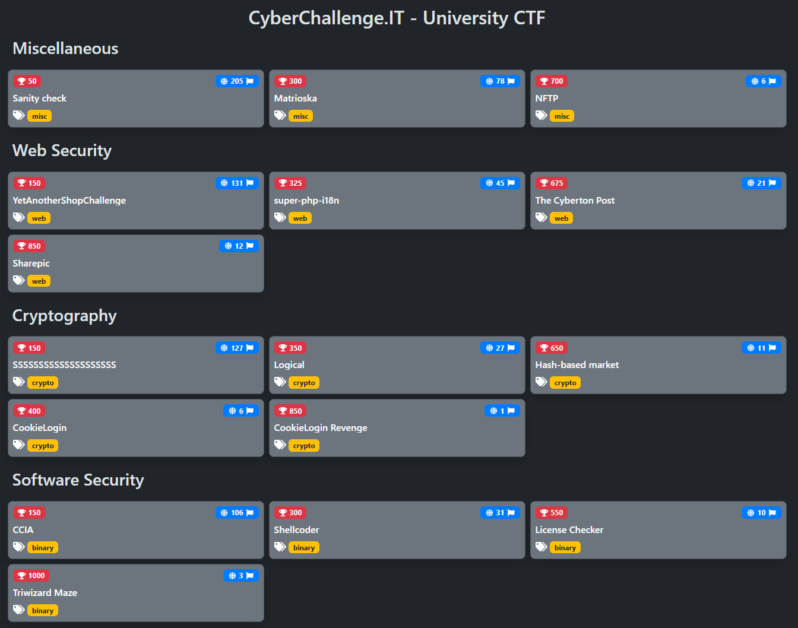

# CyberChallenge.IT 2024 - University CTF

## Description

Complete source codes of the CyberChallenge.IT 2024 - University CTF mirror held from 29 May 2024, 08:00 UTC to 29 May 2024, 15:00 UTC.

- Competition organizers: [CINI Cybersecurity National Lab](https://cybersecnatlab.it/)
- Challenges managers: Giulia Martino <@Giulia> and Matteo Rossi <@mr96>
- Platform manager: Gianluca Altomani <@devgianlu>
- Infrastructure manager: Giovanni Minotti <@giotino>
- Authors of the challenges: see the table below

## Challenges

| Category | Title                            | Author                          | Dynamic            | Type  | Url                                                 | Port  | Solves |
| :------- | :------------------------------- | :------------------------------ | :----------------: | ----: | --------------------------------------------------: | :---: |  ----: |
| binary   | [CCIA](binary01)                 | Matteo Protopapa <@matpro>      | :x:                |       |                                                     |       |    106 |
| binary   | [Shellcoder](binary02)           | Giulia Martino <@Giulia>        | :heavy_check_mark: | tcp   | shellcoder.challs.external.open.ecsc2024.it         | 38201 |     31 |
| binary   | [License Checker](binary03)      | Alberto Carboneri <@Alberto247> | :heavy_check_mark: | tcp   | licensechecker.challs.external.open.ecsc2024.it     | 38204 |     10 |
| binary   | [Triwizard Maze](binary04)       | Marco Bonelli <@mebeim>         | :heavy_check_mark: | tcp   | triwizard-maze.challs.external.open.ecsc2024.it     | 38202 |      3 |
| crypto   | [SSSSSSSSSSSSSSSSSSSS](crypto01) | Francesco Felet <@PhiQuadro>    | :x:                |       |                                                     |       |   127  |
| crypto   | [Logical](crypto02)              | Lorenzo Demeio <@Devrar>        | :heavy_check_mark: | tcp   | logical.challs.external.open.ecsc2024.it            | 38207 |     27 |
| crypto   | [Hash-based market](crypto03)    | Matteo Rossi <@mr96>            | :heavy_check_mark: | tcp   | hashmarket.challs.external.open.ecsc2024.it         | 38206 |     11 |
| crypto   | [CookieLogin](crypto04)          | Matteo Rossi <@mr96>            | :heavy_check_mark: | tcp   | cookielogin.challs.external.open.ecsc2024.it        | 38200 |      6 |
| crypto   | [CookieLogin Revenge](crypto05)  | Matteo Rossi <@mr96>            | :heavy_check_mark: | tcp   | cookieloginrevenge.challs.external.open.ecsc2024.it | 38212 |      1 |
| misc     | [Matrioska](misc01)              | Giovanni Minotti <@Giotino>     | :x:                |       |                                                     |       |     78 |
| misc     | [NFTP](misc02)                   | Matteo Protopapa <@matpro>      | :heavy_check_mark: | tcp   | nftp.challs.external.open.ecsc2024.it               | 38203 |      6 |
| web      | [YetAnotherShopChallenge](web01) | Lorenzo Leonardini <@pianka>    | :heavy_check_mark: | http  | yasc.challs.external.open.ecsc2024.it               | 38208 |    131 |
| web      | [super-php-i18n](web02)          | Lorenzo Leonardini <@pianka>    | :heavy_check_mark: | http  | super-php-i18n.challs.external.open.ecsc2024.it     | 38209 |     45 |
| web      | [The Cyberton Post](web03)       | Lorenzo Leonardini <@pianka>    | :heavy_check_mark: | http  | thecybertonpost.challs.external.open.ecsc2024.it    | 38210 |     21 |
| web      | [Sharepic](web04)                | Lorenzo Leonardini <@pianka>    | :heavy_check_mark: | http  | sharepic.challs.external.open.ecsc2024.it           | 38211 |     12 |

## CTF Data

- [submissions.csv](data/submissions.csv): User submissions in CSV format

## Solves

