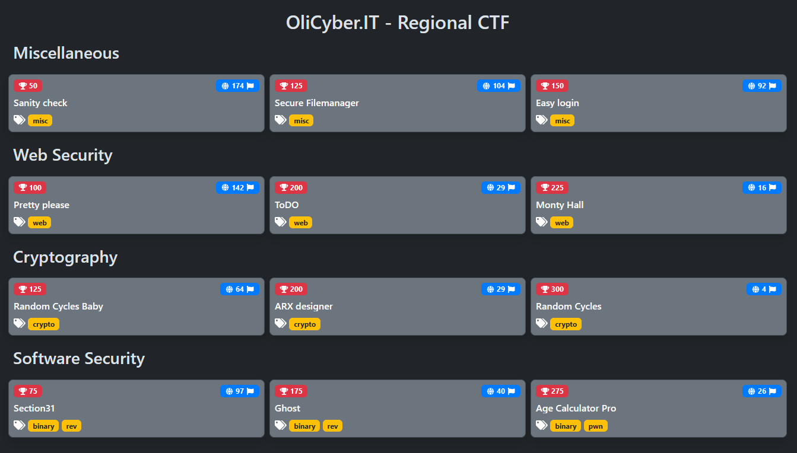

# Olicyber.IT 2024 - Regional CTF

## Description

Complete source codes of the OliCyber.IT 2024 - Regional CTF mirror held from 06 Apr. 2024, 13:00 UTC to 06 Apr. 2024, 17:00 UTC.

- Competition organizers: [CINI Cybersecurity National Lab](https://cybersecnatlab.it/)
- Challenges managers: Giulia Martino <@Giulia> and Matteo Rossi <@mr96>
- Platform manager: Gianluca Altomani <@devgianlu>
- Infrastructure manager: Giovanni Minotti <@giotino>
- Authors of the challenges: see the table below

## Challenges

| Category | Title                            | Author                        |      Dynamic       | Type |                                   Url | Port  | Solves |
| :------- | :------------------------------- | :---------------------------- | :----------------: | ---: | ------------------------------------: | :---: | -----: |
| crypto   | [Random Cycles Baby](crypto01)   | Lorenzo Demeio <@Devrar>      |        :x:         |      |                                       |       |     64 |
| crypto   | [ARX designer](crypto02)         | Matteo Protopapa <@matpro>    |        :x:         |      |                                       |       |     29 |
| crypto   | [Random Cycles](crypto03)        | Lorenzo Demeio <@Devrar>      | :heavy_check_mark: |  tcp |      random-cycles.challs.olicyber.it | 38102 |      4 |
| misc     | [Secure Filemanager](misc01)     | Giovanni Minotti <@Giotino>   | :heavy_check_mark: |  tcp | secure-filemanager.challs.olicyber.it | 38104 |    104 |
| misc     | [Easy login](misc02)             | Giovanni Minotti <@Giotino>   | :heavy_check_mark: | http |          easylogin.challs.olicyber.it |  80   |     92 |
| binary   | [Section31](software01)          | Fabio Zoratti <@orsobruno96>  |        :x:         |      |                                       |       |     97 |
| binary   | [Ghost](software02)              | Fabio Zoratti <@orsobruno96>  |        :x:         |      |                                       |       |     40 |
| binary   | [Age Calculator Pro](software03) | Giulia Martino <@Giulia>      | :heavy_check_mark: |  tcp |   agecalculatorpro.challs.olicyber.it | 38103 |     26 |
| web      | [Pretty please](web01)           | Stefano Alberto <@Xato>       | :heavy_check_mark: | http |       prettyplease.challs.olicyber.it |  80   |    142 |
| web      | [ToDO](web02)                    | Aleandro Prudenzano <@drw0if> | :heavy_check_mark: | http |               todo.challs.olicyber.it |  80   |     29 |
| web      | [Monty Hall](web03)              | Aleandro Prudenzano <@drw0if> | :heavy_check_mark: | http |         monty-hall.challs.olicyber.it |  80   |     16 |

## CTF Data

- [challenges.json](data/challenges.json): JSON file with the list of challenges
- [scoreboard-list.json](data/scoreboard-list.json): JSON file with the scoreboard in list format
- [scoreboard-table.json](data/scoreboard-table.json): JSON file with the scoreboard in tabular format
- [scoreboard.csv](data/scoreboard.csv): Tabular scoreboard in CSV format
- [submissions.csv](data/submissions.csv): User submissions in CSV format

## Solves

