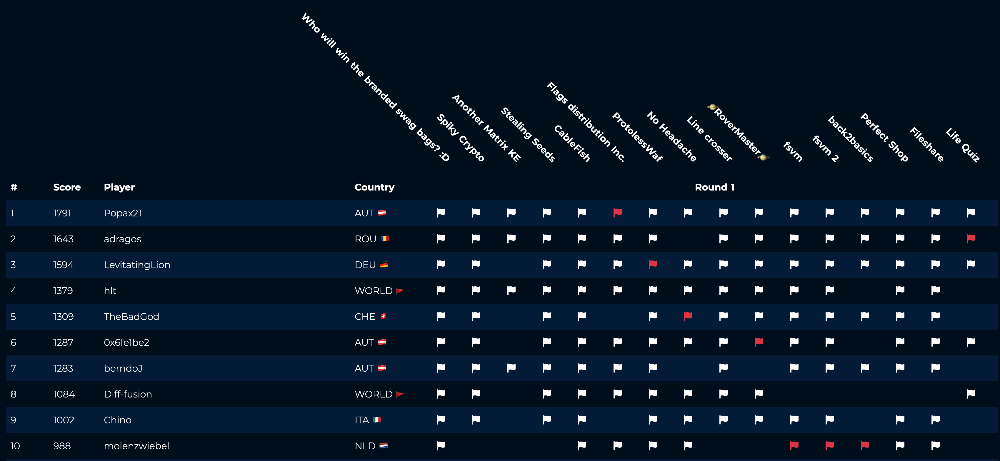
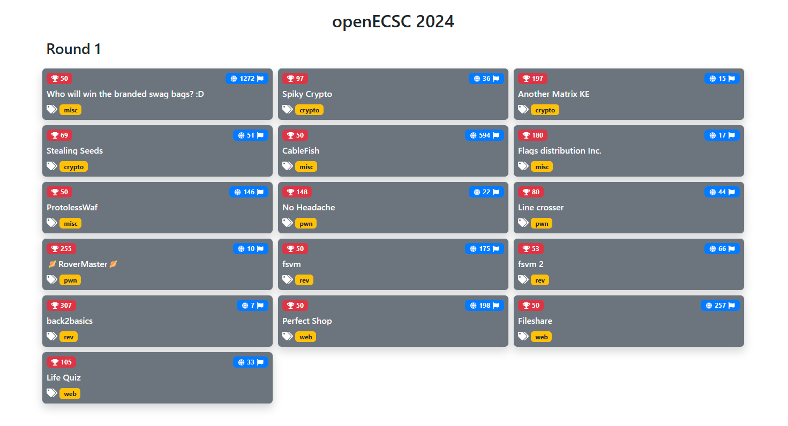

# openECSC 2024 - Round 1

## Description

Complete source codes of the challenges proposed during the first round of [openECSC 2024](https://open.ecsc2024.it) held from 18 Mar. 2024, 10:00 UTC to 24 Mar. 2024, 22:00 UTC.

- Competition organizers: [CINI Cybersecurity National Lab](https://cybersecnatlab.it/) and [Italian National Cybersecurity Agency](https://www.acn.gov.it/portale/en/home)
- Challenges managers: Giulia Martino <@Giulia> and Matteo Rossi <@mr96>
- Platform manager: Gianluca Altomani <@devgianlu>
- Infrastructure manager: Giovanni Minotti <@giotino>
- Authors of the challenges: see the table below

## Challenges

| Category | Title                             | Author                                                | Dynamic            | Type  | Url                                       | Port  | Solves |
| :------- | :-------------------------------- | :---------------------------------------------------- | :----------------: | ----: | ----------------------------------------: | ----: | -----: |
| crypto   | [Spiky Crypto](crypto01)          | Lorenzo Demeio <@Devrar>, Matteo Rossi <@mr96>        | :x:                |       |                                           |       |     36 |
| crypto   | [Another Matrix KE](crypto02)     | Lorenzo Demeio <@Devrar>, Matteo Rossi <@mr96>        | :heavy_check_mark: | tcp   | anothermatrixke.challs.open.ecsc2024.it   | 38009 |     15 |
| crypto   | [Stealing Seeds](crypto03)        | Lorenzo Demeio <@Devrar>                              | :heavy_check_mark: | tcp   | stealingseeds.challs.open.ecsc2024.it     | 38006 |     51 |
| misc     | [CableFish](misc01)               | Matteo Protopapa <@matpro>                            | :heavy_check_mark: | tcp   | cablefish.challs.open.ecsc2024.it         | 38005 |    594 |
| misc     | [Flags distribution Inc.](misc02) | Alberto Carboneri <@Alberto247>                       | :heavy_check_mark: | tcp   | flagsdistribution.challs.open.ecsc2024.it | 38000 |     17 |
| misc     | [ProtolessWaf](misc03)            | Giovanni Minotti <@giotino>                           | :heavy_check_mark: | http  | protolesswaf.challs.open.ecsc2024.it      | 80    |    146 |
| pwn      | [No Headache](pwn01)              | Marco Bonelli <@mebeim>                               | :heavy_check_mark: | tcp   | noheadache.challs.open.ecsc2024.it        | 38004 |     22 |
| pwn      | [Line crosser](pwn02)             | Fabio Zoratti <@orsobruno96>                          | :heavy_check_mark: | tcp   | linecrosser.challs.open.ecsc2024.it       | 38002 |     44 |
| pwn      | [🪐RoverMaster🪐](pwn03)         | Giulia Martino <@Giulia>, Vincenzo Bonforte <@Bonfee> | :heavy_check_mark: | tcp   | rovermaster.challs.open.ecsc2024.it       | 38007 |     10 |
| rev      | [fsvm](rev01)                     | Matteo Protopapa <@matpro>                            | :x:                |       |                                           |       |    175 |
| rev      | [fsvm 2](rev02)                   | Matteo Protopapa <@matpro>                            | :x:                |       |                                           |       |     66 |
| rev      | [back2basics](rev03)              | Matteo Rossi <@mr96>                                  | :heavy_check_mark: | tcp   | back2basics.challs.open.ecsc2024.it       | 38008 |      7 |
| web      | [Perfect Shop](web01)             | Stefano Alberto <@Xato>                               | :heavy_check_mark: | http  | perfectshop.challs.open.ecsc2024.it       | 80    |    198 |
| web      | [Fileshare](web02)                | Stefano Alberto <@Xato>                               | :heavy_check_mark: | http  | fileshare.challs.open.ecsc2024.it         | 443   |    257 |
| web      | [Life Quiz](web03)                | Stefano Alberto <@Xato>                               | :heavy_check_mark: | http  | lifequiz.challs.open.ecsc2024.it          | 80    |     33 |

## CTF Data

- [challenges.json](data/challenges.json): JSON file with the list of challenges
- [scoreboard-list.json](data/scoreboard-list.json): JSON file with the scoreboard in list format
- [scoreboard-table.json](data/scoreboard-table.json): JSON file with the scoreboard in tabular format
- [scoreboard.csv](data/scoreboard.csv): Tabular scoreboard in CSV format
- [submissions.json](data/submissions.csv): User submissions in CSV format

## Scoreboard (top 10)

## Solves

