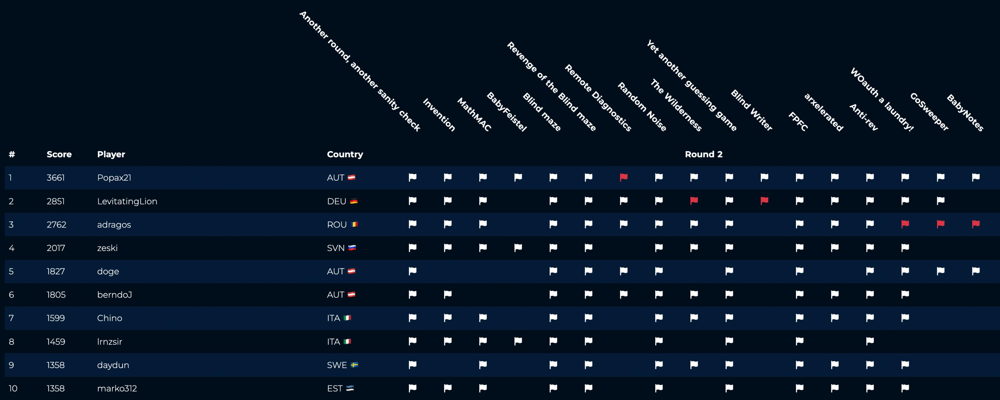
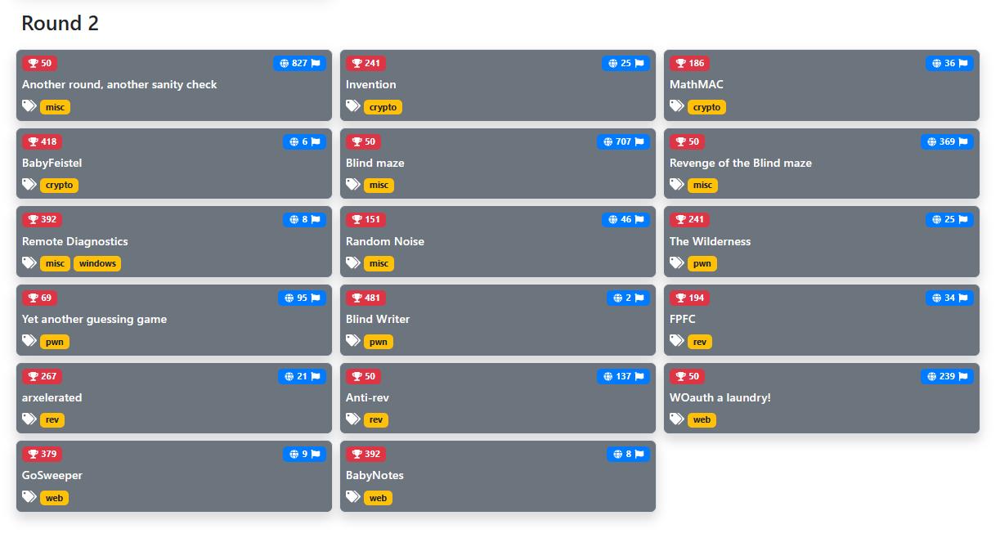

# openECSC 2024 - Round 2

## Description

Complete source codes of the challenges proposed during the second round of [openECSC 2024](https://open.ecsc2024.it) held from 22 Apr. 2024, 10:00 UTC to 28 Apr. 2024, 22:00 UTC.

- Competition organizers: [CINI Cybersecurity National Lab](https://cybersecnatlab.it/) and [Italian National Cybersecurity Agency](https://www.acn.gov.it/portale/en/home)
- Challenges managers: Giulia Martino <@Giulia> and Matteo Rossi <@mr96>
- Platform manager: Gianluca Altomani <@devgianlu>
- Infrastructure manager: Giovanni Minotti <@giotino>
- Authors of the challenges: see the table below

| Category | Title                               | Author                                                        | Dynamic            | Type  | Url                                            | Port  | Solves |
| :------- | :---------------------------------- | :------------------------------------------------------------ | :----------------: | ----: | ---------------------------------------------: | ----: | -----: |
| crypto   | [Invention](crypto01)               | Lorenzo Demeio <@Devrar>                                      | :heavy_check_mark: | tcp   | invention.challs.open.ecsc2024.it              | 38011 |     25 |
| crypto   | [MathMAC](crypto02)                 | Riccardo Zanotto <@Drago>                                     | :heavy_check_mark: | tcp   | mathmac.challs.open.ecsc2024.it                | 38013 |     36 |
| crypto   | [BabyFeistel](crypto03)             | Matteo Rossi <@mr96>                                          | :heavy_check_mark: | tcp   | babyfeistel.challs.open.ecsc2024.it            | 38017 |      5 |
| misc     | [Blind maze](misc01)                | Giovanni Minotti <@giotino>                                   | :heavy_check_mark: | http  | blindmaze.challs.open.ecsc2024.it              | 80    |    707 |
| misc     | [Remote Diagnostics](misc02)        | Oliver Lyak <@ly4k>                                           | :heavy_check_mark: | http  | remotediagnostics.challs.open.ecsc2024.it      | 80    |      8 |
| misc     | [Random Noise](misc03)              | Aleandro Prudenzano <@drw0if>                                 | :x:                |       |                                                |       |     46 |
| misc     | [Revenge of the Blind maze](misc04) | Giovanni Minotti <@giotino>                                   | :heavy_check_mark: | http  | blindmazerevenge.challs.open.ecsc2024.it       | 80    |    369 |
| pwn      | [The Wilderness](pwn01)             | Giulia Martino <@Giulia>, Oliver Lyak <@ly4k>                 | :heavy_check_mark: | tcp   | thewilderness.challs.open.ecsc2024.it          | 38012 |     25 |
| pwn      | [Yet another guessing game](pwn02)  | Giulia Martino <@Giulia>                                      | :heavy_check_mark: | tcp   | yetanotherguessinggame.challs.open.ecsc2024.it | 38010 |     95 |
| pwn      | [Blind Writer](pwn03)               | Nalin Dhingra <@Lotus>                                        | :heavy_check_mark: | tcp   | blindwriter.challs.open.ecsc2024.it            | 38003 |      2 |
| rev      | [FPFC](rev01)                       | Alberto Carboneri <@Alberto247>                               | :heavy_check_mark: | tcp   | fpfc.challs.open.ecsc2024.it                   | 38015 |     34 |
| rev      | [arxelerated](rev02)                | Andrea Raineri <@Rising>                                      | :x:                |       |                                                |       |     21 |
| rev      | [Anti-rev](rev03)                   | Lorenzo Catoni <@lorenzcat>                                   | :x:                |       |                                                |       |    137 |
| web      | [WOauth a laundry!](web01)          | Vittorio Mignini <@M1gnus>, Simone Cimarelli <@Aquilairreale> | :heavy_check_mark: | http  | woauthalaundry.challs.open.ecsc2024.it         | 80    |    239 |
| web      | [GoSweeper](web02)                  | Stefano Alberto <@Xato>                                       | :heavy_check_mark: | http  | gosweeper.challs.open.ecsc2024.it              | 443   |      9 |
| web      | [BabyNotes](web03)                  | Riccardo Bonafede <@bonaff>, Stefano Alberto <@xatophi>       | :heavy_check_mark: | http  | babynotes.challs.open.ecsc2024.it              | 443   |      8 |

## CTF Data

- [challenges.json](data/challenges.json): JSON file with the list of challenges
- [scoreboard-list.json](data/scoreboard-list.json): JSON file with the scoreboard in list format

## Scoreboard (top 10)

## Solves

