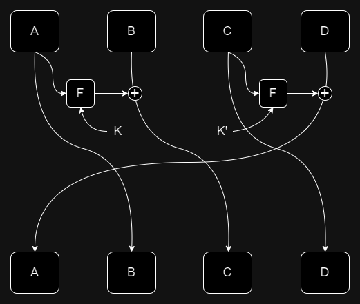

# openECSC 2024 - Round 2

## [crypto] BabyFeistel (5 solves)

I was told that we have [too much crypto](https://eprint.iacr.org/2019/1492.pdf) nowadays, so I tried to stay as low as possible with the number of rounds. Will this be enough?

`nc babyfeistel.challs.open.ecsc2024.it 38017`

Author: Matteo Rossi <@mr96>

## Overview

The challenge provides us the implementation of a custom block cipher. It is instantiated with a 16 bytes long key (taken from `os.urandom`), and the only operation that we can do is asking for the encryptions of chosen plaintexts under the same, random, key. Our final objective is to recover that key.

## Solution

The cipher is a generalized Feistel network with the structure depicted in the figure. Every word in the cipher is 8 bytes long, which means that plaintexts and ciphertexts are 32 bytes long, while keys are 16 bytes long.



The round function, `F`, is just an application of two alternated S-Boxes (both 8 bits to 8 bits) to the XOR of the input and the round key, followed by the permutation described by the matrix `perm`.

The key schedule is interesting: `F` takes as input 8 bytes of key, so the master key is splitted in 2 parts and used for the first 2 applications of `F`. Then, the `sha256` of the key is computed and the first 16 bytes are used as the key for the next round. The process is iterated to fullfill the number of rounds. 

The structure of the key schedule gives us a big hint: our key recovery must be in the first round to reconstruct the original key, since we can't invert the `sha256` in the key schedule.

### Creating a distinguisher
As most of key recovery attacks, we start with a distinguisher. Our goal is to build a distinguisher that goes "as far as possible" (in terms of rounds), then prepend/append the remaining rounds, start guessing key bytes and verify them through the distinguisher. The proposed distinguisher is based on the square attack.

In the following we will use plaintext structures of 256 elements each, i.e., sets of 256 plaintexts with 32 byts each.

We will refer with:
- `C` to a constant byte (that does not change among the elements of the set)
- `A` to an active byte (that takes all the values from 0 to 255 included, exactly one time)
- `B` to a balanced byte (that takes values that are not controlled by us/are random, but of which the overall XOR is 0)
- `?` to an unknown byte (again, not controlled/random)

We start with a set of 256 plaintexts of the form:
`CCCCCCCC ACCCCCCC CCCCCCCC CCCCCCCC`

This means that the `C` bytes are fixed (for example, to 0), while the `A` byte takes all the values from 0 to 255. Notice that "activating" a byte in the second or fourth block makes more sense than in the first or third one, since they will pass inside the `F` function at the second round (while the other two will do it at the first), and so their structure is "destroyed" later, giving us the possibility to reach more rounds.

Since the application of `F` maps constant bytes to constant bytes, at the end of the first round our output set will look like this:
`CCCCCCCC CCCCCCCC ACCCCCCC CCCCCCCC`

Applying again the rounds function to go from the output of the first round to the one of the second round, we have that `F` applied to the third block results in a block of the form `AACCACAC` (as bytes corresponding to the ones in the first column of `perm` are XOR-ed with exactly one active byte, and so they become active), while the other blocks are just shifted.

Going forward with the number of rounds, we get something like this:
```
0 CCCCCCCC ACCCCCCC CCCCCCCC CCCCCCCC
1 CCCCCCCC CCCCCCCC ACCCCCCC CCCCCCCC
2 AACCACAC CCCCCCCC CCCCCCCC ACCCCCCC
3 ACCCCCCC AACCACAC BBBBBBAB CCCCCCCC
4 ???????? ACCCCCCC BBCCBCBC BBBBBBAB
5 BBBBBBBB ???????? ???????? BBCCBCBC
6 ???????? BBBBBBBB ???????? ????????
7 ???????? ???????? ???????? ????????
```

where line 0 is our input, and the i-th line represents the output of the i-th round. As we can see, we can't say anything (with this method) about the output of the 7th round, but we have an entirely balanced block at the end of the 6th.

This is confirmed by the following code that gives us, for any fixed key, a full-zero block on the second output block.

```py
key = os.urandom(16)
base_text = bytearray(32)
res = bytearray(32)
enc = BabyFeistel(key, 6)
texts = []
for i in range(256):
    base_text[8] = i
    tmp = enc.encrypt(base_text)
    res = xor(res, tmp)
print(res.hex())

# 0ca7e558873e35000000000000000000c2ff3005df508dd019db663927d9425a
```

### Extending to a key recovery
Since we want to recover the first round key, it makes sense to prepend a round. 

This means that we want to "shift" our distinguisher forward by one round, guess a key and reach our plaintext structure described in the section before at the end of round 1, to basically have something that looks like the following. With this we will be able to use the distinguisher at the end of the 7th round to "evaluate" key candidates.

```
0 XXXXXXXX XXXXXXXX XXXXXXXX XXXXXXXX
1 CCCCCCCC ACCCCCCC CCCCCCCC CCCCCCCC
2 CCCCCCCC CCCCCCCC ACCCCCCC CCCCCCCC
3 AACCACAC CCCCCCCC CCCCCCCC ACCCCCCC
4 ACCCCCCC AACCACAC BBBBBBAB CCCCCCCC
5 ???????? ACCCCCCC BBCCBCBC BBBBBBAB
6 BBBBBBBB ???????? ???????? BBCCBCBC
7 ???????? BBBBBBBB ???????? ????????
```

How do we choose the input? Third and fourth blocks must be constant. Second block at the end of round 1 is the first block of the input, so it must have the form `ACCCCCCC`, while the second block must de-activate the bytes that are activated by the application of `F` on the first block.  

The application of `F` to an input block of the form `iCCCCCCC` results in a block of the form `SSCCSCSC` where `S = S1[i ^ key[0]]`. So, in order to deactivate it, we simply need to put `SSCCSCSC` as the first block and guess `key[0]`.  

If `key[0]` is correct we will observe a flow like this:
```
0 ACCCCCCC SSCCSCSC CCCCCCCC CCCCCCCC
1 CCCCCCCC ACCCCCCC CCCCCCCC CCCCCCCC
2 CCCCCCCC CCCCCCCC ACCCCCCC CCCCCCCC
3 AACCACAC CCCCCCCC CCCCCCCC ACCCCCCC
4 ACCCCCCC AACCACAC BBBBBBAB CCCCCCCC
5 ???????? ACCCCCCC BBCCBCBC BBBBBBAB
6 BBBBBBBB ???????? ???????? BBCCBCBC
7 ???????? BBBBBBBB ???????? ????????
```

otherwise we will see something like this:
```
0 ACCCCCCC SSCCSCSC CCCCCCCC CCCCCCCC
1 CCCCCCCC ACCCCCCC BBCCBCBC CCCCCCCC
2 BBBBBBBB CCCCCCCC ACCCCCCC BBCCBCBC
3 BBCCBCBC BBBBBBBB BBBBBBBB ACCCCCCC
4 BBBBBBBB BBCCBCBC ???????? BBBBBBBB
5 ???????? BBBBBBBB ??BB?B?B ????????
6 ???????? ???????? ???????? ??BB?B?B
7 ???????? ???????? ???????? ????????
```

So the square property is preserved if and only if the key guess is correct (with probability almost one). We use this property to distinguish among correct and wrong key bytes. We repeat this process on the other byte positions of block 2 to recover the first subkey, and on block 4 to recover the second one. Joining them together we recover the master key.  

Full automatic exploit is given below.

## Exploit

```py
#!/usr/bin/env python3

import os
from pwn import remote

HOST = os.environ.get("HOST", "babyfeistel.challs.open.ecsc2024.it")
PORT = int(os.environ.get("PORT", 38017))

S1 = [
    0x63, 0x7c, 0x77, 0x7b, 0xf2, 0x6b, 0x6f, 0xc5, 0x30, 0x1, 0x67, 0x2b, 0xfe, 0xd7, 0xab, 0x76,
    0xca, 0x82, 0xc9, 0x7d, 0xfa, 0x59, 0x47, 0xf0, 0xad, 0xd4, 0xa2, 0xaf, 0x9c, 0xa4, 0x72, 0xc0,
    0xb7, 0xfd, 0x93, 0x26, 0x36, 0x3f, 0xf7, 0xcc, 0x34, 0xa5, 0xe5, 0xf1, 0x71, 0xd8, 0x31, 0x15,
    0x4, 0xc7, 0x23, 0xc3, 0x18, 0x96, 0x5, 0x9a, 0x7, 0x12, 0x80, 0xe2, 0xeb, 0x27, 0xb2, 0x75,
    0x9, 0x83, 0x2c, 0x1a, 0x1b, 0x6e, 0x5a, 0xa0, 0x52, 0x3b, 0xd6, 0xb3, 0x29, 0xe3, 0x2f, 0x84,
    0x53, 0xd1, 0x0, 0xed, 0x20, 0xfc, 0xb1, 0x5b, 0x6a, 0xcb, 0xbe, 0x39, 0x4a, 0x4c, 0x58, 0xcf,
    0xd0, 0xef, 0xaa, 0xfb, 0x43, 0x4d, 0x33, 0x85, 0x45, 0xf9, 0x2, 0x7f, 0x50, 0x3c, 0x9f, 0xa8,
    0x51, 0xa3, 0x40, 0x8f, 0x92, 0x9d, 0x38, 0xf5, 0xbc, 0xb6, 0xda, 0x21, 0x10, 0xff, 0xf3, 0xd2,
    0xcd, 0xc, 0x13, 0xec, 0x5f, 0x97, 0x44, 0x17, 0xc4, 0xa7, 0x7e, 0x3d, 0x64, 0x5d, 0x19, 0x73,
    0x60, 0x81, 0x4f, 0xdc, 0x22, 0x2a, 0x90, 0x88, 0x46, 0xee, 0xb8, 0x14, 0xde, 0x5e, 0xb, 0xdb,
    0xe0, 0x32, 0x3a, 0xa, 0x49, 0x6, 0x24, 0x5c, 0xc2, 0xd3, 0xac, 0x62, 0x91, 0x95, 0xe4, 0x79,
    0xe7, 0xc8, 0x37, 0x6d, 0x8d, 0xd5, 0x4e, 0xa9, 0x6c, 0x56, 0xf4, 0xea, 0x65, 0x7a, 0xae, 0x8,
    0xba, 0x78, 0x25, 0x2e, 0x1c, 0xa6, 0xb4, 0xc6, 0xe8, 0xdd, 0x74, 0x1f, 0x4b, 0xbd, 0x8b, 0x8a,
    0x70, 0x3e, 0xb5, 0x66, 0x48, 0x3, 0xf6, 0xe, 0x61, 0x35, 0x57, 0xb9, 0x86, 0xc1, 0x1d, 0x9e,
    0xe1, 0xf8, 0x98, 0x11, 0x69, 0xd9, 0x8e, 0x94, 0x9b, 0x1e, 0x87, 0xe9, 0xce, 0x55, 0x28, 0xdf,
    0x8c, 0xa1, 0x89, 0xd, 0xbf, 0xe6, 0x42, 0x68, 0x41, 0x99, 0x2d, 0xf, 0xb0, 0x54, 0xbb, 0x16
]

S2 = [
    0x52, 0x9, 0x6a, 0xd5, 0x30, 0x36, 0xa5, 0x38, 0xbf, 0x40, 0xa3, 0x9e, 0x81, 0xf3, 0xd7, 0xfb,
    0x7c, 0xe3, 0x39, 0x82, 0x9b, 0x2f, 0xff, 0x87, 0x34, 0x8e, 0x43, 0x44, 0xc4, 0xde, 0xe9, 0xcb,
    0x54, 0x7b, 0x94, 0x32, 0xa6, 0xc2, 0x23, 0x3d, 0xee, 0x4c, 0x95, 0xb, 0x42, 0xfa, 0xc3, 0x4e,
    0x8, 0x2e, 0xa1, 0x66, 0x28, 0xd9, 0x24, 0xb2, 0x76, 0x5b, 0xa2, 0x49, 0x6d, 0x8b, 0xd1, 0x25,
    0x72, 0xf8, 0xf6, 0x64, 0x86, 0x68, 0x98, 0x16, 0xd4, 0xa4, 0x5c, 0xcc, 0x5d, 0x65, 0xb6, 0x92,
    0x6c, 0x70, 0x48, 0x50, 0xfd, 0xed, 0xb9, 0xda, 0x5e, 0x15, 0x46, 0x57, 0xa7, 0x8d, 0x9d, 0x84,
    0x90, 0xd8, 0xab, 0x0, 0x8c, 0xbc, 0xd3, 0xa, 0xf7, 0xe4, 0x58, 0x5, 0xb8, 0xb3, 0x45, 0x6,
    0xd0, 0x2c, 0x1e, 0x8f, 0xca, 0x3f, 0xf, 0x2, 0xc1, 0xaf, 0xbd, 0x3, 0x1, 0x13, 0x8a, 0x6b,
    0x3a, 0x91, 0x11, 0x41, 0x4f, 0x67, 0xdc, 0xea, 0x97, 0xf2, 0xcf, 0xce, 0xf0, 0xb4, 0xe6, 0x73,
    0x96, 0xac, 0x74, 0x22, 0xe7, 0xad, 0x35, 0x85, 0xe2, 0xf9, 0x37, 0xe8, 0x1c, 0x75, 0xdf, 0x6e,
    0x47, 0xf1, 0x1a, 0x71, 0x1d, 0x29, 0xc5, 0x89, 0x6f, 0xb7, 0x62, 0xe, 0xaa, 0x18, 0xbe, 0x1b,
    0xfc, 0x56, 0x3e, 0x4b, 0xc6, 0xd2, 0x79, 0x20, 0x9a, 0xdb, 0xc0, 0xfe, 0x78, 0xcd, 0x5a, 0xf4,
    0x1f, 0xdd, 0xa8, 0x33, 0x88, 0x7, 0xc7, 0x31, 0xb1, 0x12, 0x10, 0x59, 0x27, 0x80, 0xec, 0x5f,
    0x60, 0x51, 0x7f, 0xa9, 0x19, 0xb5, 0x4a, 0xd, 0x2d, 0xe5, 0x7a, 0x9f, 0x93, 0xc9, 0x9c, 0xef,
    0xa0, 0xe0, 0x3b, 0x4d, 0xae, 0x2a, 0xf5, 0xb0, 0xc8, 0xeb, 0xbb, 0x3c, 0x83, 0x53, 0x99, 0x61,
    0x17, 0x2b, 0x4, 0x7e, 0xba, 0x77, 0xd6, 0x26, 0xe1, 0x69, 0x14, 0x63, 0x55, 0x21, 0xc, 0x7d
]

perm = [
    1, 0, 0, 1, 1, 1, 0, 1,
    1, 1, 0, 0, 1, 1, 1, 0,
    0, 1, 1, 0, 1, 1, 1, 0,
    0, 1, 1, 1, 1, 0, 1, 0,
    1, 0, 1, 1, 0, 1, 1, 0,
    0, 1, 0, 1, 1, 0, 1, 1,
    1, 0, 1, 1, 0, 1, 0, 1,
    0, 1, 0, 1, 0, 1, 1, 1
]


def xor(a, b):
    return bytes([x ^ y for x, y in zip(a, b)])


p = remote(HOST, PORT)
key = bytearray(16)

for i in range(16):
    print(f"Recovering byte {i}")
    base_text = bytearray(32)
    if i < 8:
        leftpos = 0
    else:
        leftpos = 16

    if i % 2 == 0:
        S = S1
    else:
        S = S2

    for ki_guess in range(256):
        payload = ""
        res = bytearray(32)

        for active_byte_value in range(256):
            base_text[leftpos + (i % 8)] = active_byte_value
            for pos in range(8):
                if perm[8 * pos + (i % 8)]:
                    base_text[8 + leftpos + pos] = S[active_byte_value ^ ki_guess]
            payload += base_text.hex()
        p.recvuntil(b"> ")
        p.sendline(b"1")
        p.recvuntil(b": ")
        p.sendline(payload.encode())
        enc_data = bytes.fromhex(p.recvline().strip().decode()[:2 * 256 * 32])

        for j in range(256):
            res = xor(res, enc_data[32 * j:32 * j + 32])
        if '00' * 8 in res.hex():
            print(f"Found key byte {hex(ki_guess)}")
            key[i] = ki_guess
            break

p.recvuntil(b"> ")
p.sendline(b"2")
p.recvuntil(b": ")
p.sendline(key.hex().encode())
print(p.recvline())
```