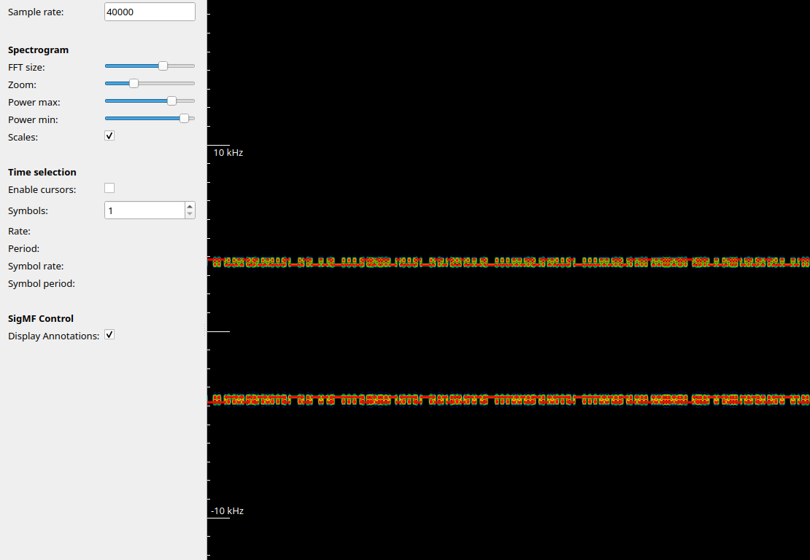
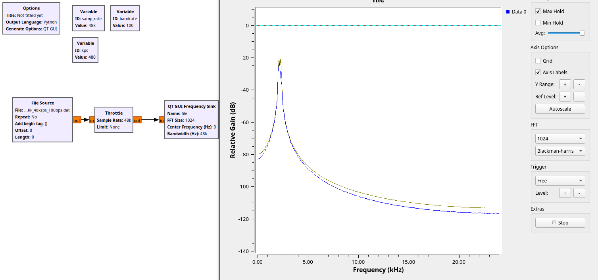
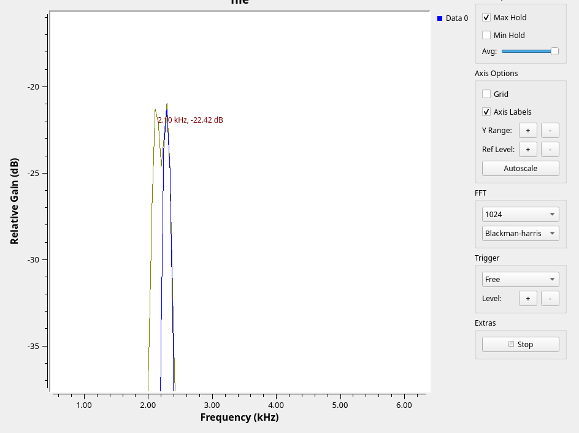
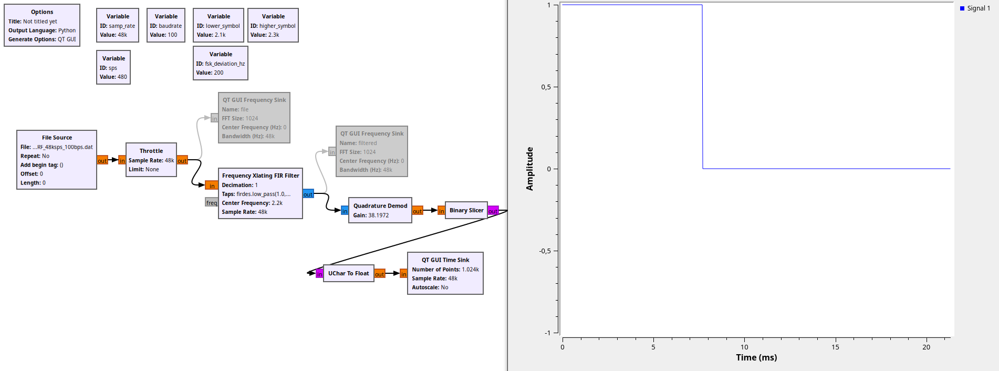
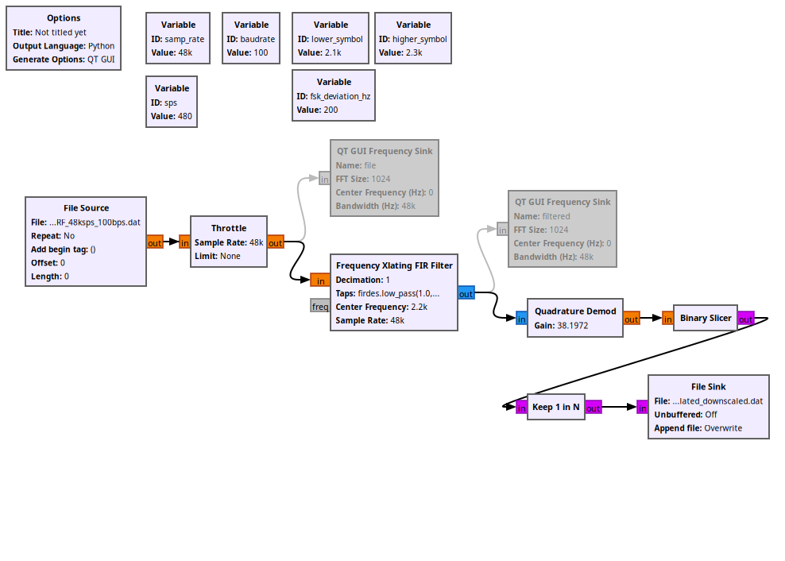

# openECSC 2024 - Round 2

## [misc] Random Noise (46 solves)

While listening to my favourite radio station, the wonderful music has been interrupted by this weird radio signal.
We only know that the embedded message is generated using this driver:

```python
def generate_packet(sequence_no, data):
    packet = b'\x13\x37' + b'\xbe\xef' # SRC and DST
    packet += sequence_no.to_bytes(1, 'big') # sequence number
    packet += len(data).to_bytes(1, 'big') + data.encode() # len + data
    packet += zlib.crc32(packet).to_bytes(4, 'big') # crc
    return b'\xaa\xaa' + packet
```

Author: Aleandro Prudenzano <@drw0if>

## Solution

We are given a RF dump, whose name suggests 48ksps (48000 samples per seconds) as the sample rate and 100bps (100 baud per seconds) as the baudrate.  

The sample rate defines the number of samples of a signal captured per second. In the natural world, signals exist as continuous waves without discrete sampling, but in the digital world, we must sample these signals at intervals of `1/sample_rate` seconds to convert them into a digital format. The baudrate will be discussed later.

Here's an example of how sampling works, the red line is the real world signal, the black one is the sampled signal:

> Image source: [https://commons.wikimedia.org/wiki/File:Pcm.svg](https://commons.wikimedia.org/wiki/File:Pcm.svg)  


The file name also contains `.float`, so we can deduce that the samples are stored as floating point numbers. This is a common way to store samples in [`GNURadio`](https://www.gnuradio.org/); another common format is `.complex`.

We can start to analyze the the signal using [`inspectrum`](https://github.com/miek/inspectrum).



The signal is both in lower side band and in upper side band. If we focus on one of them, we can see the carrier signal is jumping around a fixed number of different frequencies. 

Modulation is the process of embedding a signal with low frequency (called modulating signal) into a signal with higher frequency (called carrier signal).
This is important in order to build a signal which can be easily transmitted over the physical carrier, in our case using radio waves.
There are three main types of modulation:
- amplitude modulation: the carrier amplitude is modified according to the modulating signal
- phase modulation: the carrier phase is modified according to the modulating signal
- frequency modulation: the carrier frequency is modified according to the modulating signal. In this case we are working with this kind of modulation


Given that, we can guess that we are talking about FSK (Frequency Shift Keying) and since the frequencies are 2 we are talking about FSK with 2 symbols.

Let's confirm some of our guess using GNURadio:



The GNURadio flowgraph displays the spectrum obtained with FFT ([Fast Fourier Transform](https://en.wikipedia.org/wiki/Fast_Fourier_transform)) in order to confirm that we have a signal which jumps around two frequencies. By zooming in, we can find out what those frequencies are:



The peak frequencies seem to be:
- 2100 Hz
- 2300 Hz

and from them we can calculate:
- `FSK deviation`: 2300-2100 = 200 Hz
- `Center frequency`: (2300+2100)/2 = 2200Hz

FSK is a technique to modulate a digital signal into an analog carrier where the frequency of the carrier signal is changed according to the digital information in order to transmit the data.

> Image source: [https://en.wikipedia.org/wiki/File:Fsk.svg](https://en.wikipedia.org/wiki/File:Fsk.svg)


In order to [demodulate FSK](https://wiki.gnuradio.org/index.php/Simulation_example:_FSK), we use a generic low pass filter described as a _FIR filter_ with the default configuration and a low pass filter as _taps_: `firdes.low_pass(1.0,samp_rate,1000,400)` (barely copying from the GNURadio tutorial linked above).

Once the signal has been centered around the 0 frequency we can use the `quadrature demod` block ([reference](https://wiki.gnuradio.org/index.php/Quadrature_Demod)) to extract the two symbols, then a `binary slicer` to convert negative and positive values to binary values 0 and 1:



Now that we've discussed the bits, let's examine the baud rate. The baud rate indicates the number of symbols transmitted per second. By using this rate along with the sample rate, we can determine the number of samples captured for each symbol, calculated as `sample_rate/baudrate`. In our example, there are `480` samples for each symbol. Therefore, we must downscale the number of samples by this factor. To achieve this, we can use a `keep 1 in N` block with `N` set to `480`.

We can then save the bits to a file in order to analyze them and work with the digital data.



We can finally take the bits and reconstruct the packets because the challenge description tells us how each frame is built:
```
- 2 byte to sync (0xAAAA)
- 2 byte src address
- 2 byte dest address
- 1 sequence number
- 1 byte length
- [lenght] bytes
- 4 byte crc32
```

## Code
```python
data = "HEX DATA"

packets = []

c = 0
while c < len(data):
    magic = data[c : c + 4]
    if magic != "aaaa":
        c += 1
        continue

    src = data[c + 4 : c + 8]
    dest = data[c + 8 : c + 12]
    seq = data[c + 12 : c + 14]
    length = data[c + 14 : c + 16]
    packet_data = data[c + 16 : c + 16 + int(length, 16) * 2]
    packet = data[c : c + 16 + int(length, 16) * 2]
    crc = data[c + 16 + int(length, 16) * 2 : c + 16 + int(length, 16) * 2 + 8]
    packet_for_crc = bytes.fromhex(src + dest + seq + length + packet_data)
    computed_crc = zlib.crc32(packet_for_crc).to_bytes(4, "big").hex()

    # validate CRC
    if crc != computed_crc:
        c += 1
        continue
    
    c += 16 + int(length, 16) * 2

    packets.append(
        {
            "seq": seq,
            "data": packet_data,
        }
    )

sorted_packets = sorted(packets, key=lambda x: x["seq"])
for p in sorted_packets:
    print(bytes.fromhex(p["data"]).decode("utf-8"), end="")
print()
```