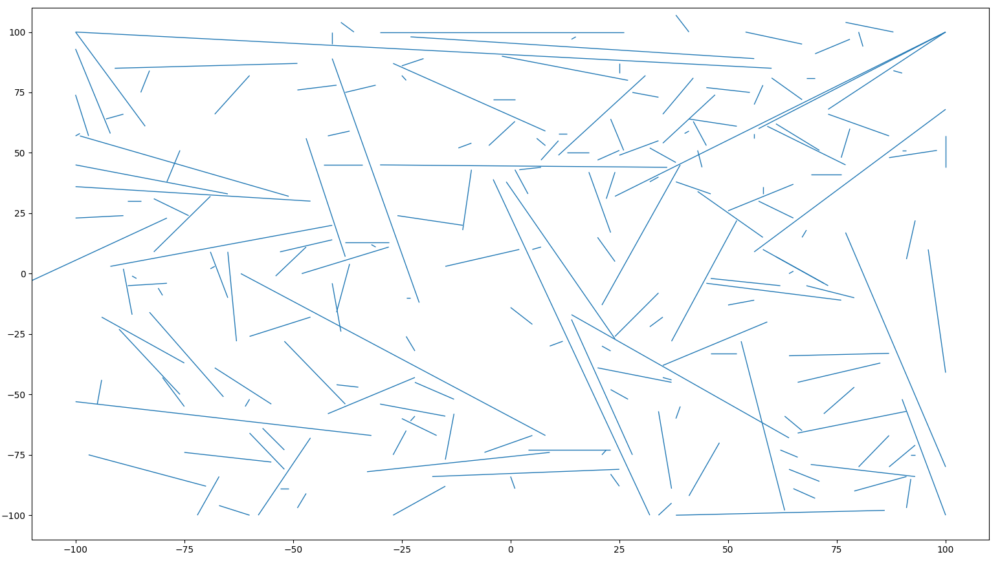
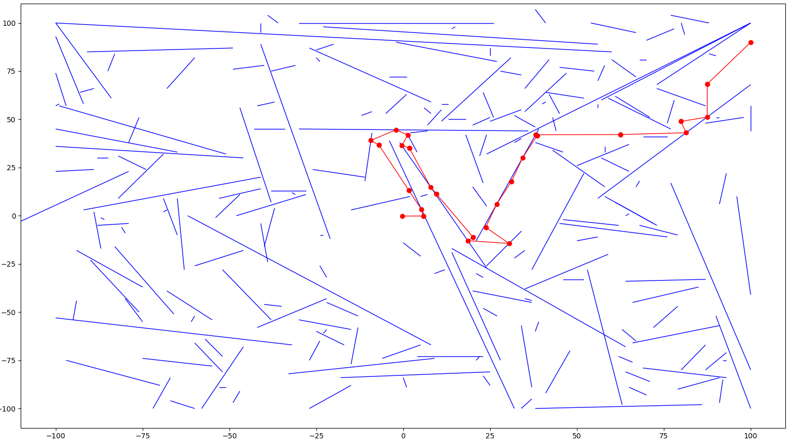

# openECSC 2024 - Round 2

## [rev] FPFC (34 solves)

Behold the newest technology! Our floating point flag checker will surely block all hackers from discovering our flags!

`nc fpfc.challs.open.ecsc2024.it 38015`

Author: Alberto Carboneri <@Alberto247>

## Overview

FPFC is a rev challenge implementing a "flag" checker making use of several floating point and trigonometric operations.
The binary is stripped, removing all symbols to harden it against reverse engineering.

## Solution

### Code analysis

A quick glance of the code in binary ninja or similar tool allows to quickly recognize well-known patterns of similar reverse challenges. The user input is a string, its length is verified to be a multiple of four, and is then splitted in tokens.
Then, `sub_12da` is called, using such tokens to manipulate global variables.
Finally, two floating point comparisons are made in the program `main`, checking two global variables against the value zero, returning the flag if both conditions are met. We will call those variables `player` from now on.

### Input parsing

Function `sub_1349` parses the user's input. For each 4-byte token extracted it is further splitted into two halfwords, each of whose is the converted into a float number.
Notably, the first float is constrained between `0` and `2*pi`, while the second float is constrained between `0` and `25`. This can be interpreted as a point in polar coordinates, with a distance of maximum `25` from the origin.

### Segments and walls

The other subroutines called from main are little interesting up until `sub_1be7`, where our input is used again.
For each pair of floating point values obtained, those are parsed into their horizontal and vertical components, and summed to the global variable `player`. We will call this new value `updated_player`. Then, the obtained values are passed to `sub_16fb`, where a for loop is used, looping over a global variable composed of pairs of pairs of integer values. 
Those are then used, in `sub_14f8`, as pair of points in the plane, and checked for intersection between the obtained segment and the segment formed by the `updated_player` pair, and the original `player` pair.
To understand what is actually happening, we can try plotting those values in the global variable as segments, using matplotlib.



This seems to be a sort of labirinth, with the player starting at point (100, 90).
We just need to understand what our input is causing, and how walls influence the movement.
Subrouting `sub_16fb` actually handles most of the complexity. For each player movement, it first checks whether it collides with a segment, then finds the closest collision, stops the movement at the collision point, and then, through some slightly over-complicated trigonometric calculation, it calculates the remaining movement and reflects the angle emulating a bounce on the segment.
This behaves sort of like a "minigolf" game, allowing us to simulate the whole physics in python and calculating a solution path.
One possible solution is shown below.



Sending the solution to the server provides the flag.

## Exploit

```python
#!/usr/bin/env python3

from pwn import *

HOST = os.environ.get("HOST", "fpfc.challs.open.ecsc2024.it")
PORT = int(os.environ.get("PORT", 38015))

with remote(HOST, PORT) as io:
    io.sendline(b'RIZZTMZZUMZZNAZZSBZZSBZZWHZZIIZZIIZZKVZZUYZZUYOONAGG')
    io.recvuntil(b'flag: ')
    print(io.recvline(False).decode())
```

## Flag

`openECSC{4lm0s7_l1k3_p1ng_pwng_0n_th3_w4llz_97bf0522}`
