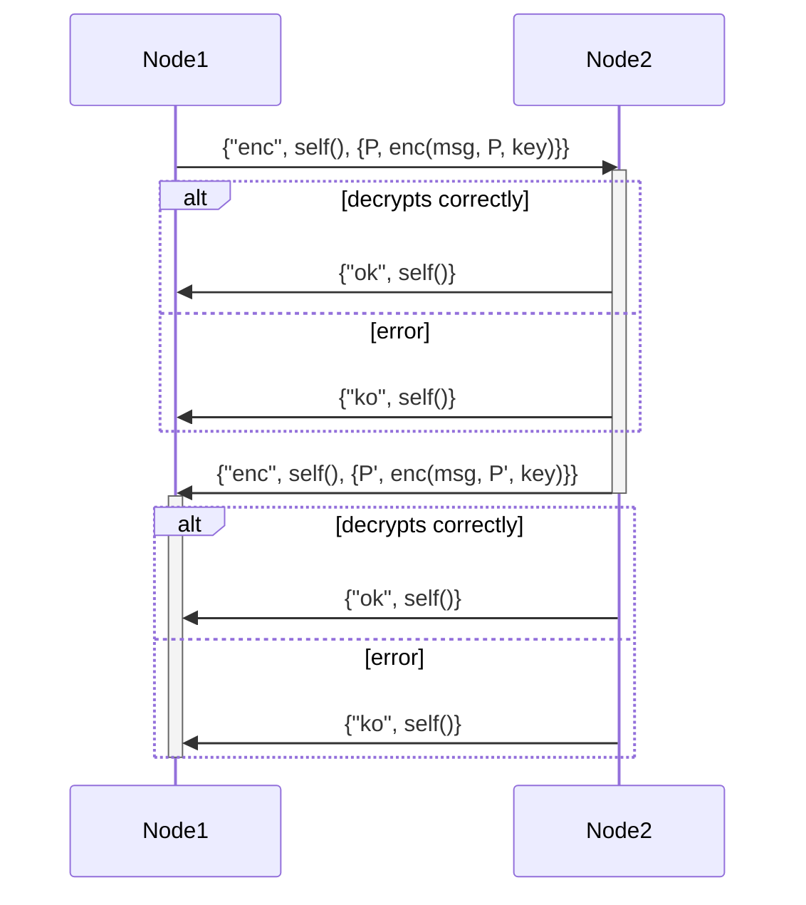
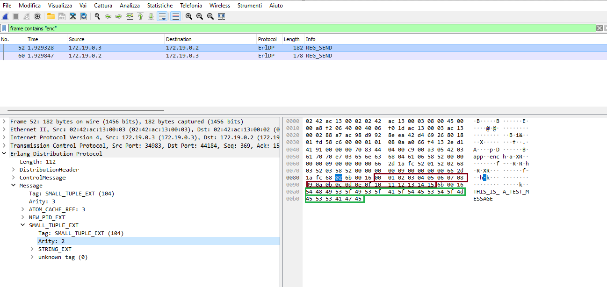

# openECSC 2024 - Round 3

## [misc] eotp (56 solves)

I have read something about Erlang/OTP, i guess that's when you encrypt with xor right?

Author: Lorenzo Catoni <@lorenzcat>

## Solution

Two erlang nodes exchange the following messages:



Where the `enc` encription function permutes the message `msg` with the permutation `P` and then performs a xor with the `key`. The permutation `P` is a list of integers that represents the order of the characters in the message. The permutation `P'` generated by the second node is `P` rotated by 1 position to the left: `[P0, P1, P2, ..., Pn] -> [P1, P2, ..., Pn, P0]`.

The erlang network protocol encodes data as Type + Length + Value (BER encoding). Wireshark can partially decode the messages but fails for some fields. The easiest way to understand how the data is organized in the network protocol is to patch `node.erl` to use an all zeroes key and identity permutation (so that the encryption does not change the message) and look for the messages in the network traffic. Like this:

```diff
diff --git a/src/gen/node.erl b/src/gen/node.erl
index c3aabf6..2ddf93f 100644
--- a/src/gen/node.erl
+++ b/src/gen/node.erl
@@ -78,7 +78,7 @@ start() ->
        Other = list_to_atom(os:getenv("OTHER")),
        Init = os:getenv("INIT"),
        Msg = os:getenv("MESSAGE"),
-       Key = os:getenv("KEY"),
+       Key = [0||_<-Msg],

        register(app, self()),

@@ -86,7 +86,7 @@ start() ->
        timer:sleep(1000),
        true = net_kernel:connect_node(Other),

-       P = shf(seq(len(Msg))),
+       P = seq(len(Msg)),
        ok = case Init of
                false -> listen({app, Other}, Msg, Key, false);
                _ -> speak({app, Other}, Msg, Key, P, false)
```

And in the capture file, we can see the message (clearly in red the permutation vector and in green the message):


The permutation vector and the encrypted message can be extracted like this:

```python
from scapy.all import rdpcap, TCP
from collections import namedtuple

pcap = rdpcap('path/to/pcap')

# filter for frames containing enc
pcap = [p for p in pcap if b'enc' in bytes(p)]
assert len(pcap) == 2

# marker for tuple of two elements (tuple=68, len=02)
tuple_of_two = bytes.fromhex("6802")

# erlang data is encoded as TLV
TLV = namedtuple('TLV', ['t', 'l', 'v'])
parsed = []
for p in pcap:
 tlv_bytes = p[TCP].load.split(tuple_of_two)[-1]

 tlvs = []
 for i in range(2):
  t = tlv_bytes[:2] # tag
  tlv_bytes = tlv_bytes[2:]
  l = tlv_bytes[0] # len
  tlv_bytes = tlv_bytes[1:]
  v = tlv_bytes[:l] # val
  tlv_bytes = tlv_bytes[l:]
  # print(t,l,v)
  tlvs.append(TLV(t,l,v))
 
 parsed.append(tlvs)
 
p0 = parsed[0][0].v
c0 = parsed[0][1].v

p1 = parsed[1][0].v
c1 = parsed[1][1].v

# check that p1 is a rotation of p0
assert p1[:-1] == p0[1:] and p1[-1] == p0[0] and sorted(p0) == list(range(len(p0)))

print(parsed)
```

To decrypt the message, we observe that we have two expressions (x is the message vector, p is the permutation vector, and k is the key):

```text
x[p0] ^ k0 = c0
x[p1] ^ k1 = c1
...
x[pn] ^ kn = cn
```

and (recalling that P' is P rotated by 1 position):

```text
x[p1] ^ k0 = d0
x[p2] ^ k1 = d1
...
x[pn] ^ k{n-1} = d{n-1}
x[0] ^ kn = dn
```

if we xor first row of the first expression with first row of the second etc we get (the key cancels out):

```text
x[p0] ^ x[p1] = c0 ^ d0
x[p1] ^ x[p2] = c1 ^ d1
...
x[pi] ^ x[p{i+1}] = ci ^ di
...
x[pn] ^ x[p0] = cn ^ dn
```

since we know the p vector and we know `x[n] = '}'` we can start from the row where `pi = n` and solve for `x[p{i+1}]` and so on, like so:

```python
L = len(p0)
x = [None] * L

x[L-1] = ord('}')

i = p0.index(L-1)

for _ in range(L):
 x[p0[(i+1) % L]] = c[i] ^ x[p0[i]]
 i = (i+1) % L

print(bytes(x).decode())
```
