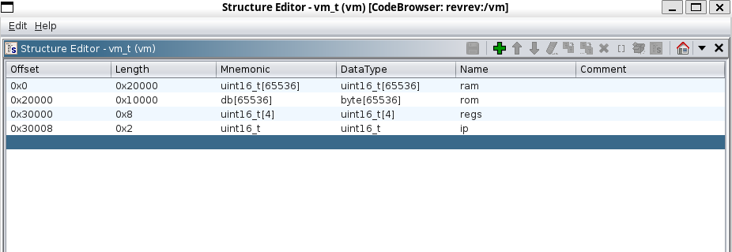

# openECSC 2024 - Round 3

## [rev] revrev (48 solves)

It's your lucky day you get two binaries for the price of one!

Author: Lorenzo Catoni <@lorenzcat>

## Solution

The binary is a custom vm, when run it asks for a file to read, then it reads the file and uses it as the vm program. Then it asks for a string (the flag) and copies into the vm memory. Before exiting the binary prints "Correct" or "Wrong" depending on the result of the vm program.
The main function calls the function `vm_exec` that has a while true and a switch case, each case is one of the vm instructions. The vm structure is the following:



From the disassembly we can see that each instruction is one byte, the first 4 bits encode the operation, the following two bits encode one of the registers and the last two bits encode the other register. Some operations use also a 16 bit immediate value (2 bytes following the instruction byte).

The following table shows the operations, as well as the number of registers and if the operation has an immediate value (the meaning of reg1 is the register whose index is specified by the bits 5 and 6 of the instruction byte, and the same for reg2 with the bits 7 and 8 of the instruction byte):

| Opcode | Num Regs | Has Imm | Description |
|--------|----------|---------|-------------|
| 0x0    | 0        | no      | hals the execution |
| 0x1    | 1        | yes     | loads the immediate value in the reg1 |
| 0x2    | 2        | no      | loads the value at address reg2 into reg1 |
| 0x3    | 2        | no      | stores the value of reg2 at address reg1 |
| 0x4    | 2        | no      | sets reg1 = 1 if reg1 < reg2, else reg1 = 0 |
| 0x5    | 2        | no      | sets reg1 = reg1 + reg2 |
| 0x6    | 2        | no      | sets reg1 = reg1 - reg2 |
| 0x7    | 0        | yes     | stores the address of the next instruction at the address of regs[3]-1, sets ip = immediate value (CALL) |
| 0x8    | 0        | no      | sets ip = value at address regs[3], increments regs[3] (RET) |
| 0x9    | 1        | yes     | sets ip = immediate value (JUMP) |
| 0xa    | 1        | yes     | sets ip = immediate value if reg1 == 0 |
| 0xb    | 1        | yes     | sets ip = immediate value if reg1 != 0 |
| 0xc    | 1        | no      | stores at address regs[3]-1 the value of reg1 (PUSH) |
| 0xd    | 1        | no      | sets reg1 = value at address regs[3], increments regs[3] (POP) |
| 0xe    | 2        | no      | sets reg1 = reg1 & reg2 |
| 0xf    | 2        | no      | sets reg1 = ~reg2 |

We can see that three registers are general purpuse, while `regs[3]` is used as stack pointer (for that reason from now on we will call the registers: A, B, C, SP). With this information we can write a very rudimental disassembler for the vm (with also some logic to mark the targets of the CALL instructions so we can see where the functions start):

```py
import sys

# (mnemonic, number_of_args, has_immediate)
opcodes = [
    ("HALT", 0, False),
    ("LOAD", 1, True),
    ("LOAD_PTR", 1, False),
    ("STORE", 2, False),
    ("CMP_LT", 2, False),
    ("ADD", 2, False),
    ("SUB", 2, False),
    ("CALL", 0, True),
    ("RET", 0, False),
    ("JMP", 0, True),
    ("JZ", 1, True),
    ("JNZ", 1, True),
    ("PUSH", 1, False),
    ("POP", 1, False),
    ("AND", 2, False),
    ("NOT", 2, False),
]

with open(sys.argv[1], "rb") as f:
    prog = f.read()

args = ["A", "B", "C", "SP"]

i = 0
lines: dict[int, str] = {}
call_targets: set[int] = set()
while i < len(prog):
    op = prog[i]
    opcode = (op >> 4) & 0xF
    arg1 = (op >> 2) & 0x3
    arg2 = op & 0x3

    mnem, nargs, has_imm = opcodes[opcode]
    line = f"{i:04x}: {mnem}"
    line += "".join(f' {args[a]}' for a in [arg1, arg2][:nargs])
    line += f' {prog[i+1:i+3].hex() if has_imm else ""}'
    lines[i] = line

    if mnem == "CALL":
        call_targets.add(int.from_bytes(prog[i + 1 : i + 3], "big"))

    i += 3 if has_imm else 1

for addr, line in lines.items():
    if addr in call_targets:
        print(f"func_{addr:04x}:")
    print(line)
```

From the disassembly we can see:

```
0000: CALL 001b
0003: HALT 
func_0004:
0004: PUSH C 
0005: PUSH B 
0006: PUSH A 
0007: NOT B B 
0008: AND A B 
0009: POP B 
000a: POP C 
000b: NOT B B 
000c: AND B C 
000d: CALL 0014
0010: PUSH C 
0011: POP B 
0012: POP C 
0013: RET 
func_0014:
0014: PUSH B 
0015: NOT A A 
0016: NOT B B 
0017: AND A B 
0018: NOT A A 
0019: POP B 
001a: RET 
func_001b:
... very long func ...
```

So the program calls the function at `0x001b` and then halts. Two more functions are defined at `0x0004` and `0x0014`. The function at `0x0014` does `a = ~(~a & ~b)`, so it calculates the bitwise or of reg A and reg B and stores it in reg A. The function at `0x0004` does:

```text
A' = A & ~B
B' = ~A & B
A = A' | B'
```

so it calculates the bitwise xor of reg A and reg B and stores it in reg A.

The big function at `0x001b` has many expression of the form:

```text
001b: LOAD A 0009
001e: LOAD_PTR A
001f: LOAD B 0007
0022: LOAD_PTR B
0023: ADD A B
0024: LOAD B 000f
0027: LOAD_PTR B
0028: CALL 0004
002b: LOAD B 000b
002e: LOAD_PTR B
002f: ADD A B
0030: LOAD B bb78
0033: ADD A B
0034: LOAD B 0008
0037: LOAD_PTR B
0038: CALL 0004
003b: LOAD B 0008
003e: STORE B A
```

which is is computing the following pseudo code (operations are always from left to right):

```
f[8] ^= f[9] + f[7] ^ f[0xf] + f[0xb] + 0xbb78; f[8] &= 0xffFF;
```

or in general:

```text
f[i] op_i= f[j0] op_j0 f[j1] op_j1 f[j2] op_j2 f[j3] op_j3 k; f[i] &= 0xffFF;
```

The functions executes this operation many times with different indexes and constants each time. In the end it just checks all `f[i]` against hardcoded values and if they are all equal returns with 1 in the register A, else returns with 0 in the register A. (This is the exit code checked by the main function to print "Correct" or "Wrong").

Example of the check (checking if f[0] == 0xc76e):

```text
026f: LOAD A 0000
0272: LOAD_PTR A
0273: LOAD B c76e
0276: SUB A B
0277: JNZ A 0325
```

We observe that we can reverse the operations starting from the last one and going backwards; a single operation can be reversed as follows:

```text
f'[i] = f[i] op_i (f[j0] op_j0 f[j1] op_j1 f[j2] op_j2 f[j3] op_j3 k);
f[i] = f'[i] op_i_inv (f[j0] op_j0 f[j1] op_j1 f[j2] op_j2 f[j3] op_j3 k);
```

after inverting all the operations going backwards the `f` vector will contain the flag. The [solution.py](./solution.py) script does the disassembly and the reverse evaluation of the operations to get the flag.
